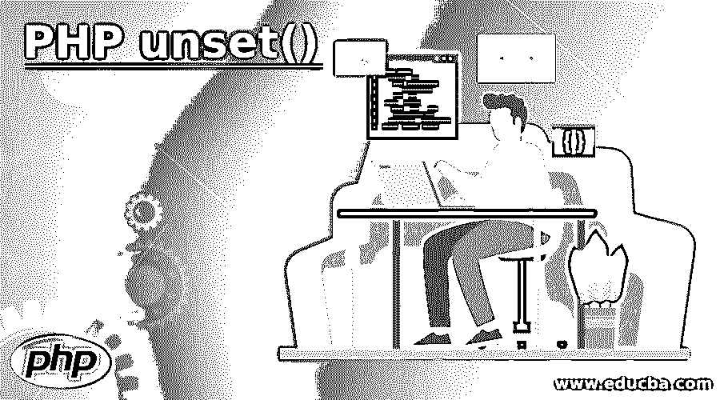
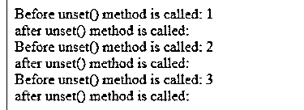
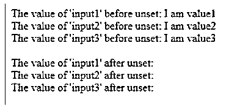

# PHP unset()

> 原文：<https://www.educba.com/php-unset/>

## PHP unset()简介

下面的文章提供了关于 PHP unset()的概述。unset()方法的主要操作是销毁指定为其输入参数的变量。换句话说，它对选定的变量执行重置操作。但是，它的行为会根据要销毁的变量的类型而有所不同。PHP4 以上版本支持该函数。

**PHP unset()的语法**

<small>网页开发、编程语言、软件测试&其他</small>

`unset ( mixed $selectedvar, mixed $selectedvar1,….., mixed $selectedvarN ) : void`

*   **selected var:**unset()方法的强制参数。至少有一个要取消设置的变量需要作为该方法的输入参数给出。
*   **selectedvarN:** 可选参数，可以作为输入参数，给 unset()方法重置。

### unset()的用例

下面给出了不同的情况:

#### 1.对局部变量应用 unset()

当局部变量被传递给 unset 函数时，该函数重置变量。

**举例:**

**代码:**

`<?php
$input = "I have value!!!";
echo "The value of 'input' before unset: " . $input . " ";
unset($input); //Applying unset() method on $input variable
echo "The value of 'input' after unset: " . $input;
?>`

**输出**:

包含在变量“input”中的值在执行 unset()方法时被销毁。

#### 2.对全局变量函数中的变量应用 unset

当用户试图对函数中的变量使用 unset，并且它也被定义为全局变量时，Unset()只重置局部变量。全球性的危机仍未受到影响。

**举例**:

**代码:**

`<?php
function Afunction()
{
$Avariable = 'local value';
echo "Within the function scope before unset: ".$Avariable." ";
global $Avariable;
unset($Avariable); //Deletes the local ‘Avariable’
echo "Within the function scope after unset:  ".$Avariable." ";
}
$Avariable = 'Global Value'; //The global ‘Avariable’
echo "Out of the function scope before unset:  ".$Avariable." ";
Afunction();
echo "Out of the function scope after unset: ".$Avariable." ";
?>`

**输出:**

变量“Avariable”的本地版本被销毁，而全局版本保持不变。

#### 3.对函数中的全局变量应用 unset

如果函数中的变量也被声明为全局变量，用户需要销毁全局变量，那么可以使用数组[$GLOBAL]来实现。

**举例**:

**代码:**

`<?php
function Afunction()
{
$Avariable = 'local value';
echo "Within the function scope before unset: ".$Avariable." ";
global $Avariable;
unset($GLOBALS['Avariable']); //Resets the global ‘Avariable’
echo "Within the function scope after unset:  ".$Avariable." ";
}
$Avariable = 'Global Value';
echo "Out of the function scope before unset:  ".$Avariable." ";
Afunction();
echo "Out of the function scope after unset: ".$Avariable." ";
?>`

**输出:**

变量“Avariable”的本地版本不受 unset 函数执行的影响，而该变量的全局版本被设置为空值。

#### 4.对引用变量传递应用 unset()

如果对作为引用传递给函数的变量调用 unset()，unset()只重置局部变量。调用环境中的变量实例保持原样。

**举例**:

**代码:**

`<?php
function Afunction(&$Avariable) //’Avariable’ is the pass by reference
{
$Avariable = 'Internal value';
echo "Within the function scope before unset: ".$Avariable." ";
unset($Avariable); //Resets the local ‘Avariable’
echo "Within the function scope after unset:  ".$Avariable." ";
}
$Avariable = 'External Value';
echo "Out of the function scope before unset:  ".$Avariable." ";
Afunction($Avariable);
echo "Out of the function scope after unset: ".$Avariable." ";
?>`

**输出:**

在通过引用传递变量“Avariable”中调用的 unset()方法仅重置局部范围内变量的内容，而不影响外部范围内的内容。

#### 5.对静态变量应用 unset()

当静态变量被设置为 unset()方法的输入参数时，在调用 unset()函数后，该变量将为函数范围内的其余命令重置。

**举例**:

**代码:**

`<?php
function UnsetStatic()
{
static $staticvar;
$staticvar++;
echo "Before unset() method is called: $staticvar"." ";
//Deletes ‘staticvar’ only for the below commands within the scope of this ‘UnsetStatic’ function
unset($staticvar);
echo "after unset() method is called: $staticvar"." ";
}
UnsetStatic();
UnsetStatic();
UnsetStatic();
?>`

**输出:**

只有在调用 unset()方法后，变量“staticvar”才会被重置。

#### 6.对数组元素应用 unset()

对数组元素应用 unset()方法会从数组中删除该元素，而不显示重新索引操作。

**举例**:

**代码:**

`<?php
$arrayinput = [0 => "first", 1 => "second", 2 => "third"];
Echo "The array elements, before unset:"." ";
Echo $arrayinput[0]."  ". $arrayinput[1]."  ". $arrayinput[2]."  "." ";
//Unset operation is called on the second element of the array ‘arrayinput’
unset($arrayinput[1]);
Echo "The array elements, after unset:"." ";
Echo $arrayinput[0]."  ". $arrayinput[1]."  ". $arrayinput[2]."  ";
?>`

**输出:**

#### 7.一次对多个元素应用 unset()

unset()方法支持一次删除多个变量。

**举例**:

**代码:**

`<?php
$input1 = "I am value1";
$input2 = "I am value2";
$input3 = "I am value3";
echo "The value of 'input1' before unset:  " . $input1 . " ";
echo "The value of 'input2' before unset:  " . $input2 . " ";
echo "The value of 'input3' before unset:  " . $input3 . " ";
echo " ";
//Reseting input1, input2 and input3 together in single command
unset($input1,$input2,$input3);
echo "The value of 'input1' after unset:  " . $input1." ";
echo "The value of 'input2' after unset:  " . $input2." ";
echo "The value of 'input3' after unset:  " . $input3." ";
?>`

**输出:**

**Note:** (unset) casting is not same as the function unset(). (unset)casting is used only as cast of type NULL whereas unset() method alters the variable. unset() is a language construct and hence is not supported by variable function. unset() method can be used to reset object properties that are visible in the current scope except ‘$this’ variable within any object method. In order to perform unset operation on the object properties that are not accessible in the current scope, an overloading method __unset() needs to be declared and called.

### 推荐文章

这是 PHP unset()的指南。在这里，我们讨论 unset()用例的介绍，并通过例子来更好地理解。您也可以看看以下文章，了解更多信息–

1.  [PHP 引用](https://www.educba.com/php-references/)
2.  [PHP 数据对象](https://www.educba.com/php-data-object/)
3.  [PHP MD5()](https://www.educba.com/php-md5/)
4.  [PHP chop()](https://www.educba.com/php-chop/)

