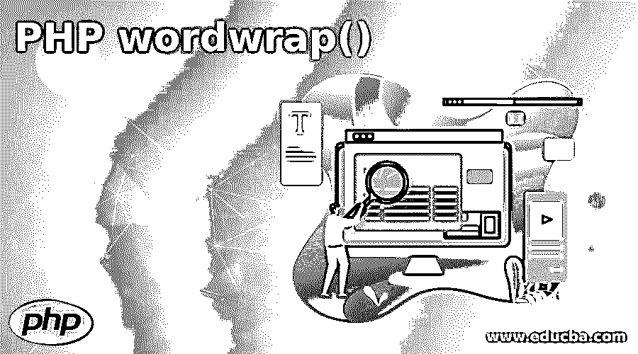
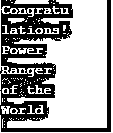

# PHP wordwrap()

> 原文：<https://www.educba.com/php-wordwrap/>

## PHP wordwrap()简介

PHP 编程语言的 PHP wordwrap()函数实际上是一个内置函数，它通过 wordwrap()函数中的一个分隔符来帮助将一个字符串包装成多个字符。它只在 PHP 4.0.2 版本上运行，也可以在其他 PHP 以上版本上运行，以支持该功能。这个 PHP wordwrap()函数有助于在字符串达到给定长度时将它换行。在 PHP 编程语言和其他一些语言中，这个函数是处理字符串函数的最佳函数之一。

### 句法

`wordwrap($str1, $width1, $break1, $cut1)`

<small>网页开发、编程语言、软件测试&其他</small>

**说明:**

PHP 编程语言的 wordwrap()函数通常接受四个参数，如上文语法部分所述。

**$str1:**word wrap()函数的$ str 1 参数实际上有助于指定输入字符串，该字符串实际上需要分成许多行。

**$width1:**word wrap()函数的$ width 1 参数实际上是帮助指定字符串必须/将要换行的字符数。这些是字符数，字符串值将在这些字符后断开。

**$break1:**word wrap()函数的$ break 1 参数实际上是一个可选参数，但是如果指定了它，那么它将在字符串断开的确切位置追加值。

**$cut1:**word wrap()函数的$ cut 1 参数实际上是一个布尔型参数。如果此$cut1 参数值设置为 TRUE 值，则字符串将始终在该点或精确指定的宽度之前换行。这意味着，如果它出现在实际上指定了 width1 参数的约束中间，它也将断开两者之间的一个单词。如果这个 cut1 参数设置为 FALSE 值，那么 wordwrap()函数甚至不会拆分单词，即使 width 参数的值小于单词的宽度。

**返回值:**

函数的作用是:返回一个被压缩到指定长度的字符串。它只不过是一个字符串，如果成功，它将被分成许多行；如果失败，它将为假值。

### wordwrap()函数如何在 PHP 中工作

PHP 编程语言的 wordwrap()函数主要基于 wordwrap()函数中提到的四个参数。它的工作原理是通过使用中断字符“break character”将给定的字符串包装成多个字符，但这只适用于 PHP 4.0.2 和其他以上的 PHP 版本。

### 实现 PHP wordwrap()函数的例子

下面是要实现的示例:

#### 示例#1

这是实现 PHP 编程语言的 wordwrap()函数的例子。这里首先创建一个变量“$text1”，其字符串值为“我的名字是 Pavan Kumar Sake”.然后又创建了另一个变量“$newtext1”变量来存储 wordwrap()函数及其四个参数。在这个 wordwrap()函数中，$str1 参数是$text 变量的值。然后使用 8 作为宽度参数，对于换行符，使用 html 标记“
”之一，对于$cut1 参数，传递 TRUE 值。然后，对于每 8 个字符，单词将被换行，然后打印出来。这个打印是在 PHP web 编程语言的 echo 函数的帮助下完成的。

**代码:**

`<?php
$text1 = "My Name is Pavan Kumar Sake.";
$newtext1 = wordwrap($text1, 8, " ", TRUE);
echo "$newtext1";
?>`

**输出:**

#### 实施例 2

这个例子也是一个实现，通过上面语法中提到的一些参数来了解 wordwrap()函数是如何工作的。首先，创建一个变量“$stringn1”并存储一个字符串语句值。然后用“10”值存储 width1 变量，用“
”html 标记值创建 break1 变量。然后在 echo 语句后使用 wordwrap()函数打印 wordwrap()函数的结果。这里有些字符串是通过宽度为“10”的换行创建的。

**代码:**

`<?php
$stringn1 = "Pavan Kumar Sake a Blogger PhysicsNerd and BusinessMan";
$width1 = 10;
$break1 = " ";
echo wordwrap($stringn1, $width1, $break1);
?>`

**输出:**

#### 实施例 3

这个例子也类似于上面的例子 1。首先$stringn1，$width1，$break1 变量是用 string 值，integer 值，
标记值创建的。然后使用 wordwrap()函数，但是这里没有使用$cut1 参数。如果单词的宽度大于指定的宽度参数值，则只有在不使用$cut1 参数的情况下，才会首先通过换行打印整个单词。

**代码:**

`<?php
$stringn1 = "Congratulations! Pavan Sake kumar";
$width1 = 8;
$break1 = " ";
echo wordwrap($stringn1, $width1, $break1);
?>`

**输出:**

#### 实施例 4

这个程序也是 wordwrap()函数的实现之一，它通过向$cut1 参数传递 TRUE 值来实现这个函数。这里用字符串值创建变量“$ stringnn1”，然后用值 8 创建$width11 变量，然后用标签
作为中断参数创建$break11 变量，用值 TRUE 创建$cut1 变量。然后在 echo 语句后使用 wordwrap()函数。这里，通过将 TRUE 作为值传递，在函数内部使用 cut1 参数。即使字符串宽度大于 width11 值，word 也会被断开并精确地换行为单个字符串文本。您可以查看下面的输出。

**代码:**

`<?php
$stringnn1 = "Congratulations! Power Ranger of the World";
$width11 = 8;
$break11 = " ";
$cut11 = true;
echo wordwrap($stringnn1, $width11, $break11, $cut11);
?>`

**输出:**

#### 实施例 5

这个程序与示例 4 非常相似，但是这里$cut1 参数值被传递了 FALSE 值，stringnn1 变量被传递了新的字符串值，width 参数的值为 7。所以输出会不一样。对于更大的字符串或更小的字符串，整个字符串将在一些空格后打印出来。但是大多数时候，被缠绕的线的宽度将是长度“7”。

**代码:**

`<?php
$stringnn1 = "Be a part of Game Changer :: profitloops";
$width11 = 7;
$break11 = " ";
$cut11 = false;
echo wordwrap($stringnn1, $width11, $break11, $cut11);
?>`

**输出:**

### 结论

我希望您了解了 PHP wordwrap()函数的定义及其语法和所有参数解释，wordwrap()函数如何在 PHP 编程语言中工作，以及实现 wordwrap()函数的各种示例，以便更好地理解 wordwrap()函数。

### 推荐文章

这是一个 PHP wordwrap()的指南。这里我们讨论 PHP wordwrap()的介绍，语法，它是如何工作的，代码和输出的例子。您也可以浏览我们的其他相关文章，了解更多信息——

1.  [PHP 调用函数](https://www.educba.com/php-call-function/)
2.  PHP levenshtein()
3.  [PHP parse_str()](https://www.educba.com/php-parse_str/)
4.  [PHP strtok()](https://www.educba.com/php-strtok/)

