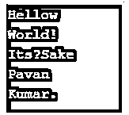

# PHP strtok()

> 原文：<https://www.educba.com/php-strtok/>

## PHP strtok()简介

就像其他编程语言一样，PHP 编程语言的 PHP strtok()函数有助于根据给定的分隔符将字符串标记成许多更小的部分。它有助于将输入字符串作为一个参数，并借助分隔符(它只是第二个参数)。PHP strtok()函数实际上是一个内置函数，它非常类似于 C strtok()函数。strtok()函数有助于将一个字符串分割成许多记号(字符串的较小部分),如果需要的话，可以考虑使用空格字符。

**语法:**

<small>网页开发、编程语言、软件测试&其他</small>

`Strtok(string $str1, string $token1/$delimeter1)`

**参数说明:**

PHP 编码语言的 strtok()函数通常只接受两个参数，这两个参数都是强制的，需要传递。一个参数是$str1 参数，第二个参数是$token1/$delimeter1 参数。

*   **$str1:**PHP 编程语言 strtok()函数的$ str 1 参数有助于表示实际提供的输入字符串。它是实际给定的字符串值。strtok()参数是一个强制参数。
*   **$token1/$delimeter1:**PHP 编程语言的 strtok()函数的$ token 1/$ delimeter 1 参数有助于表示定界字符(拆分字符或令牌字符)。strtok()参数也是一个强制参数。

**strtok()函数的返回值:**

strtok()函数实际上返回一个字符串或一组字符串，这些字符串在分隔符/标记的帮助下被分隔开。借助 while 循环中 strtok()函数的用法，可以找到这些字符串系列/组。

### strtok()函数在 PHP 中是如何工作的？

*   PHP 编程语言的 strtok()函数的工作原理是，在仅有的两个参数的帮助下，将普通字符串分割成许多更小的字符串，这两个参数实际上是强制的，需要传递。
*   一个是字符串参数，第二个是分隔符/令牌参数。
*   Delimeter 参数有助于将字符串值拆分成许多更小的字符串元素。
*   字符串值可以是任何字母或任何字符或空格或类似的东西。
*   字符串将仅在指定的 delimeter1 参数值的精确点处被拆分。
*   delimeter1 参数可以有不同类型的字符、字母、数值，这有助于将字符串从一个大句子拆分成小字符串。

### PHP strtok()的例子

下面是一些例子:

#### 示例#1

这是借助作为$delimeter1 参数的“space”值和作为$str1 参数值的“Pavan Kumar Sake”来实现 strtok()函数的示例。首先，使用字符串值“Pavan Kumar Sake”创建$str1 变量，然后使用“space”创建$delimeter 变量。然后用 strtok()函数及其两个参数创建$token1 变量。然后用条件(token1 值不是假值)创建 while()函数。如果条件为真，那么 echo 语句将通过在 space 元素的精确点拆分字符串来打印$token1 变量值。

**语法:**

`<?php
$str1 = "Pavan Kumar Sake";
$delimeter1 = " ";
$token1 = strtok($str1, $delimeter1);
while ($token1 !== false)
{
echo "$token1  ";
$token1 = strtok($delimeter1);
}
?>`

**输出:**

#### 实施例 2

这是借助“，”特殊字符值作为$delimeter11 参数和“Hi，Pavan Kumar Sake Blogger”作为$str11 参数值实现 strtok()函数的示例。首先，使用字符串值“Hi，Pavan Kumar Sake Blogger”创建$str11 变量，然后使用特殊字符“，”创建$delimeter11 变量。然后用 strtok()函数及其两个参数创建$token11 变量。然后用条件创建 while()函数(token11 值不是 FALSE 值)。如果条件为真，则 echo 语句将通过在“，”特殊字符元素的确切位置拆分字符串来打印$token11 变量值。

**语法:**

`<?php
$str11 = "Hi,PavanKumarSake Blogger";
$delimeter11 = ",";
$token11 = strtok($str11, $delimeter11);
while ($token11 !== false)
{
echo "$token11  ";
$token11 = strtok($delimeter11);
}
?>`

**输出:**

#### 实施例 3

这是借助于作为$delimeter11 参数的“space”值和“Hellow World！其？SakePavan Kumar”作为$string11 参数的值。首先，$string11 变量是用一个字符串值“Hellow World！其？SakePavan Kumar Sake ",然后使用“space”元素创建 delimeter11 变量。然后用 strtok()函数及其两个参数创建$token111 变量。然后 PHP 标记内的 while()函数用条件创建(token111 值不是 FALSE 值)。如果 while 循环中的条件为真，那么 echo 语句将通过在 space 元素的精确点拆分给定/提供的字符串来打印$token111 变量值。您可以查看下面的输出，了解如何将字符串句子分割成更小的字符串元素。

**语法:**

`<?php
$string11 = "Hellow World! Its?SakePavan Kumar.";
$delimiter11 =  " ";
$token111 = strtok($string11, $delimiter11);
while($token111 !==false)
{
echo $token111\. " ";
$token111 =strtok($delimiter11);
}
?>`

**输出:**

#### 实施例 4

这是借助“e”字母值作为$delimeter1 参数($del11 变量值)和“嘿哥们！欢迎来到 PavanKumarSake 公园”作为$str111 参数的值。首先，$str111 变量是用一个字符串值“嘿，伙计！欢迎来到 PavanKumarSake 公园”,然后用“e”字母字符值创建$del11 变量。然后用 strtok()函数及其两个参数($str111 和$del11 参数)创建$token11 变量。然后使用条件创建 while()函数($token11 值不是假值)。如果循环的条件为真，那么 php 的 echo 语句将通过在“e”字母字符元素的确切位置拆分字符串来打印$token11 变量值。

**语法:**

`<?php
$str111 = "Hey Buddy! Welcome to PavanKumarSake Park";
$del11 =  "e";
$token11 = strtok($str111, $del11);
while($token11 !==false)
{
echo $token11\. " ";
$token11=strtok($del11);
}
?>`

**输出:**

### 结论

在这里，我们看到了 PHP 编程语言的 strtok()函数的定义及其语法和各种参数解释，strtok()函数如何在 PHP 中工作，以及各种实现示例，以了解 strtok()函数如何工作。

### 推荐文章

这是一个 PHP strtok()的指南。这里我们讨论 PHP strtok()的介绍，以及函数的工作原理和例子。您也可以看看以下文章，了解更多信息–

1.  [PHP parse_str()](https://www.educba.com/php-parse_str/)
2.  [PHP wordwrap()](https://www.educba.com/php-wordwrap/)
3.  PHP levenshtein()
4.  [PHP sha1()](https://www.educba.com/php-sha1/)

