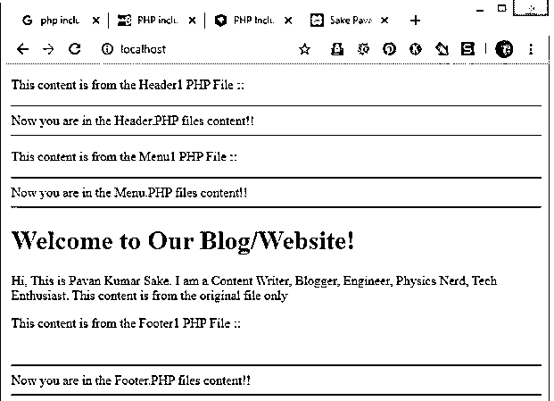
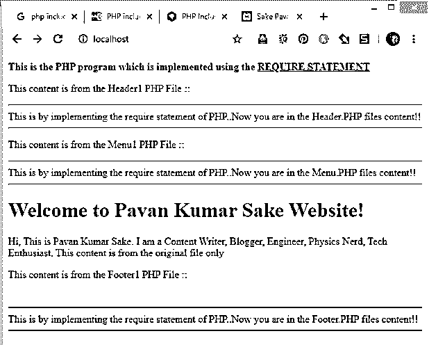

# PHP 包含并要求

> 原文：<https://www.educba.com/php-include-and-require/>

## PHP 简介包括并要求

PHP Include 和 Require 语句帮助获取特定 PHP 文件/doc 中存在的所有代码/文本/标记代码，然后它会将代码文本从包含的文件复制到使用 PHP Include 语句的文件中。如果包含在 include.php 文件中的脚本被复制到原来的 PHP 文件中，那么输出将与上面描述中提到的一样。为了区分大项目的程序，必须创建不同的程序。要将所有这些文件组合成一个文件，应该在原始索引或其他 PHP 程序文件中使用 include 或 require 语句。

**语法:**

<small>网页开发、编程语言、软件测试&其他</small>

`include(“Enter File Path – Pavan Kumar Sake”); or include “Enter File Path – Pavan Kumar Sake”;
require(“Enter the File Path – Pavan Kumar Sake”); or require “Enter the File Path – Pavan Kumar Sake”;`

### PHP 中 Include 和 Require 是如何工作的？

这个声明将有助于允许 other.PHP 文件中的代码包含在一个特定的原始 PHP 文件中。如果我们直接在原始 PHP 文件中使用 specific.PHP 文件中的代码，它会返回相同的输出。通过使用 include()或 require()函数/语句，可以节省大量时间，并且通过包含文件/内容也可以减少工作量。

只需在 specific.PHP 文件中存储一些代码，然后在任何需要的时候，只要借助语法部分提到的 include()或 require()语句，就可以将它包含在任何其他 PHP 文件中。如果需要，可以使用 include()语句多次输入代码，而不是多次输入整个 PHP 代码。例如，我们可以将 HEADER.PHP、MENU.PHP 和 FOOTER.PHP 的文件包含在一个主 INDEX.PHP 文件中，以便将 those.PHP 文件中的代码包含在 INDEX.PHP 文件中。

### 实现 PHP 的例子包括并要求

下面是提到的例子:

#### 示例#1

这是实现 PHP Include 语句的例子。首先创建 html 标记，然后在 title 标记中输入一些字符串内容。当光标被放置时，这将在浏览器选项卡上可见。然后用"

"段标记输入一些内容，然后用 include 语句将 HEADER1.PHP 文件的内容导入到索引程序中。然后段落标签被用于一些内容显示，然后再次包括声明被用于导入 MENU1.PHP 文件的内容。然后使用标题标签和段落标签，其中包含一些内容。然后再次使用 PHP includes 语句从 FOOTER1.PHP 文件导入内容。然后 html 标签关闭。包括这个程序的语句，这将有助于获得其他 3 个 PHP 文件的内容。

**INDEX.PHP 文件的语法:**

`<!DOCTYPE html>
<html lang="en">
<head>
<title>Sake Pavan Kumar DOC - Implementing include() function </title>
</head>
<body>

This content is from the Header1 PHP File :: 

<?php include "header1.php"; ?>

This content is from the Menu1 PHP File :: 

<?php include "menu1.php"; ?>
<h1>Welcome to Our Blog/Website!</h1>

Hi, This is Pavan Kumar Sake. I am a Content Writer, Blogger,
Engineer, Physics Nerd, Tech Enthusiast.
This content is from the original file only

This content is from the Footer1 PHP File :: 

 
<?php include "footer1.php"; ?>
</body>
</html>`

**HEADER1.PHP 文件的语法:**

`<html>
<body>

<?php
echo "Now you are in the Header.PHP files content!!"
?>

</body>
</html>`

**MENU1.PHP 文件的语法:**

`<html>
<body>

<?php
echo "Now you are in the Menu.PHP files content!!"
?>

</body>
</html>`

**FOOTER1.PHP 文件的语法:**

`<html>
<body>

<?php
echo "Now you are in the Footer.PHP files content!!"
?>

</body>
</html>`

**输出:**

#### 实施例 2

这是 PHP 编程语言实现 REQUIRE 语句的例子。这里我们没有使用 include 语句“include() statement”，而是使用了 require 语句“require() statement”。这里也和例 1 一样，大部分内容都是相同的 HTML 标签，一些字符串输出内容也是相同的，只是 PHP 的 REQUIRE 语句的用法不同。查看输出以便更好地理解。

**索引的语法。PHP:**

`<!DOCTYPE html>
<html lang="en">
<head>
<title>Sake Pavan Kumar DOC - Implementing include() function </title>
</head>
<body>

<b>This is the PHP program which is implemented using the <u>REQUIRE STATEMENT</u></b>

This content is from the Header1 PHP File :: 

<?php require "header1.php"; ?>

This content is from the Menu1 PHP File :: 

<?php require "menu1.php"; ?>
<h1>Welcome to Pavan Kumar Sake Website!</h1>

Hi, This is Pavan Kumar Sake. I am a Content Writer, Blogger,
Engineer, Physics Nerd, Tech Enthusiast.
This content is from the original file only

This content is from the Footer1 PHP File :: 

 
<?php require "footer1.php"; ?>
</body>
</html>`

**header 1 的语法。PHP:**

`<html>
<body>

<?php
echo "This is by implementing the require statement of PHP..";
echo "Now you are in the Header.PHP files content!!";
?>

</body>
</html>`

**menu 1 的语法。PHP:**

`<html>
<body>

<?php
echo "This is by implementing the require statement of PHP..";
echo "Now you are in the Menu.PHP files content!!";
?>

</body>
</html>`

**footer 1 的语法。PHP:**

`<html>
<body>

<?php
echo "This is by implementing the require statement of PHP..";
echo "Now you are in the Footer.PHP files content!!";
?>

</body>
</html>`

**输出:**

### PHP 的优势包括并要求

PHP 包含并要求一条语句，这条语句在根据我们的需要开发静态和动态网页时具有巨大的优势。这个 PHP 语句减少了工作量，在大多数情况下有助于节省大量时间。如果需要在特定文件或不同类型的 PHP 文件中输入某种类型的代码，必须每次都输入，然后如果我们在任何时候或任何地方使用 include()或 require()，我们可以节省输入的时间，也可以减少工作量。我们可以为每个 web 开发部分使用单独的 PHP 文件。

### 结论

我希望你已经了解了 PHP Include and Require 语句的定义及其语法和解释，如何在 PHP 中包含和要求工作，以及各种示例、语句的优点等。为了更好、更容易地理解 PHP 包含或要求语句。

### 推荐文章

这是一个 PHP 包含和要求的指南。在这里，我们讨论了 PHP 包含和要求的介绍，包括适当的语法、优点和例子。您也可以浏览我们的其他相关文章，了解更多信息——

1.  [PHP 字符串操作符](https://www.educba.com/php-string-operators/)
2.  [PHP wordwrap()](https://www.educba.com/php-wordwrap/)
3.  [PHP is_null()](https://www.educba.com/php-is_null/)
4.  [PHP explode()](https://www.educba.com/php-explode/)

