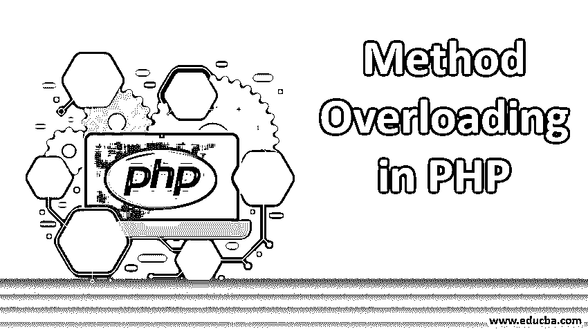
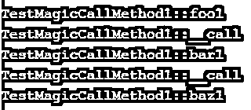
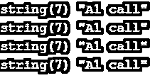

# PHP 中的方法重载

> 原文：<https://www.educba.com/method-overloading-in-php/>




## PHP 中的方法重载介绍

方法重载是不同于属性重载的一种重载。它将创建一个或多个不是在该类范围内创建的动态方法。PHP 方法重载的概念也有助于触发用于适当目的的神奇方法。除了属性重载概念之外，PHP 方法的重载概念允许对对象和静态上下文进行函数调用。基本上是哎呀的方法之一。

**语法:**

<small>网页开发、编程语言、软件测试&其他</small>

```
Public _call (string $name1 , array $arguments1 ) : mixed
Public static _callStatic (string $name1 , array $arguments1 ) : mixed
```

### PHP 中方法重载是如何工作的？

方法重载通过创建动态方法来处理类内部的声明。它还通过为适当的目的触发一些神奇的方法来工作，并且它还在静态上下文和对象上调用函数/函数调用。方法重载的概念也适用于大多数其他编程语言，比如 T2 的 c，java，T3 等等..方法重载概念也称为静态多态概念。

有一些神奇的功能，它们是:

*   **_call():** 这个 call()魔法函数将被触发，以便调用对象上下文中的重载方法。
*   **_callStatic():** 这个 callStatic()魔法函数也会被触发，以便调用静态上下文中的重载概念/方法。

### PHP 中方法重载的例子

下面是 PHP 中方法重载的例子

#### 示例#1

下面的 [PHP 编程语言中的$name1 参数是要调用的方法的](https://www.educba.com/how-to-connect-database-to-php/)名称，而$arguments 是枚举数组之一，包含用于传递给$name 'ed 方法的参数/参数。

_call()函数使用了两个参数 name1 和 arguments1。内爆()函数实际上从数组元素中返回字符串，即从字符串/句子中返回。在 Implode(separator，array)中，separator 是可选参数，但为了向后兼容，建议同时使用这两个参数。separator 参数中特定类型的分隔符将向数组参数中出现的单词/字符串插入分隔符。

Obj 变量将创建一个名为 SPK 的新对象。Obj-> will 有助于访问对象的方法和属性。Spk 将从静态上下文执行，而 obj 将从对象上下文运行。

**代码:**

```
<?php
class SPK {
public function __call($name1, $arguments1) {
echo "object method calling '$name1' "
. implode(', ', $arguments1). "\n";
}
public static function __callStatic($name1, $arguments1) {
echo "static method Calling '$name1' "
. implode(', ', $arguments1). "\n";
}
}
// Create new object
$obj = new SPK;
$obj->runTest('in one of the object context');
SPK::runTest('in one of the static context');
?>
```

**输出:**


#### 实施例 2

在下面的例子中，foo1 类仅使用 _call()函数和 die()函数创建，以便打印消息，并且也从当前程序/PHP 脚本中退出。Die()与 exit()函数相同，它只接受 a 括号内的一个参数。

Foo1->将有助于从变量$foo1 中访问对象的方法和属性。

**代码:**

```
<?php
class Foo1 {
function __call($m1, $a1) {
die($m1);
}
}
$foo1 = new Foo1;
print $foo1->{' wow !'}();
// outputs ' wow !'
?>
```

**输出:**


#### 实施例 3

这是 PHP 编程语言中使用 call()函数和私有/受保护方法的方法重载的例子。

在这里，调用私有/受保护的方法是通过输入或其他方式来完成的..

Echo _METHOD_PHP_EOL 将返回使用的方法类型。这是通过仅使用从对象上下文运行的 _call()函数来完成的。

**代码:**

```
<?php
class TestMagicCallMethod1 {
public function foo1()
{
echo __METHOD__.PHP_EOL;
}
public function __call($method1, $args1)
{
echo __METHOD__.PHP_EOL;
if(method_exists($this, $method1))
{
$this->$method1();
}
}
protected function bar1()
{
echo __METHOD__.PHP_EOL;
}
private function baz1()
{
echo __METHOD__.PHP_EOL;
}
}
$test    =    new TestMagicCallMethod1();
$test->foo1();
$test->bar1();
$test->baz1();
?>
```

**输出:**




#### 实施例 4

这是 call()和 call static()函数概念的程序，用于方法重载概念。在这个 PHP 程序中，首先调用 call()函数，然后调用实例中的 callstatic()函数。

Var dump()将提供 PHP 和其他一些面向对象编程语言括号中变量的信息。除此之外，一切都是一样的，就像上面的例子。

**代码:**

```
<?php
class A1 {
public function test1 () {
static::who();
A1::who();
self::who();
$this->who();
}
public static function __callStatic($a1, $b1) {
var_dump('A1 static');
}
public function __call($a1, $b1) {
var_dump('A1 call');
}
}
$a1 = new A1;
$a1->test1();
?>
```

**输出:**




#### 实施例 5

这是 _call()函数的例子，如果对象的类是用一个根本不存在的方法调用的，那么 _call()函数的概念就被调用了，而不是方法。

在下面的 PHP 程序中，area()方法被创建为动态执行以帮助方法重载概念的神奇方法，称为 _call()函数。它的行为将根据传递的对象参数而改变。

**代码:**

```
<?php
class Shape1 {
const PI1 = 3.142 ;
function __call($name1,$arg1){
if($name1 == 'area1')
switch(count($arg1)){
case 0 : return 0 ;
case 1 : return self::PI1 * $arg1[0] ;
case 2 : return $arg1[0] * $arg1[1];
}
}
}
$circle1 = new Shape1();
echo $circle1->area1(3);
$rect1 = new Shape1();
echo $rect1->area1(8,6);
?>
```

**输出:**


#### 实施例 6

这里 _call()和 _callstatic()函数的用法与第一个<sup>和第一个</sup>例子一样。

**代码:**

```
<?php
class Toys1
{
public function __call($name1,$pavan1){
echo "Magic method invoked while method overloading with object reference";
}
public static function __callStatic($name1,$pavan1){
echo "Magic method invoked while method overloading with static access";
}
}
$objToys1 = new Toys1;
$objToys1->overloaded_method();
Toys1::overloaded_property();
?>
```

**输出:**


#### 实施例 7

方法重载的 Call()函数触发并调用了对象上下文中不可访问的方法。Call()与 syntax _call(字符串$name1，数组$arguments1)混合使用。

那么$name1 参数是要调用的方法的名称，而数组$arguments1 是包含/具有要传递给$name variables 方法的参数的枚举数组的参数。

**代码:**

```
<?php
class ABC1 {
public function __call($method_name1, $arguments1) {
$methodArray1 = array('displayMessage11','displayMessage12');
if (in_array($method_name1,$methodArray1) === false) {
die("\n Method does not exist");
}
if (count($arguments1) === 2) {
$this->displayMessage12($arguments1[0],$arguments1[1]);
}
elseif (count($arguments1) === 1) {
$this->displayMessage11($arguments1[0]);
} else {
echo "\n unknown method";
return false;
}
}
function displayMessage11($var11) {
echo "\n from func1($var11)";
}
function displayMessage12($var11,$var12) {
echo "\n from func2($var11,$var12)";
}
}
$obj1 = new ABC1;
$obj1->displayMessage11('hello');
$obj1->displayMessage12('hello','hello2');
$obj1->displayMessage13('Hello');
?>
```

**输出:**


#### 实施例 8

它也和第一个示例程序一样。检查一次。

**代码:**

```
<?php
class MethodOverloading1
{
public function __call($name1,$pavan1){
echo "\n--It is now With the object reference ";
}
public static function __callStatic($name1,$pavan1){
echo "\n-----It is now With the static reference \n";
}
}
// Here now creating the object of the class " MethodOverloading "
$obj1 = new MethodOverloading1;
echo "Method Overloading1 Now in Command ";
// Now using the object's reference
$obj1->DemoTest1();
// Now using the static's reference
MethodOverloading1::DemoTest1();
?>
```

**输出:**


#### 实施例 9

这是一个程序，使用一些参数显示圆和矩形的面积，并调用()函数的方法重载概念。只有在对象上下文中，程序才会由于对象变量的对象赋值给类而运行，等等。

**代码:**

```
<?php
class TDshape1 {
const Pi1 = 3.142 ;  // constant value
function __call($fname1, $argument1){
if($fname1 == 'area1')
switch(count($argument1)){
case 0 : return 0 ;
case 1 : return self::Pi1 * $argument1[0] ; // 3.14 * 15
case 2 : return $argument1[0] * $argument1[1];  // 5 * 11
}
}
}
$circle1 = new TDshape1();
echo "Area of the circle:".$circle1->area1(15); // display output of the area of circle
$rect1 = new TDshape1();
echo "\n Area of the rectangle:".$rect1->area1(5,11); // display output of the area of rectangle
?>
```

**输出:**


### 推荐文章

这是 PHP 中方法重载的指南。这里我们讨论基本概念，方法重载在 PHP 中是如何工作的，以及各种例子。您也可以看看以下文章，了解更多信息–

1.  PHP 中的质数
2.  [PHP 中的多重继承](https://www.educba.com/multiple-inheritance-in-php/)
3.  [PHP 中的日历](https://www.educba.com/calendar-in-php/)
4.  [PHP 中的私有](https://www.educba.com/private-in-php/)


