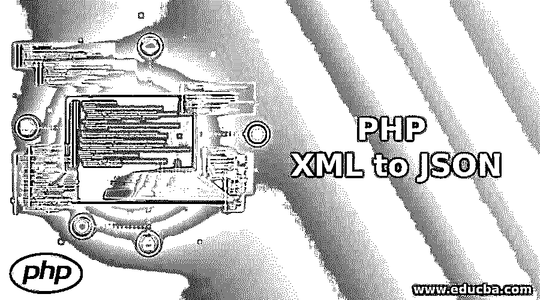

# PHP XML 到 JSON

> 原文：<https://www.educba.com/php-xml-to-json/>

## PHP XML 到 JSON 的介绍

为了在 PHP 中将 XML 转换为 json，我们有一个名为 json_encode 的函数，这是 PHP 中的一个内置函数，将 XML 转换为 JSON 的过程是首先使用函数 _ file \ _ get \ _ contents()_ 获取 XML 文件的内容，XML 文件的 URL 作为参数传递给该函数，然后删除回车、制表符和换行符，然后用单引号替换双引号。 然后修剪尾部和前导空格，以确保 XML 被一个简单的 XML 函数正确解析，最后使用 json_encode 函数进行转换。

**PHP 中声明 Zlib 模块的语法:**

<small>网页开发、编程语言、软件测试&其他</small>

`json_encode(URL_to_the_XML_file)`

其中，URL_to_the_XML_file 是要转换为 JSON 的 XML 文件的 URL。

### 用 PHP 将 XML 转换成 JSON 的步骤

*   使用函数 file_get_contents()获取 XML 文件内容，XML 文件的 URL 作为参数传递给该函数。
*   移除制表符、回车符和换行符。
*   单引号取代了双引号。
*   结尾和开头的空格被修剪，以确保 XML 被一个简单的 XML 函数正确解析。
*   调用 simplexml_load_string()函数来加载 xml 文件的内容。
*   XML 到 JSON 的最终转换是通过调用 json_encode()函数完成的。

### PHP XML 到 JSON 的例子

下面给出了 PHP XML 到 JSON 的例子:

#### 示例#1

这个 PHP 程序演示了 XML 到 json 的转换，我们将 XML 文件的 URL 作为参数提供给 json_encode 函数，将 XML 文件的内容转换成 JSON。

**代码:**

`<html>
<body>
<?php
class XmlToJson {
public function Parse ("C://Users/admin/Desktop/check.xml") {
# Getting the contents of the XML file by making use of the function file_get_contents() to which the URL of the XML file is passed as a paramter
$filepath= file_get_contents("C://Users/admin/Desktop/check.xml");
# Removing the tabs, returns and the newlines
$filechange = str_replace(array("\n", "\r", "\t"), '', $filepath);
# The trailing and leading spaces are trimmed to make sure the XML is parsed properly by a simple XML function.
$filetrim = trim(str_replace('"', "'", $filechange));
# The simplexml_load_string() function is called to load the contents of the XML file.
$resultxml = simplexml_load_string($filetrim);
# The final conversion of XML to JSON is done by calling the json_encode() function.
$resultjson = json_encode($resultxml);
return $resultjson;
}
}
?>
</body>
</html>`

**输出:**

在上面的程序中，我们通过使用函数 file_get_contents()来获取 XML 文件的内容，XML 文件的 URL 作为参数传递给这个函数。然后移除制表符、回车符和换行符。然后双引号被单引号取代。然后，修剪尾随空格和前导空格，以确保简单的 XML 函数能够正确解析 XML。然后调用 simplexml_load_string()函数来加载 xml 文件的内容。然后通过调用 json_encode()函数完成 XML 到 JSON 的最终转换。

#### 实施例 2

这个 PHP 程序演示了 XML 到 json 的转换，我们将 XML 文件的 URL 作为参数提供给 json_encode 函数，将 XML 文件的内容转换成 JSON。

**代码:**

`<html>
<body>
<?php
class XmlToJson {
public function Parse ("C://Users/admin/Desktop/test.xml") {
# Getting the contents of the XML file by making use of the function file_get_contents() to which the URL of the XML file is passed as a paramter
$filepath= file_get_contents("C://Users/admin/Desktop/test.xml");
# Removing the tabs, returns and the newlines
$filechange = str_replace(array("\n", "\r", "\t"), '', $filepath);
# The trailing and leading spaces are trimmed to make sure the XML is parsed properly by a simple XML function.
$filetrim = trim(str_replace('"', "'", $filechange));
# The simplexml_load_string() function is called to load the contents of the XML file.
$resultxml = simplexml_load_string($filetrim);
# The final conversion of XML to JSON is done by calling the json_encode() function.
$resultjson = json_encode($resultxml);
return $resultjson;
}
}
?>
</body>
</html>`

**输出:**

在上面的程序中，我们通过使用函数 file_get_contents()来获取 XML 文件的内容，XML 文件的 URL 作为参数传递给这个函数。然后移除制表符、回车符和换行符。然后双引号被单引号取代。然后，修剪尾随空格和前导空格，以确保简单的 XML 函数能够正确解析 XML。然后调用 simplexml_load_string()函数来加载 xml 文件的内容。然后通过调用 json_encode()函数完成 XML 到 JSON 的最终转换。

#### 实施例 3

这个 PHP 程序演示了 XML 到 json 的转换，我们将 XML 文件的 URL 作为参数提供给 json_encode 函数，将 XML 文件的内容转换成 JSON。

**代码:**

`<html>
<body>
<?php
class XmlToJson {
public function Parse ("C://Users/admin/Desktop/file.xml") {
# Getting the contents of the XML file by making use of the function file_get_contents() to which the URL of the XML file is passed as a paramter
$filepath= file_get_contents("C://Users/admin/Desktop/file.xml");
# Removing the tabs, returns and the newlines
$filechange = str_replace(array("\n", "\r", "\t"), '', $filepath);
# The trailing and leading spaces are trimmed to make sure the XML is parsed properly by a simple XML function.
$filetrim = trim(str_replace('"', "'", $filechange));
# The simplexml_load_string() function is called to load the contents of the XML file.
$resultxml = simplexml_load_string($filetrim);
# The final conversion of XML to JSON is done by calling the json_encode() function.
$resultjson = json_encode($resultxml);
return $resultjson;
}
}
?>
</body>
</html>`

**输出:**

在上面的程序中，我们通过使用函数 file_get_contents()来获取 XML 文件的内容，XML 文件的 URL 作为参数传递给这个函数。然后移除制表符、回车符和换行符。然后双引号被单引号取代。然后，修剪尾随空格和前导空格，以确保简单的 XML 函数能够正确解析 XML。然后调用 simplexml_load_string()函数来加载 xml 文件的内容。然后通过调用 json_encode()函数完成 XML 到 JSON 的最终转换。

### 推荐文章

这是一个 PHP XML 到 JSON 的指南。这里我们分别讨论介绍、在 PHP 中将 XML 转换成 JSON 的步骤和例子。您也可以看看以下文章，了解更多信息–

1.  [PHP 表单验证](https://www.educba.com/php-form-validation/)
2.  [PHP 通过引用传递](https://www.educba.com/php-pass-by-reference/)
3.  [PHP 删除文件](https://www.educba.com/php-delete-file/)
4.  [PHP preg_match_all](https://www.educba.com/php-preg_match_all/)

