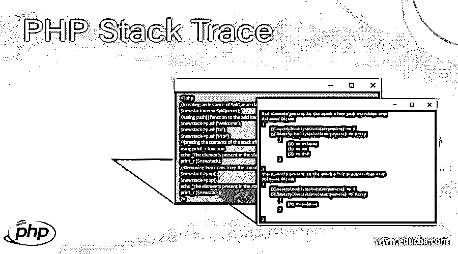
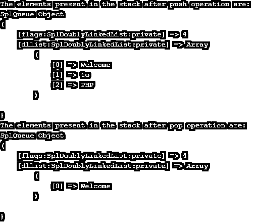
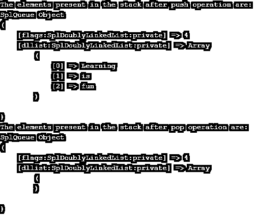
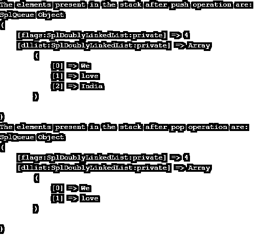

# PHP 堆栈跟踪

> 原文：<https://www.educba.com/php-stack-trace/>

## PHP 堆栈跟踪简介

在 PHP 中，具有特定属性的元素的顺序集合称为堆栈。并且堆栈基于后进先出操作，这意味着最后放置在堆栈中的对象将是从堆栈中移除的第一个对象，并且向堆栈添加元素和删除元素都被限制在堆栈的一端。它被定义为堆栈的顶部，定义堆栈的操作是 push 和 pop，push 意味着从堆栈的顶部向堆栈添加元素，pop 意味着从堆栈的顶部移除元素。

**PHP 中声明栈的语法如下:**

<small>网页开发、编程语言、软件测试&其他</small>

`push(item_to_added_to_the_stack);
pop();`

其中 item_to_be_added_to_the_stack 是将要从堆栈顶部添加到堆栈中的项目。

### PHP 中堆栈的使用

PHP 中堆栈的工作方式如下:

*   在 PHP 中，具有特定属性的元素的顺序集合称为堆栈。
*   堆栈基于后进先出进行操作，这意味着放在堆栈最后的对象将是从堆栈中移除的第一个对象。
*   向堆栈添加元素和删除元素都仅限于堆栈的一端，它被定义为堆栈的顶部。
*   定义堆栈的操作是压入和弹出。
*   栈上的 push 操作意味着从栈顶向栈中添加元素。
*   栈上的弹出操作意味着从栈顶移除栈中的元素。

### 例子

让我们讨论 PHP 堆栈跟踪的例子。

#### 示例#1: PHP 程序使用 push()函数和 pop()函数将项目添加到堆栈中，并从堆栈顶部删除项目，然后显示堆栈的内容:

**代码:**

`<?php
//creating an instance of SplQueue class
$newstack = new SplQueue();
//using push() function to the add items to the stack from the top of the stack
$newstack->push('Welcome');
$newstack->push('to');
$newstack->push('PHP');
//printing the contents of the stack after push operation in a human readable format by using print_r function
echo "The elements present in the stack after push operation are:\n";
print_r ($newstack);
//Removing two items from the top of the stack using pop() function and then displaying the contents of the stack in human readable form using print_r function
$newstack->pop();
$newstack->pop();
echo "The elements present in the stack after pop operation are:\n";
print_r ($newstack);
?>`

**输出:**

在上面的程序中，创建了 SplQueue()类的一个实例。然后，我们利用 push()操作将元素从栈顶添加到栈中。然后，我们将堆栈的内容作为输出显示在屏幕上。然后我们利用 pop()操作从栈顶移除栈中的元素。然后，我们将堆栈的内容作为输出显示在屏幕上。

#### 例 2:使用 push()函数和 pop()函数将项目添加到堆栈中并从堆栈顶部删除项目，然后显示堆栈内容的 PHP 程序:

**代码:**

`<?php
//creating an instance of SplQueue class
$newstack = new SplQueue();
//using push() function to the add items to the stack from the top of the stack
$newstack->push('Learning');
$newstack->push('is');
$newstack->push('fun');
//printing the contents of the stack after push operation in a human readable format by using print_r function
echo "The elements present in the stack after push operation are:\n";
print_r ($newstack);
//Removing two items from the top of the stack using pop() function and then displaying the contents of the stack in human readable form using print_r function
$newstack->pop();
$newstack->pop();
$newstack->pop();
echo "The elements present in the stack after pop operation are:\n";
print_r ($newstack);
?>`

**输出:**

在上面的程序中，创建了 SplQueue()类的一个实例。然后，我们利用 push()操作将元素从栈顶添加到栈中。然后，我们将堆栈的内容作为输出显示在屏幕上。然后我们利用 pop()操作从栈顶移除栈中的元素。然后，我们将堆栈的内容作为输出显示在屏幕上。

#### 例 3:使用 push()函数和 pop()函数将项目添加到堆栈中并从堆栈顶部删除项目，然后显示堆栈内容的 PHP 程序:

**代码:**

`<?php
//creating an instance of SplQueue class
$newstack = new SplQueue();
//using push() function to the add items to the stack from the top of the stack
$newstack->push('We');
$newstack->push('love');
$newstack->push('India');
//printing the contents of the stack after push operation in a human readable format by using print_r function
echo "The elements present in the stack after push operation are:\n";
print_r ($newstack);
//Removing two items from the top of the stack using pop() function and then displaying the contents of the stack in human readable form using print_r function
$newstack->pop();
echo "The elements present in the stack after pop operation are:\n";
print_r ($newstack);
?>`

**输出:**

在上面的程序中，创建了 SplQueue()类的一个实例。然后，我们利用 push()操作将元素从栈顶添加到栈中。然后，我们将堆栈的内容作为输出显示在屏幕上。然后我们利用 pop()操作从栈顶移除栈中的元素。然后，我们将堆栈的内容作为输出显示在屏幕上。

### 结论

在本文中，我们通过定义、语法和基本操作学习了 PHP 中堆栈的概念，这些操作通过编程示例和它们的输出来定义 PHP 中的堆栈，即 push()函数和 pop()函数。

### 推荐文章

这是一个 PHP 堆栈跟踪指南。这里我们讨论 PHP 中堆栈的介绍和工作原理，以及代码实现的例子。您也可以看看以下文章，了解更多信息–

1.  [PHP 输出缓冲](https://www.educba.com/php-output-buffering/)
2.  [PHP 附加文件](https://www.educba.com/php-append-file/)
3.  [PHP 通过引用传递](https://www.educba.com/php-pass-by-reference/)
4.  [PHP mail()](https://www.educba.com/php-mail/)

