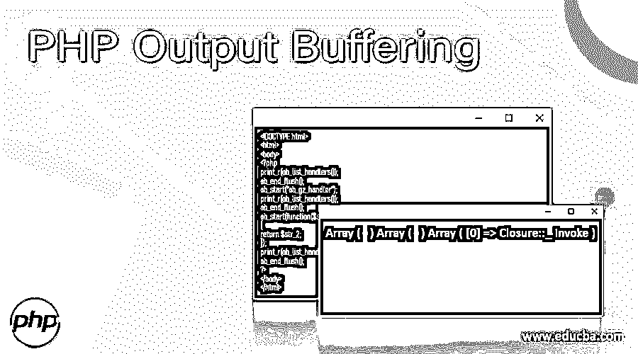

# PHP 输出缓冲

> 原文：<https://www.educba.com/php-output-buffering/>

## PHP 输出缓冲的定义

PHP 输出缓冲是一个过程，它确认 PHP 引擎保存数据，同时在输入被处理时提供输出。一旦 PHP 引擎得到一个处理过的数据用于执行以提供一个输出，那么同时该数据被以比特和片断的形式发送到引擎到浏览器。如果使用上述输出缓冲机制来执行，那么这将在数据处理方面提供更高的效率和可行性，因为数据首先存储在变量中，然后作为脚本的一部分发送到浏览器。

**语法:**

<small>网页开发、编程语言、软件测试&其他</small>

输出缓冲没有固定的格式，但可以用以下方式表示和使用:

`<?php
function to start
php_info( ); // processing before giving the output.
use variable to assign the final value as an output
?>`

### PHP 中输出缓冲是如何工作的？

PHP 中的输出缓冲在其工作方面有很多重要意义，如下所示:

*   由于 PHP 是一种解释型语言，输出流所指向的页面很难轻易显示。因此，正在采取一些措施，如输出缓冲。
*   输出缓冲有助于将数据存储到一些变量中，这些变量将在 PHP 脚本执行后请求发送到浏览器之前用于呈现。
*   如果页面包含了输出缓冲和它的各种功能，那么所有在加载时变得扭曲和缓慢的页面都会变得正常。
*   PHP 中的输出缓冲有很多优点，其中之一是开发人员虔诚地使用这个 PHP 函数，因为它减少了客户端和服务器之间的交互次数，HTML 一次被发送到浏览器，从而使它更加通用、灵活和高效，适用于大型项目，其中大量页面和组件作为大屏幕出现。
*   另一方面，还有更多优点，因为整个输出缓冲区是使用许多其他变量作为 HTML 中的字符串整体存储的。所有 HTML 文件都可以使用字符串方法和程序员编写的其他内置自定义方法进行操作和修改，这反过来有助于 PHP 中网页的平滑呈现。
*   许多其他压缩方法也可用于创建和操作更简单的渲染方式。
*   Cookies 和会话管理对于 PHP 中的输出缓冲也起着举足轻重的作用，因为它为 PHP 中的输出缓冲提供了一个额外的优势，可以有效地获取作为内容的一部分发送的标头信息，而不是全部，而是需要发送的任何内容。
*   此外，应该记住，在任何面向 PHP 的应用程序中使用输出缓冲之前，非常需要检查与 PHP 版本相关的兼容性问题，因为它可能根据需要使用其他 PHP 版本，那么 PHP 输出缓冲功能可能有可能无法正常工作。因此，需要检查输出缓冲是否使能，默认情况下是关闭的。
*   它还在数据库调用方面提供了更多的能力，因为它允许程序员使用一些高级功能，如最小化和简化，这也适用于 cookies 和会话。
*   输出缓冲被认为是最安全和有效的方法之一，对页面渲染有额外的关注和能力，因为它提供了大多数最终用户所期望的更快、更灵活、更平滑、更安全的方法。
*   通过保存数据和各种操作，使用缓冲来临时处理整个页面导航和呈现的过程是最现代化的概念之一。

### 例子

让我们讨论 PHP 输出缓冲的例子。

#### 示例#1

这个程序演示了由用户定义的 callback()函数，它将替换变量中定义的值，如输出所示。

**代码:**

`<!DOCTYPE html>
<html>
<body>
<?php
function cll_bck($buff)
{
return (str_replace("Mobile", "Tabs", $buff));
}
ob_start("cll_bck");
?>
<html>
<body>

Everyone_prefers_Mobile_over_Tabs.

</body>
</html>
<?php
ob_end_flush();
?>
</body>
</html>`

**输出:**

#### 实施例 2

这个程序演示了 ob_get_contents()函数，在传递输出中显示的变量的同时，获取为最终引擎定义的内容。

**代码:**

`<!DOCTYPE html>
<html>
<body>
<?php
ob_start();
echo "Today_day_is_good. ";
$o_t_1 = ob_get_contents();
echo "and_pleasant";
$o_t_2 = ob_get_contents();
ob_end_clean();
var_dump($o_t_1, $o_t_2);
?>
</body>
</html>`

**输出:**

#### 实施例 3

这个程序演示了 ob_start 函数，在这个函数中，输出缓冲被初始化，然后显示在输出中。

**代码:**

`<!DOCTYPE html>
<html>
<body>
<?php
ob_start();
echo 'Text written will_get displayed easily.';
?>
</body>
</html>`

**输出:**

#### 实施例 4

这个程序演示了调用 ob_end_clean 函数后将被删除的文本的用法，如输出所示。

**代码:**

`<!DOCTYPE html>
<html>
<body>
<?php
ob_start();
echo 'Text_written_will_get_removed_easily_using ob_end_clean.';
ob_end_clean();
?>
</body>
</html>`

**输出:**

#### 实施例 5

这个程序演示了 ob_list_handlers()函数，该函数用于返回一个带有输出缓冲区处理程序的数组，处理程序列表显示在输出中。

**代码:**

`<!DOCTYPE html>
<html>
<body>
<?php
print_r(ob_list_handlers());
ob_end_flush();
ob_start("ob_gz_handler");
print_r(ob_list_handlers());
ob_end_flush();
ob_start(function($str_2)
{
return $str_2;
});
print_r(ob_list_handlers());
ob_end_flush();
?>
</body>
</html>`

**输出:**

#### 实施例 6

这个程序演示了正在定义的所有类型的可能代码的编码和解码，但是如果有什么东西丢失了，或者浏览器得到了一些错误的值，那么它将返回如图所示的输出。

**代码:**

`<!DOCTYPE html>
<html>
<body>
<pre>
<?php
iconv_set_encoding("int_encd", "internal_UTF_8");
iconv_set_encoding("o/p_encd", "ISO-8859-1");
var_dump(iconv_get_encoding('all_encd_types'));
?>
</pre>
</body>
</html>`

**输出:**

### 结论

PHP 输出缓冲是一种向最终用户提供输出的有效方式，在将数据放入浏览器之前，它将数据保存在缓冲区中，然后分配一个变量进行引用，因为它使程序员能够根据最终用户的适当要求相应地更改和操作数据。

### 推荐文章

这是一个 PHP 输出缓冲的指南。这里我们讨论 PHP 中输出缓冲的定义和工作原理？并附有示例。您也可以看看以下文章，了解更多信息–

1.  [PHP json_decode](https://www.educba.com/php-json_decode/)
2.  [PHP 表单验证](https://www.educba.com/php-form-validation/)
3.  [PHP 附加文件](https://www.educba.com/php-append-file/)
4.  [PHP 通过引用传递](https://www.educba.com/php-pass-by-reference/)

