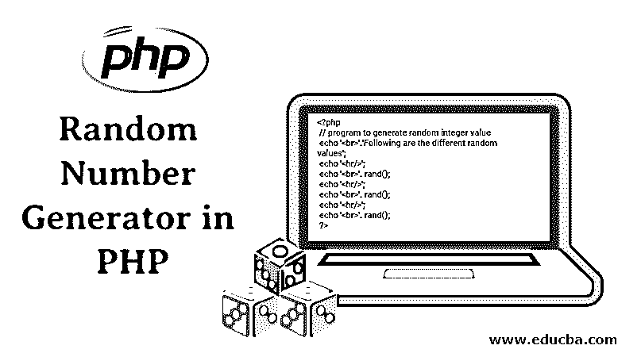
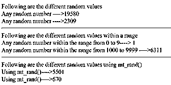

# PHP 中的随机数生成器

> 原文：<https://www.educba.com/random-number-generator-in-php/>




## PHP 中的随机数生成器是什么？

在这篇文章中，我们将学习 PHP 中的随机数生成器。那么什么是随机数生成器呢？

我们可以使用内置函数生成随机数或整数。这些功能是做什么的？这些函数在最小值和最大值的范围内生成不同的数字组。每次你调用这个函数，它都会产生一个唯一的数字。我们可以生成任何数字，比如 2 位数，3 位数等等。

<small>网页开发、编程语言、软件测试&其他</small>

数字在该范围内被打乱并相应地生成。有[各种内置函数](https://www.educba.com/python-built-in-functions/)生成随机数。

### 随机数发生器函数

现在，我们将学习生成伪随机数的不同函数:

*   **无范围的 rand()函数，有范围的 rand()函数:**这个函数被调用时返回一个随机数。当最小值和最大值被提供给函数时，它生成一个范围内的随机数。
*   **mt_rand()函数:**这个函数类似于 rand()。mt_rand()中的 mt 代表梅森图。函数是一个随机数生成器，返回一个整数值。它像 rand()函数一样生成一个伪随机数。这是第一个伪随机数发生器。它是老式随机数生成器的高级形式。它快速、高效，并提供高质量的整数。
*   **getrandmax()函数:**这个函数没有定义参数，顾名思义，它返回最大或最大可能的随机数。
*   **mt_getrandmax()函数:**类似于 getrandmax()函数，同样返回最大或最大可能的随机数。这里 mt 再次代表 Mersenne Twister，这是一种生成随机数的算法。
*   **srand(种子)函数:**该函数用给定的种子值给随机数发生器播种，如果没有给该函数一个随机数种子
*   **mt_srand(seed):** 这个函数类似于 srand()函数，这个函数用给定的种子值播种[随机数发生器](https://www.educba.com/random-number-generator-in-javascript/)。

我们将学习语法，后面是提到的每种类型函数的例子。

#### 1.rand()函数

**语法:**

```
rand()
```

**举例:**

```
<?php
// program to generate random integer value
echo '<br>'.'Following are the different random values';
echo '<hr/>';
echo '<br>'. rand();
echo '<hr/>';
echo '<br>'. rand();
echo '<hr/>';
echo '<br>'. rand();
?>
```

**输出:**


#### 2.给定范围内的 rand()函数

该函数为 rand()函数提供范围。

**语法:**

```
rand(min, max);
```

其中 min 是可选的最小值，表示最小数值，max 是可选的最大值，表示最大数值。

同样，min 的默认值为零，max 的默认值为 getrandmax()函数值。函数的返回类型总是整数。

**举例:**

```
<?php
// program to generate random integer value
echo 'Following are the different random values within ranges min and max';
echo '<hr/>';
echo '<br> Range : 1 to 100 ----> '. rand(1,100);
echo '<hr/>';
echo '<br> Range 5 to 25 ---->'. rand(5, 25);
echo '<hr/>';
echo '<br>Range 10000 to 50000 --->'. rand(10000, 50000);
?>
```

**输出:**


#### 3.函数 mt_rand

**语法:**

```
int mt_rand(min, max)
```

其中，min 是可选值，表示最小数字，max 是可选值，表示最大数字。最小值的默认值为 0，最大值的默认值为给定的最高值。返回类型是整数。

**举例:**

```
<?php
// program to generate random integer value
echo 'Following are the different random values using mt_rand()';
echo '<hr/>';
echo '<br> Range : 1 to 100 ----> '. mt_rand(1,100);
echo '<hr/>';
echo '<br> Range 5 to 25 ---->'. mt_rand(5, 25);
echo '<hr/>';
echo '<br>Range 9 to 19 --->'. mt_rand(9, 19);
?>
```

**输出:**


#### 4.getrandmax()函数

**语法:**

```
mt_getrandmax();
```

该函数返回一个整数值

**举例**:

```
<?php
// program to generate random integer values
//using getrandmax() function
echo 'Random number using getrandmax() function';
echo '<hr/>';
echo(getrandmax());
echo '<hr>';
?>
```

**输出:**


#### 5.mt_getrandommax()函数

**语法:**

```
mt_getrandmax();
```

该函数返回一个整数值。

**举例:**

```
<?php
// program to generate random integer values
//using mt_getrandmax() function
echo 'random number using mt_getrandmax() function';
echo '<hr/>';
echo(mt_getrandmax());
?>
```

**输出:**


#### 6.srand()函数

**语法:**

```
srand(seed);
```

其中种子是一个可选值，该函数不返回任何内容。

**举例:**

```
<?php
// program to generate random integer value
echo 'example using srand';
echo '<br>'. srand(3);
echo(rand(1, 5));
echo '<hr>';
echo 'example using srand';
echo '<br>'. srand(2);
echo(rand(1, 5));
?>
```

**输出:**


#### 7.函数

**举例:**

```
<?php
// program to generate random integer value using mt_srand() function
echo 'example using mt_srand';
echo '<hr>';
mt_srand(5);
echo mt_rand(1,5);
?>
```

**输出:**


### 生成整数

在下面的例子中，我们使用了 rand()，rand(min，max)和 mt_rand()。

**代码:**

```
<?php
// program to generate random integer value
echo 'Following are the different random values';
echo '<br> Any random number ---->'. rand();
echo '<br> Any random number ---->'. rand();
echo '<hr>';
// random number with range
echo 'Following are the different random values within a range ';
echo '<br> Any random number within the range from 0 to 9----> '. rand(0,9);
echo '<br>Any random number within the range from 1000  to 9999 ---->'. rand(1000,9999);
echo '<hr>';
// random number with range
echo 'Following are the different random values using mt_rand() ';
echo '<br> Using mt_rand()---->'. mt_rand(1000,9999);
echo '<br> Using mt_rand()---->'. mt_rand(100,999);
?>
```

**输出:**




### 世代浮点数

浮点数表示小数类型为 float 的数字。示例–10.0、8.12、6.23e-5、2.345、2.98e+10 等。

**代码:**

```
<?php
function fun($min, $max) {
$square_root = sqrt(4);
return mt_rand($min * $square_root, $max * $square_root) /  100;
}
echo 'Program to display floating point numbers ';
echo '<hr>';
echo "<br>".fun(1, 10, 2);
?>
```

**输出:**


### 结论

在本文中，我们学习了 PHP 中用于生成随机数的各种函数。这些函数通过示例进行了解释。希望这篇文章对任何想学习 PHP 随机数生成器的人有用。

### 推荐文章

这是一个 PHP 中随机数生成器的指南。这里我们讨论 php 中随机数生成器的不同功能及其例子。您也可以阅读以下文章，了解更多信息——

1.  [PHP 中的 While 循环](https://www.educba.com/while-loop-in-php/)
2.  [PHP 中的星形模式](https://www.educba.com/star-patterns-in-php/)
3.  [在 PHP 中排序](https://www.educba.com/sorting-in-php/)
4.  [PHP 中的套接字编程](https://www.educba.com/socket-programming-in-php/)


