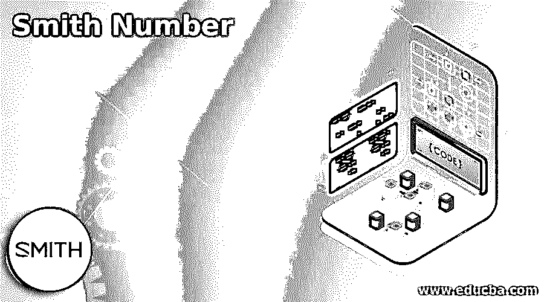
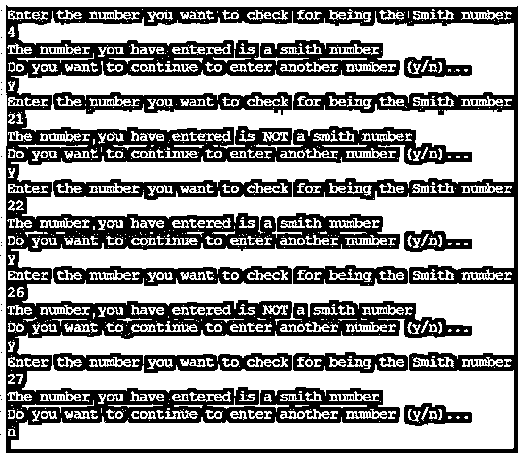
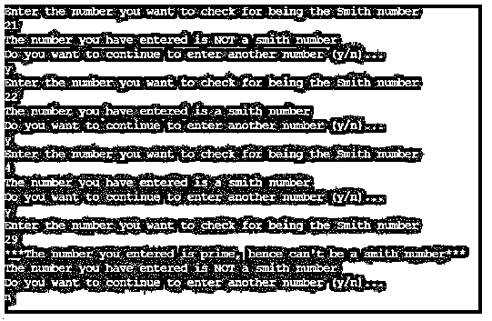
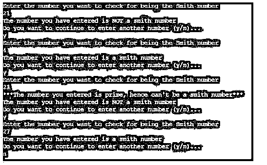

# 史密斯数

> 原文：<https://www.educba.com/smith-number/>

## 史密斯数简介

史密斯数被定义为必须是合数的数列中的娱乐数学数，并且该数的质因数中的位数总和等于该数本身的位数总和。因此，在 number = 121 的例子中，由于原数中的位数和质因数中的位数是相同的，所以我们称该数为史密斯数。试着用你选择的另一个数字做这件事。Albert Wilansky 在他姐夫的电话号码中发现了这种模式后，引入了这个号码。

### 史密斯数背后的逻辑

*   我们用一个例子来看逻辑如果数是 121，它满足条件 121 是合数，现在位数之和等于 1 + 2 + 1 = 4，数的质因数是 11，11 为 1，121 不是质数。即使数字是正方形，我们也需要取同一个数字两次。现在质因数(11 和 11)之和是 1 + 1 + 1 + 1 = 4。
*   代码实现试图测试整个逻辑，方法是将其分解为编写测试素数的逻辑、素数因子的和以及数字中的一些数字。现在使用下面的一步一步的算法，让我们从理论上理解它，然后实施到各自的。

### 如何查史密斯数？

让我们来看看这个循序渐进的过程:

<small>网页开发、编程语言、软件测试&其他</small>

我们将在这里浏览伪代码，然后用它来实现 C++/Python/Java。

*   首先，将数字作为输入。
*   利用寻找最后一位数字的概念，我们不断地对这些数字进行一个接一个的求和，最终返回总和，并将其存储到一个变量中。
*   现在，我们定义另一个函数来检查一个数是否是质数。
*   现在，编写另一个函数来查找因子，检查因子是否是质数，如果是，则继续对这些因子求和。
*   最后，返回这个质因数的和。
*   然后，比较这两个和，以返回检查输入的数字是否为史密斯数字的真或假。

### 史密斯数的例子

下面提到了不同的例子:

#### 示例#1

在 C++中求史密斯数。

**语法:**

`#include <iostream>
#include<math.h>
using namespace std;
int findSumOfDigit(int n) {
int s = 0;
while (n > 0) {
s = s + n % 10;
n = n / 10;
}
return s;
}
bool isPrime(int n)
{
if (n <= 1)
return false;
if (n <= 3)
return true;
if (n % 2 == 0 || n % 3 == 0)
return false;
for (int i = 5; i * i <= n; i = i + 6)
if (n % i == 0 || n % (i + 2) == 0)
return false;
return true;
}
int findSumPrimeFactors(int n) {
int i = 2, sum = 0;
while (n > 1) {
if (n % i == 0) {
sum = sum + findSumOfDigit(i);
n = n / i;
} else {
do {
i++;
}
while (!isPrime(i));
}
}
return sum;
}
bool isSmithNum(int num)
{
if (isPrime(num)){
return false;
}
int a = findSumOfDigit(num);
int b = findSumPrimeFactors(num);
return (a==b);
}
int main(void)
{
int num;
char choice;
do{
cout << "Enter the number you want to check for being the Smith number\n";
cin >> num;
if (isSmithNum(num))
cout << "The number you have entered is a smith number\n";
else
cout << "The number you have entered is NOT a smith number\n";
cout << "Do you want to continue to enter another number (y/n)...\n";
cin >> choice;
}while(choice=='y' || choice =='Y');
}`

**输出:**

#### 实施例 2

Python 中的查找。

**语法:**

`def countOfDigits(num):
c = 0
while num != 0:
num = num//10
c += 1
return c
def sumOfDigits(num):
temp = num
sum = 0
for i in range(countOfDigits(num)):
sum+=num%10
num//=10
return sum
def checkPrime(num):
for i in range(2,num):
if (num % i) == 0:
return False
else:
continue
return True
#Function to check whether a number is a Smith Number or not
def isSmithNum(num):
if(checkPrime(num)):
print("***The number you entered is prime, hence can't be a smith number***")
else:
factorizePrime = [] temp = num
c = 2
while(temp>1):
if(temp%c == 0 and checkPrime(c)):
factorizePrime.append(c)
temp/=c
else:
c+=1
continue
for i in range(0,len(factorizePrime)):
if(countOfDigits(factorizePrime[i])>1):
while(countOfDigits(factorizePrime[i])>1):
factorizePrime[i] = sumOfDigits(factorizePrime[i])
if(sum(factorizePrime) == sumOfDigits(num)):
return True
else:
return False
choice ='y'
while(choice=='y' or choice =='Y'):
print("Enter the number you want to check for being the Smith number")
num = int(input())
if (isSmithNum(num)):
print("The number you have entered is a smith number")
else:
print("The number you have entered is NOT a smith number")
print("Do you want to continue to enter another number (y/n)...")
choice = input()`

**输出:**

#### 实施例 3

在 Java 中查找(确保将文件命名为 Main.py)。

**语法:**

`import java.util.*;
public class Main {
int sumOfDigits(int n) {
int s = 0;
while (n > 0) {
s = s + n % 10;
n = n / 10;
}
return s;
}
boolean checkPrime(int n)
{
if (n <= 1)
return false;
if (n <= 3)
return true;
if (n % 2 == 0 || n % 3 == 0)
return false;
for (int i = 5; i * i <= n; i = i + 6)
if (n % i == 0 || n % (i + 2) == 0)
return false;
return true;
}
int sumOfPrimeFactors(int n) {
int i = 2, sum = 0;
while (n > 1) {
if (n % i == 0) {
sum = sum + sumOfDigits(i);
n = n / i;
} else {
do {
i++;
}
while (!checkPrime(i));
}
}
return sum;
}
boolean isSmithNum(int num)
{
if (checkPrime(num)){
System.out.println("***The number you entered is prime, hence can't be a smith number***");
return false;
}
int a = sumOfDigits(num);
int b = sumOfPrimeFactors(num);
return (a==b);
}
public static void main(String args[])
{
int n;
char choice;
Main obj = new Main();
Scanner sc= new Scanner(System.in);
do{
System.out.println("Enter the number you want to check for being the Smith number");
n= sc.nextInt();
if (obj.isSmithNum(n))
System.out.println("The number you have entered is a smith number");
else
System.out.println("The number you have entered is NOT a smith number");
System.out.println("Do you want to continue to enter another number (y/n)...");
choice= sc.next().charAt(0);
}while(choice=='y' || choice =='Y');
}
}`

**输出:**

### 结论

在本文中，我们研究了逻辑和实现。我们应该着眼于 C++、Python 和 Java 中不同函数的实现，因为我们已经尝试了各种算法来实现相同的结果。为了方便起见，可以尝试用他们自己的编程语言来交换它们。

### 推荐文章

这是一本史密斯数指南。这里我们讨论一下入门，逻辑，如何查史密斯数？和示例。您也可以看看以下文章，了解更多信息–

1.  [Java 中的史密斯数](https://www.educba.com/smith-number-in-java/)
2.  [Python 名称错误](https://www.educba.com/python-nameerror/)
3.  [jQuery indexOf](https://www.educba.com/jquery-indexof/)
4.  [jQuery 数组到字符串](https://www.educba.com/jquery-array-to-string/)

