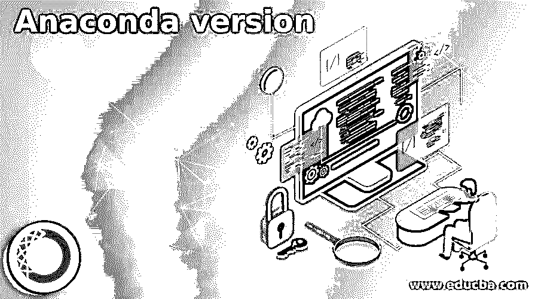

# Anaconda 版本

> 原文：<https://www.educba.com/anaconda-version/>

## Anaconda 版本简介

Anaconda 主要用于科学计算，包括机器学习、大数据处理、数据科学、预测分析等。简而言之，它是 R 和 Python 编程语言的发行版，主要关注并旨在提供部署管理和打包，其初始版本于 2017 年发布，稳定版本于 2021/05 年发布，最初它提供了 250 个已安装的软件包，我们可以使用 Pypl 安装其他软件包，它还为我们提供了一个 GUI，称为 Anaconda Navigator，可以作为 CLI(命令行界面)的替代方案。现在 Anaconda 的最新版本是 2020.11。在本教程的下一节，我们将看到 Anaconda 的不同版本，详细介绍以便更好地理解，以及安装它的步骤和初学者入门。

### 水蟒的版本

在这一节中，我们将看到 Anaconda 的版本列表，以及版本中增加的内容等等，所以让我们开始吧，见下文；

<small>网页开发、编程语言、软件测试&其他</small>

首先，我们将从最初的版本 0.8.0 开始，之后，他们提出了下面的版本列表，其中一些在下面提到；

**1) 2012-07-17: 0.8.1:** 在这个版本中，他们修复了下面提到的几个东西；

a)他们已经为所有 C 扩展模块添加了测试

b)固定 lzo 支架

c)修复 ctypes 错误

**2) 2012-07-18: 0.8.2:** 同此版本还有 as，remove，&修正了下述来自版本的要点；

a)删除 scikits 名称空间

b)增加了设置文件

c)添加了 disco 配置

d)支持 anaconda 命令，通过它我们可以获得版本信息

2012-07-18: 0.8.3: 在此版本中，我们在以下地方提到了一些事情:

a)测试中的大量改进

b)更新脚本 etc/init.d/disco

c)修复 disco 配置

d)在 anaconda 命令中增加了包选项

e)添加对 disco、patch 等的修复。

**4) 2012-08-21: 0.9.0:** 下面提到了本次发布的版本变化；

a)对其他几个包进行更新

b)他们还增加了对 macOS 的支持。

c)添加了其他软件包和 bitey

2012-09-06: 1.0.0: 在这个版本中，我们有很多变化，下面只提到几个以供参考；

a)他们已经实现了基于免费和高级的构建版本

b)增加了对 Windows 的支持

c)现在我们也可以从不同的位置安装安装程序。

d)在安装时，他们已经删除了无用的文件。

e)在 pandas、scikits-image 中从特定版本到不同版本的更新。

f)更新到 disco 文件、路径等。

**6) 2012-11-13: 1.2.0:** 现在让我们跳到 1.2.0 版本之后我们将直接进入不同的版本让我们开始吧；

a)更新 libpng、matplotlib h5py、IOPro 等。

b)将上述内容从特定版本更新到版本

c)绩效改进

d)添加的功能

e)添加 py、pytest、MDP、NLTK 等。

f)还改进了 anaconda 包的管理

2013-05-08: 1.5.0 这个版本提供了各种修复、改进、增强等功能。为了更好地理解，我们将在这一点上进行讨论，让我们从下面开始看；

a)增强，例如在系统路径中添加了 anaconda

b)另外一个增强是添加了 anaconda 作为默认版本

c)增加了配置选项

python、matplotlib、numpy、astropy 等的更新。

e)他们还修复了许多 bug，例如 python config 之前没有为 macOS 使用正确的界面。

f)他们也从这个版本中移除了 macOS 等上的共享 libpng 中的硬编码位置。

g)添加了缺失的运行时 windows 安装程序

**8) 2020.11:** 以下是与此版本相关的主要变更如下:

a)他们已经将 anaconda navigator 更新到了 1.10.0 的新版本

b)在 PyCharm 中更新，基本上是对文字和链接的更新。

c)他们已经删除了 libllvm9

d)也删除了 snappy

在这之后，我们有了 anaconda 的另一个版本，基本上是这样的，让我们详细讨论每一点，见下文；

a)更新 EULA，PyCharm 再次与 GUI 安装程序的文本和链接相关

b)修复了许多与 win-32 和 win-64 基本环境相关的问题

c) Python 3.8 现在将用作基础和安装程序环境。

d)他们移除了如此多的软件包，其中很少是 pytest-arraydiff、pytest-arraydiff、hypothesis、pytest-openfiles 等等。

现在我们将讨论与这个版本相关的变化，让我们开始吧。

a)更新到 anaconda navigator

b)更新到图形用户界面

c)对 windows 7 的支持

d)将名称更改为 Anaconda 个人版

**11) 2019.10:** 让我们更详细地讨论这个具体的改进版本，见下文

a)更新各种包

b)更改 macOS 的默认软件包安装目录

c)少数后端改进，包括提取脚本，这有助于更好地与旧的操作系统一起工作

d)为清理库添加了 python 包装器

e)添加了新的包，如 tbb、ripgrep 等。

**12) 2019.07:** 让我们仔细看看这个版本的变化详情见下文；

a)更新文档，包括集成、教程、便于使用的导航等。

b)更新包，包括 ML/AI 包和 R 包。

c)更新 conda 文件，该文件现在与兼容。conda 文件格式

**13) 2019.03:** 让我们来讨论一下这个版本的更多不同更新见下文；

a)改进了现在快得多的减速性能

b)它包括 conda 版本 as 4.6

c)后端改进很少。

DLL 处理冲突库方面的改进

e)现在，我们可以将 conds 与 Windows Powershell 完全集成。

### 结论

我们可以查看本文中的可用版本列表，并比较每个版本的增强功能、错误修复和改进，这对于开发人员来说很容易阅读、理解和安装。

### 推荐文章

这是一个指南蟒蛇版本。在这里，我们详细讨论了 Anaconda 的不同版本，以便更好地理解和安装它的步骤。您也可以看看以下文章，了解更多信息–

1.  [Joomla 版本](https://www.educba.com/joomla-version/)
2.  [CodeIgniter 版本](https://www.educba.com/codeigniter-version/)
3.  [树遍历 Python](https://www.educba.com/tree-traversal-python/)
4.  [DB2 版本](https://www.educba.com/db2-version/)

