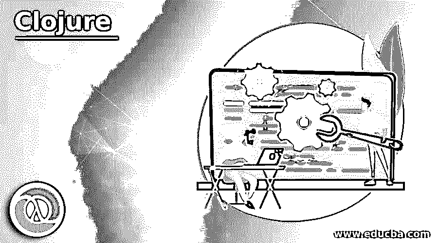

# Clojure

> 原文：<https://www.educba.com/clojure/>

## Clojure 简介

一种动态的通用编程语言，它结合了脚本语言的交互式开发和可接近性，为多线程编程提供了一个健壮而有效的基础结构，尽管 Clojure 是一种编译语言，但它支持运行时的所有功能， 变得完全动态并易于访问 Java 框架，具有可选的类型推断和类型提示，由 Clojure 提供，clo jure 是一种由持久和不可变数据结构组成的函数式编程语言，当可变状态对于获得正确、干净的多线程设计是必要的时，它提供反应式代理系统和软件事务存储器系统。

### 使用 Clojure 的必要性

*   它是一个强大的、一致的、简单的工具，由一组有用的特性组成。
*   它提供了一个动态的交互环境。Clojure 中的大多数语言结构都是可以改变的，因此程序可以通过加载数据、添加特性、修复错误、不间断地进行测试来发展。
*   它属于 Lisp 语言家族，将特性代码作为数据添加，并将宏系统添加到 Clojure。
*   Clojure 简化了多线程编程，因为线程之间共享不可变的数据结构。
*   Clojure 提供了某些工具来避免作为一级对象提供的可变状态函数，以及由递归迭代取代的基于副作用的循环。
*   Clojure 提供了一种灵活、强大且简单的机制来支持运行时多态性。使用运行时多态性的系统可以很容易地改变和扩展。
*   它共享 JVM 类型系统、线程等。，因此它是一种托管语言，其功能是用 JVM 中的字节码编译的。Clojure 支持 Java 中接口和类的动态实现。

### Clojure 的工作

*   它是一种动态的、功能性的高级编程语言，其设计基于一种称为 LISP 的编程语言，由允许它在 Java 和. Net 的运行时环境中运行的编译器组成。
*   LISP 编程语言没有语法，这是一种提供强大宏功能的微型语言。
*   因为它是基于 LISP 编程语言，所以它的代码比其他编程语言要少。
*   它由不可变的数据结构组成，不允许改变创建的对象，因此它是一种函数式编程语言。
*   对于程序员来说，应用程序的状态是由 mague 管理的。
*   conjure 支持并发性。
*   它可以包含现有的编程语言。
*   Clojure 作为一种编程语言可以用两种方式来处理，即 Leiningen 和 Eclipse plugin。
*   Clojure 项目可以使用一个叫做 Leiningen 的工具来创建、构建和自动化。
*   Clojure 的开发可以在 Eclipse 集成开发环境中使用 Eclipse 中一个名为逆时针的插件来完成。
*   Clojure 程序文件以。clj 扩展。

### 优点和缺点

下面给出了优点和缺点:

<small>网页开发、编程语言、软件测试&其他</small>

#### 优势:

*   它是一种动态的、功能性的高级编程语言，其设计基于一种称为 LISP 的编程语言，由允许它在 Java 和. Net 的运行时环境中运行的编译器组成。
*   LISP 编程语言没有语法，这是一种提供强大宏功能的微型语言。
*   因为它是基于 LISP 编程语言，所以它的代码比其他编程语言要少。
*   它由不可变的数据结构组成，不允许改变创建的对象，因此它是一种函数式编程语言。
*   对于程序员来说，应用程序的状态是由 mague 管理的。
*   conjure 支持并发性。
*   它可以包含现有的编程语言。
*   作为一门编程语言，可以用两种方式处理，即 Leiningen 和 Eclipse plugin。
*   它提供了快速原型，因为它是一种动态类型的语言。

#### 缺点:

*   Clojure 中的原语类型都是 Java 原语，Clojure 运行时在试图包装所有 Java 原语时必须付出性能代价。
*   异常处理和异常在 Clojure 中通过包装 Java 库来处理，在生产就绪环境中，必须小心处理好异常以避免堆栈跟踪。
*   编译器在 Clojure 中抛出 Java 堆栈跟踪错误，因为 Clojure 是在另一个运行时之上构建的解释型语言。这使得纠正问题变得非常困难，因为我们不能确定错误的原因是 Java 问题还是魔法问题。
*   作为一种编程语言，Clojure 有一套复杂的规则，因此，对于任何编程语言来说，学习 curve 都是最高的。
*   唯一支持 Clojure 开发模型的编辑器是一个基于 REPL 的编辑器的工作原型，叫做 Light Table。但是 Light Table 有一个很小的插件生态系统，只能扩展到大型项目。
*   LISP 编程体验只有在一个叫 Paredit 的平台上更好。除非代码是在 Paredit 平台上编写的，否则在 LISP 中构建代码是不可能的；否则，很难对代码进行修改。
*   对于短脚本和命令行实用程序来说，它并不是理想的工具，因为需要几毫秒才能运行的程序会由于 JVM 的引导和 Clojure 运行时开销而消耗一到两秒的初始化时间。
*   Clojure 不支持静态类型和显式类型，这使得原型开发变得更慢和困难。
*   它还没有一个充满活力的用户生态系统，这些用户可以为常见的任务和应用程序提供帮助、框架和库。

### 应用程序

不同的应用如下所述:

*   Clojure 中的一些应用程序支持基于 web 的桌面创建和应用程序。
*   Clojure 中的桌面应用程序是使用一个名为 see-saw 的库创建的。
*   配置！可以使用一个选项来改变桌面上文本的值。
*   使用桌面上的 see-saw 类的 alert 方法可以显示一个模式对话框。
*   Clojure 中的 Buttons 类允许在桌面上显示按钮。
*   Clojure 中的 Labels 类允许在桌面上显示标签。
*   Clojure 中的 Text 类允许在桌面上显示文本。

### 推荐文章

这是一个 Clojure 的指南。这里我们分别讨论其介绍、用途、工作原理、优点、缺点和应用。您也可以看看以下文章，了解更多信息–

1.  [OpenShift 替代方案](https://www.educba.com/openshift-alternatives/)
2.  [什么是 Scala？](https://www.educba.com/what-is-scala/)
3.  什么是 Groovy？
4.  [Scala 的用途](https://www.educba.com/uses-of-scala/)

