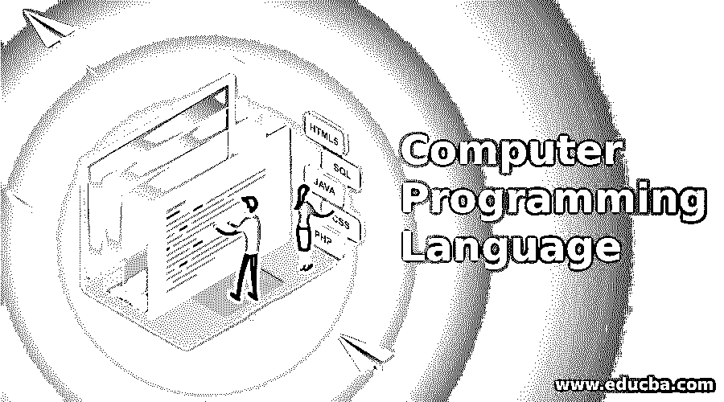
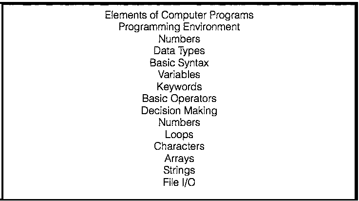
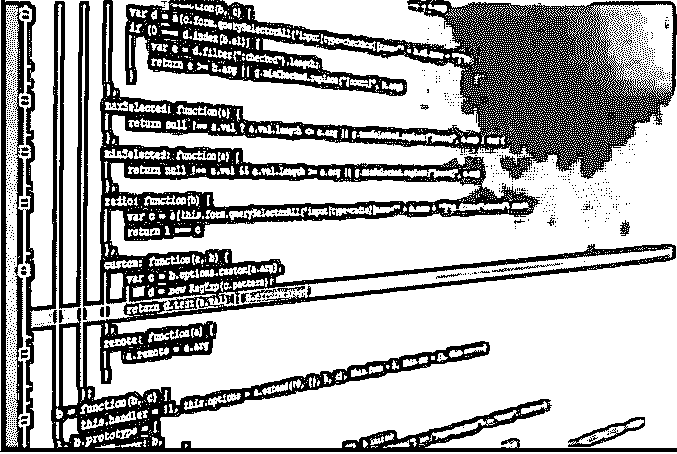
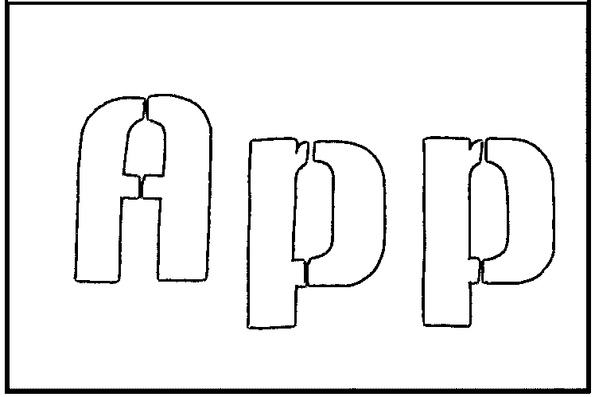
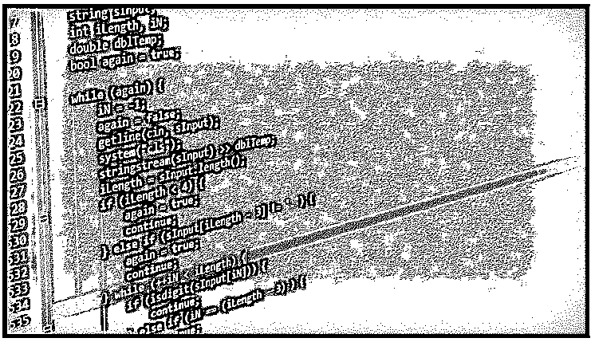
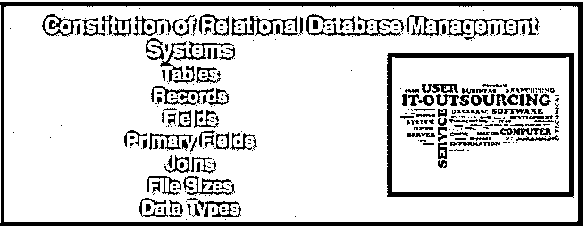
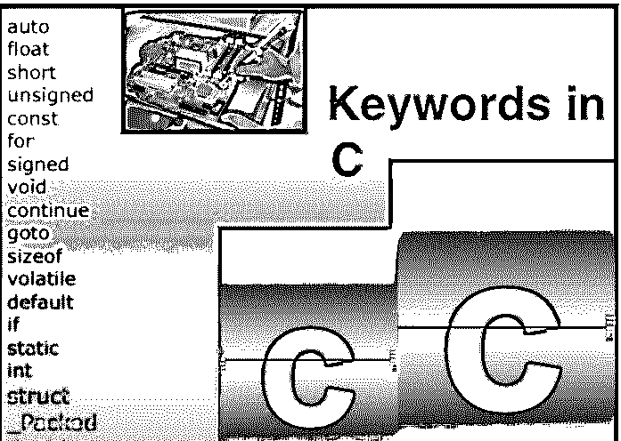
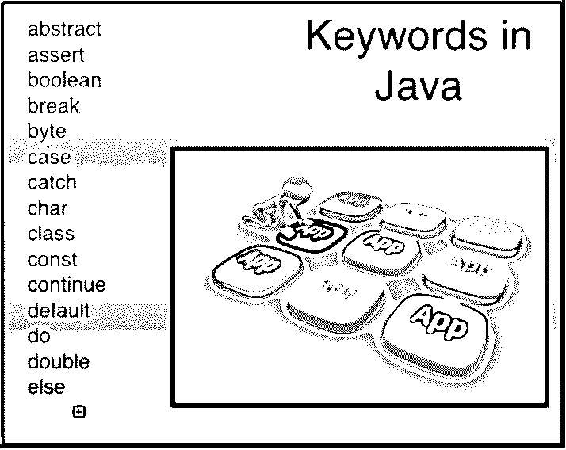
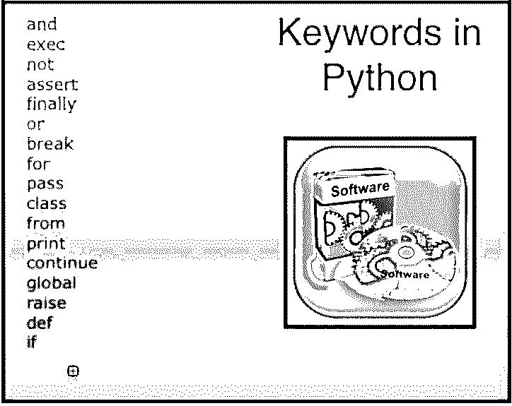
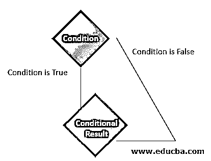

# 计算机程序语言

> 原文：<https://www.educba.com/computer-programming-language/>

## 计算机编程语言导论

一直想知道更多关于代码编程，但缺乏时间？如果你的源代码知识有差距，这本关于源代码计算机程序的终极备忘单将指导你如何弥补它们。计算机编程语言包括理解从编程环境到相关变量的一切。如果你掌握了编程技巧，你就能成为虚拟世界中真正的英雄。因此，为初学者学习计算机编程，获得在网络世界取得成功所需的技巧和诀窍。

### 计算机编程语言中的源代码是什么？

这是使用计算机编程语言编写的指令序列，通过计算机执行特定的任务。那么，人类语言和计算机语言有什么区别呢？嗯，这就是现实世界和虚拟世界的区别。计算机程序指令的介绍被称为课程代码。

<small>网页开发、编程语言、软件测试&其他</small>

它被称为程序源代码。没有程序的计算机就像没有糖的咖啡或者没有太阳的早晨。计算机程序可以有两到几百万行指令。就像人类世界有几种语言一样，也有几种计算机编程语言如 [Python](https://www.educba.com/software-development/courses/python-certification-course/ "Python Training Course Bundle") ，C++，Java，C， [Perl](https://www.educba.com/course/perl-programming-training-course/ "PERL Training Course") ，PHP，Ruby。

有数百种不同的编程语言。所以如果你想说多种语言，虚拟世界是一个完美的地方。

### 让虚拟成为现实:计算机程序能做什么

从电影到医学，从国防到农业，从娱乐到通讯，计算机程序几乎被用于每个领域。常用的一些不同的计算机程序包括 MS Word、Internet Explorer 和 Adobe Photoshop。此外，计算机程序被用于从医疗检查到语音通信的一切事情。

### 电脑程序员:机器背后的人

计算机程序员是写计算机程序或执行计算机编程的人。不同的程序员在许多类型的计算机编程语言中都有不同的专业知识。

### 算法:计算机编程语言的全部

就计算机编程语言而言，解决问题或算法的逐步过程起着核心作用。一个[算法](https://www.educba.com/learning-algorithms/ "Best Programming Languages for Algorithms")是一组有限的定义明确的指令，计算机程序员在拿出实际代码之前构建算法。

 

编写计算机算法有标准化的方法。

### 计算机编程语言的要素:语言的语法

计算机编程语言的要素如下。

#### 计算机编程环境

在任何编程语言中，要学习的最重要的东西是环境设置。这是编程的基础。安装在个人电脑上将用于编写数据，编译和执行程序。

 

开始使用任何编程语言的设置包括文本编辑器、编译器和解释器。文本编辑器用于创建计算机程序，而编译器将程序转换成二进制格式。为了直接执行程序，需要一个解释程序。文本编辑器的例子包括记事本++ 、文本编辑和 BBEdit。诸如 Java、Pascal 和 C++之类的编程语言需要在开始编程之前安装它们的编译器。

某些编程语言，如 Python、Perl 和 PHP，不需要编译成二进制格式。解释器可以逐行读取程序，直接执行程序，无需进一步转换。

### 基本语法:计算机编程语言的基础

 

单行计算机程序很容易编写。然而，执行复杂的程序需要复杂的编码。不同的语言在句法方面有所不同。例如，每一个 C 程序都以 main 函数开始，并被括在大括号中。大括号内的编码部分被称为程序体。

函数是用于执行特定任务的小程序单元。c 编程提供内置函数。在某些程序设计语言中，子程序被用来代替函数。注释是用来使程序易于理解的特性，你可以用任何你想用的语言来写。除了用于准备编程语句的可打印字符之外，程序中还有空格、制表符和换行符。空白字符在所有编程语言中都很常见。

大多数编译器会忽略空行或包含空白和注释的行。每个单独的语句都以特定的方式结束；例如，C 程序的单个语句以分号结束。

### 程序如何工作:一步一步的过程？

 

*图片来源:pixabay.com*

一个程序以复杂的方式工作。例如，C 程序使用 C 编译器将命令转换成二进制格式[。创建并执行名为 demo 的二进制文件。和其他语言一样，如果你不遵守规则。有一个语法错误。出现这样的错误后，程序将不会被编译。](https://www.educba.com/best-c-compilers/)

### 数据类型:计算机程序的构建模块

数据类型表示可以使用计算机程序处理的数据类型。范围从数字到字母数字、十进制等等。当编写一个计算机程序来处理不同类型的数据时，应该清楚地说明它的类型，以确保计算机理解如何处理不同的数据。关键字是可以由数据类型表示的值范围。

 

*图片来源:pixabay.com*

原始数据类型可用于构建更复杂的数据类型，即用户定义的数据类型。有些编程语言不需要关键字来指定数据类型，因为它们足够智能，可以自动处理给定的数据类型。Python 就是这种语言的一个例子。

### 变量:编程成功的三步之路

变量:为计算机内存位置提供的名称，用于存储计算机程序中的值。首先，您必须创建具有适当名称的变量，然后将值存储在这两个变量中。接下来，从这些变量中检索和使用存储的值。创建变量的另一个名称是声明变量。根据使用的编程语言，在程序内部创建变量有不同的方法。

### 变量的特征

一个变量只能保存某种类型的值。例如，如果变量被定义为 int 或 char 类型，那么它只能存储整数或字符。c 编程语言需要创建变量，而 Python 不需要。因此，游戏的规则是不同的，这取决于所使用的计算机编程语言。

1.  Python、Perl 和 PHP 等编程语言在创建变量时不需要指定数据类型。
2.  变量可以有任何名称或标签。
3.  很少有编程语言允许变量名以数字开头。

一旦创建了变量，就可以在这些变量中存储值。使用变量中存储的值是整个练习的目的。在 C 编程中，可以使用不同的百分比和字符打印不同的数据类型。

 

 

各种编程语言提供了不同的保留关键字集。它们唯一共同的规则是保留关键字不能用于命名变量。

 

### 连接这些点:运算符

计算机编程语言中的运算符是一个符号，它通知编译器/解释器进行特定的数学、关系或逻辑运算，并产生最终结果。

### 加起来就是:算术运算符

这些用于数学计算。算术运算符包括加、减等运算以及执行这些运算的操作数或值。

### 关系运算符=布尔结果

关系表达式是用来产生布尔结果的符号，这意味着结果要么为真，要么为假。

### 逻辑运算符:与、或、非

逻辑运算符有助于根据特定条件创建决策，并且可以将条件的结果组合起来以产生最终结果。有三种基本类型的运算符:And、Or 和 Not。

### 决策:选择正确的选项

正如在现实生活中一样，在虚拟世界中，决策也涉及到根据某些给定的条件选择一个选项。a；编程语言使用基于以下途径起作用的条件或决策语句:

不同的编程语言提供不同类型的决策语句。例如，在 C 编程语言中，当必须在两个选项中选择一个时，使用 if…else 语句。另一种可替代 if 语句的语句类型是，必须测试变量是否与某些值相等，其中每个值称为一个 case。为每个开关情况检查打开的变量。使用中断语句终止开关[。](https://www.educba.com/break-statement-in-python/)

### 一圈又一圈，一圈又一圈，循环往复

循环用于执行一个或多个语句一定(n)次。高级计算机编程语言的真正标志是它使用各种循环。使用这种有效的技术重复执行语句是非常有益的。

有不同种类的循环，如 while 循环、do 循环等。while 循环，仅举几个例子。在循环中遇到 break 语句来终止它，程序控制转到下一条语句。

### 数字游戏:从简单的整数到浮点

 

每种计算机编程语言都支持不同种类的数字，例如简单的整数、浮点数等等。某些编程语言具有内置的数学函数，如 c。其他语言如 Python 将数字分为不同的类型，如 int、long、complex 和 float。

### 人物:扮演重要角色

这很容易通过字符类型变量中分配的字符来实现。记住字符数据类型可以消耗 8 位内存是很重要的。在许多编程语言中，一些字符通过转义序列具有特殊的含义。

### 数组:数据类型的集合

几乎所有基本的计算机编程语言都有一个称为数组的概念，数组是一种数据结构，可以存储单一数据类型的固定大小的元素集合。数组可以被看作是一种变量的集合。

数组包含连续的内存位置，低位地址等于第一个元素，高位地址等于最后一个元素。有一维数组。通过索引数组名来访问元素。

### 串联:存储多个字符

如果需要在一个变量中存储多个字符，就使用字符串。C #中的字符串表示为字符数组。Java 等高级编程语言提供了一个字符串作为内置数据类型，因此字符串可以在这里直接定义为字符数组。

### 功能:行动胜于语言

功能是一组有组织的、可重用的代码，用于执行单个相关的活动，并为应用程序提供更好的模块化。它们还增加了代码的可重用性。

### 一个角色，多个名字

1.  在计算机编程语言中，函数被称为过程、方法、子程序和其他类似的标签。
2.  在 c 语言中，函数由头和体组成，在 Java 语言中，编程被命名为方法。

### 文件输入输出:计算机程序设计语言的基础

计算机文件用于以数字格式存储数据，例如图像数据、纯文本或任何其他此类内容。根据所使用的计算机编程语言，计算机文件具有不同的扩展名。文件输入或我们写入文件的数据转化为输出或从文件中读取的内容。

### 结论

有许多不同种类的编程语言，包括 Objective C、C++、C 和 Java 等等。在选择特定的开发语言时，要记住的第一点也是最重要的一点是应用程序需求的性质，即它是基于 web 桌面还是基于移动应用程序。此外，开发人员应该考虑接受该语言的市场的性质以及特定语言的学习曲线。

开发人员的理想目标应该是精通基于网络的语言以及基于桌面和移动平台的语言，以便在虚拟世界中编写历史。编程代表了一个神奇的过程，通过它虚拟的命令产生真实的结果。在虚拟世界中，即使是分号也有含义，就像任何人类语言一样。然而，只有你的编程语言的限制定义了你在虚拟现实中的世界的限制。

### 推荐文章

这是一本计算机编程语言指南。在这里，我们还讨论了计算机编程语言的各种基础知识，如循环、数据类型等。您也可以看看以下文章，了解更多信息–

1.  [Linux vs Ubuntu](https://www.educba.com/linux-vs-ubuntu/)
2.  [R 编程职业](https://www.educba.com/careers-in-r-programming/)
3.  [编码 vs 编程](https://www.educba.com/coding-vs-programming/)

