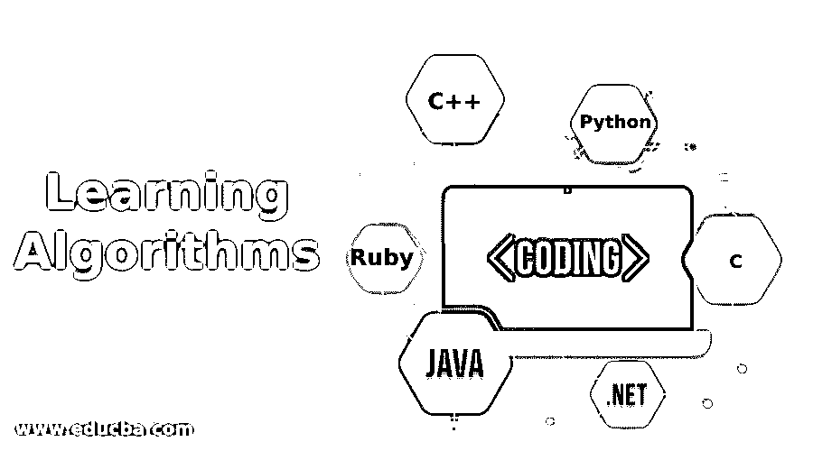

# 学习算法

> 原文：<https://www.educba.com/learning-algorithms/>

## 学习算法简介

所以，在我开始讲述语言和它们的算法面具之前，让我们先了解一下什么是算法。你可能在电影中听说过，尤其是像《剑鱼》这样的电影或任何其他想要黑客的电影，在这些电影中，黑客会说这样的话，如果我去改变算法，添加等等等等，那么我就能黑进中情局之类的东西。但这是相当胡言乱语。没有那种东西。学习[算法](https://www.educba.com/algorithms-and-cryptography/ "Algorithms and Cryptography")不仅仅是为了黑客。

首先，算法只是数据结构。它们是一种做事的方法或方式，更可能是解决算法问题。还是很困惑，那我就用更简单的方式来说吧。把算法想象成公式的。可以帮助你毫不费力地完成任务的公式。类似于以下内容:

<small>网页开发、编程语言、软件测试&其他</small>

**(a+b)2= a2+2ab+b2**

但是这些都很简单。适当的算法比仅仅(a+b)有用得多。这些算法被用于银行，但不仅仅是为了安全之类的，而是无处不在。假设你在银行开户。你在里面放入 X 元钱，想知道你会得到多少利息。

银行的会计会把金额、期数和利率这些数字放在软件的一个盒子里。算法软件运行并给你输出。算法计算出这个输出…这段代码已经有了计算利息的公式。在我们的例子中，单利是:

**A = P (1 + rt)**

A =金额

P =本金

R =利率

T =时间或 n

现在，最有可能的是，你一定对什么是算法有了一个概念。记住，如果你是编程初学者，它不会也永远不会与函数和算法混淆。两者是两回事。如果你有任何困惑，就把它们清除掉，然后再继续。

### 语言、数学和算法

记住几件事，当你想写更好的算法时，理解算法数学是最重要的。牢不可破或防错的算法也是如此。这些被称为牢不可破的学习算法只是纯数学的代码片段，没有所需的部分就不会解决问题。我们举个例子: **a + b = 20**

我们假设这里 a 是 5。现在，如果我知道 a 是 5，那么这个算法很容易被破解。但是然而，如果我连 a 是什么都不知道，那么我还是有可能破解这个算法的。破解的方法就像我会蛮力破解一样。蛮力意味着尝试每一种可能的组合。所以我要做的是开始猜测数字，比如 1+19，2+18，3+17，10+10 等等。所以，现在这两件事都会发生。

第一种可能性是，由于上述所有组合给我的答案都是 20，所以它们都可以破解这个算法。但是，如果程序员将它硬编码为只接受 5+15，那么所有的组合都不会工作。但是，由于我正在尝试所有可能的组合，所以有一段时间我会尝试 5+15，这将破解算法。

同样，程序员可以尝试保持有限的尝试次数和更多的安全结构，但即使这样，我们也有很多工具来绕过它。

### 牢不可破的学习算法还是神话？

所以，问题是是否有任何东西被称为牢不可破的算法，或者它只是一个神话。答案是两者都有。我最近在网上读了一些东西，在那里我读到了一句名言:

***“不可能只意味着一个人没有试过所有的办法。”*T3】**

是啊。算法就是这样工作的。就拿上面这个案例来说吧。让我们假设有另一种算法:

**a + b + c + d + e + f = (-9)**

是的。这就是你如何编写一个无法破解的算法。事情是这样的，一台像样的电脑配一个好的显卡，用 oclhashcat 就能轻松破解这个。但这只是一个例子。这里的组合可以是任何形式。答案是负九，这意味着在 a、b、c、d、e 和 f 中，几个负数至少是一个大数被一个小数减去。

这让我回到我们的第一个算法例子 *a + b = 20。*即使在这里，也可以有很多像-1+21 或-29354+ 29374 这样的组合。明白我的意思了。因此，[无法破解的算法](https://www.educba.com/what-is-an-algorithm/)的理论只能到人类大脑所能想到的程度。无法破解的算法不是神话。一个写得很好的算法即使被计算机破解也需要 2-3 个月甚至更长时间，就像 WPA2 加密的东西一样。

问题是，一个人必须有耐心保持心理平静，直到问题得到解决。根据数学，不存在无法破解的算法。只是需要有人真正对它感兴趣。

### 编写算法的最佳语言

坦率地说，官方并没有一种特定的语言能够高超地编写算法。函数式语言占了上风；然而，原因是它们在计算和数学方面比其他面向对象语言优越得多。但是，我只是列举了一些算法，我觉得这些算法足够好，可以用来编写数学代码:

#### 1.Python 和 Ruby

首先，我会推荐高级语言。高级语言最容易掌握。这些语言更容易，因为不像 C 或任何其他低级语言，这些语言在阅读方面更容易。

甚至它们的语法也非常简单，即使没有人教，初学者也能理解。这些语言中所有常见的数据结构都有抽象。您甚至可以构建自己的实现版本，并在数据结构上构建数据结构。这些语言是动态输入的。

但是这里只有一个问题，对于程序员来说开始可能更容易，但是当他们运行测试时，他们可能会看到很多在运行之前没有看到的错误，不像其他低级语言。

#### 2.c 语言

c 在这里和 [Python](https://www.educba.com/software-development/courses/python-certification-course/ "Python Training Course Bundle") 正好相反。在这里你可能会感到困惑，因为尽管 C 是一种高级语言，但由于它的编码方法，有些人甚至认为它是一种低级语言。这里就抽象而言，即使是 C 也是非常好的。如果你对算法感兴趣，在以后的某一天，你可能需要学习适当的低级语言，比如汇编语言。

关键是，如果你非常了解 C，从 C 或任何类似类型的语言移植到汇编语言是非常容易的。内存管理在 C 中也是非常好的，这一点对于算法来说非常重要。

#### 3.Java 程序

很多人实际上讨厌 Java 过于冗长和严格。甚至有些人说它缺少现代复杂语言中的许多特性。但这实际上并不值得关注。

与 Python 不同，Java 不是动态类型语言。它是一种静态类型的语言，有大量的垃圾收集。这意味着 Java 实际上会在编译期间甚至在运行之前显示错误。与其他高级语言相比，Java 具有极低的内存泄漏，这显然是可以修复的，并且没有分段错误。

#### 4.C#和 C++

C#和 Java 差不多。它更像是具有现代语言功能的 Java。有些人甚至喜欢用 C++。但这是极其不必要的复杂。有些人使用它是因为它很难理解，但一旦你设法破解了它，人们将很难理解你的[算法，这使得它非常适合工作](https://www.educba.com/algorithm-in-programming/)。另一方面，C#有类似于 Java 的垃圾收集。

还有其他函数式语言，比如 Haskell (Lisp 家族)和 Scala(基于 Java)。你可以看看我其他的博客，我在上面详细写了他们是如何工作的。Java、C 和 C++都运行在一个或另一个虚拟机上。而 Ruby 和 Python 是它们解释器上的解释器。

如果你问我，我会更喜欢 C#，因为它有所有现代的功能，而且更容易移植到低级编程语言。用科学术语来说，它具有 Java、Scala、C 和更低级语言的属性。如果您只是想从算法开始，您可能会考虑使用 visual studio community edition 或 Visual studio express。你可能不得不购买，除非你想要的大部分东西在 python 中都是免费的。

### 推荐文章

这里有一些文章可以帮助你获得更多关于学习算法的编程语言的细节，所以只要浏览一下链接就可以了。

1.  [算法面试问题](https://www.educba.com/algorithm-interview-questions/)
2.  [算法和密码学](https://www.educba.com/algorithms-and-cryptography/)
3.  [数据结构和算法 C++](https://www.educba.com/data-structures-and-algorithms/)
4.  [数据结构与算法面试](https://www.educba.com/data-structures-and-algorithms-interview-questions/)

