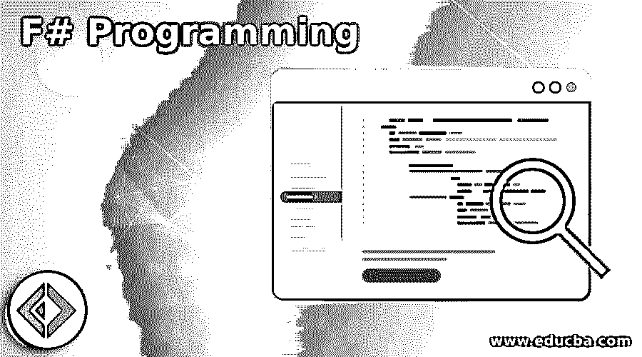

# F#编程

> 原文：<https://www.educba.com/f-sharp-programming/>

## F#编程简介

F#是一种函数式编程语言，允许快速编写准确且可维护的代码。F#编程主要包括定义自动简化的表单和函数。这有助于您将注意力集中在问题区域的编程信息上，并操作其数据。对于微软研究团队开发的. NET 平台来说，F#是一种现代函数式语言。该版本自 2005 年开始开发，并于 2013 年 12 月发布了 3.1 版。它最初是一个学术研究项目。多年来，它已经发展成为一种生产就绪语言，许多企业特别是金融业使用这种语言。

### F#编程的特点

*   许多人声称 F#是最不受欢迎、最被低估和最缺乏代表性的编程语言之一。但是这个故事有不同的一面。StackOverflow 视需要而定。全球薪资最高的语言被选为 F#。
*   F#有利于数据和基于域的增长。F#非常有用。它现在也可以被转换成世界上最常见的语言，JavaScript。它还可以通过这个受保护的连接访问大量的 JavaScript 库和设备库。
*   在人工智能、机械学习和相关数据分析领域，F#已经崭露头角。这正是制作 F#的目的。由于巨大的规模和预期，人工智能将在广泛的语言环境和技术中发挥强大的作用，这些语言环境和技术与 it 领域的发展非常匹配，以至于 JavaScript 和 Python 等通用语言可以在未来迅速发展并形成挑战。

### F#的优势

C#有一个负面的功能，它要求使用空值而不是假象。这是容易植入和难以检测的小故障的原因。为了解决这个难题，在整个代码中增加了可读性更差的检查。

<small>网页开发、编程语言、软件测试&其他</small>

#### 1.代数数据类型

F#完全提升了 ADT，帮助组织在数据结构方面得到更精确的定义，减少了误解的可能性，提高了编码的一致性。基本上，在 F#中，不必要的情况可以通过使它们不可呈现来避免，简单地通过不允许编写不正确的源代码来避免。

#### 2.转变和突变

F#支持使用转换而不是突变。实体在转换中不会改变，因此条件也不会改变。它只是构建一个新的对象，并保持现有的不变。这意味着该实体在出生时仍将以单一状态交付。当只处理一个条件时，它极大地简化了创建过程，这减少了代码量，因此一旦我们看到一个实体，它就处于唯一可能的状态，并且在没有额外测试的情况下使用它是安全的。

#### 3.简洁的语法

F#提供了一个复杂的推理风格方案，从如何使用某些值来推断值类型。因此，在大多数情况下，代码中的类型将被省略，以便 F#可以被识别。为了最大化效率和促进代码维护，必须提供更少的发现。有些人认为语法 F#更容易阅读，也更优雅。

### F#的缺点

下面给出了 F#的缺点:

#### 1.命名更具挑战性

F#没有 C#对于方法的重载特性。所以存储在同一个模块中的两个 F#函数不能同名，这样就无法命名。在 F#中，想出一个清晰的命名约定是一件困难的事情。

#### 2.更复杂的数据结构

更复杂的数据结构包括使用转换-变异方法的有效操作。例如，将使用 F#中的二叉树来代替 C#中的哈希表。大量使用 zippers 代替迭代器是另一个例子。

#### 3.不太先进的工具

微软花了很多钱让 C#程序员成为合适的工具。可悲的是，没有那么多的 F#资源让编码变得不那么方便。F#没有重构的基本方法。

### 结论

F#已经剥夺了它们最好的特性，把它们留在了危险之中。这就是 F#代码更安全、更容易保存的原因。尽管某些类别的项目中 F#是个坏主意，但是那些必须高度估计和利用数据的项目肯定应该被考虑。Fpotential #比 C#更有效地代表市场挑战，这使它成为一个理想的服务器端应用程序。

### 推荐文章

这是一个 F#编程指南。这里我们分别讨论 F#的介绍、特点、优缺点。您也可以看看以下文章，了解更多信息–

1.  [是什么。网络核心](https://www.educba.com/what-is-dot-net-core/)
2.  [什么是 IDE？](https://www.educba.com/what-is-ide/)
3.  [纱线卷装经理](https://www.educba.com/yarn-package-manager/)
4.  [C#字符串函数](https://www.educba.com/c-sharp-string-functions/)

