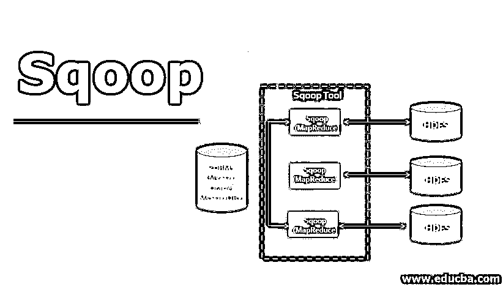
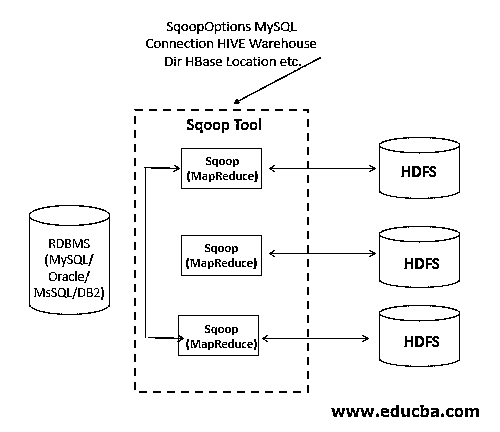

# Sqoop

> 原文：<https://www.educba.com/sqoop/>

## 什么是 Sqoop？

以下是 sqoop 的基本要点:

*   它用于在 HDFS 和关系数据库服务器之间传输大量数据。
*   它用于将数据从 RDBMS 导入 Hadoop，以及将数据从 Hadoop 导出到 RDBMS。
*   它使用 Map Reduce 进行导入和导出操作。
*   它还在导入和导出过程中使用命令行参数。
*   还支持 [Linux 操作系统](https://www.educba.com/what-is-linux/)。
*   它不是群集服务。
*   名称“Sqoop”来自“SQL”和“Hadoop”，意思是 SQOOP 的前两个字母，即“SQ”，来自 SQL，后三个字母，即“OOP”，来自 Hadoop。
*   Sqoop [总是需要“JDBC”](https://www.educba.com/what-is-jdbc/)和“连接器”。这里的 JDBC，即[、MySQL](https://www.educba.com/what-is-mysql/) 、Oracle 等。以及 Oraoop 或 Cloudera 等连接器。
*   对于 Sqoop 的安装，您需要一个“二进制 Tarball”。

<small>Hadoop、数据科学、统计学&其他</small>

### 完成 Sqoop 操作的步骤

下面是执行 sqoop 操作的步骤，如下所示:

*   **第一步** **:** 向 RDBMS 发送请求，发送关于表的元数据信息的返回(这里的元数据是关于数据的数据)。
*   **第二步** **:** 从收到的信息中，它将生成 java 类(使用 JDBC 和连接器)。
*   **第三步:**现在 Sqoop，post 编译，创建 jar 文件(Java 打包标准)，这将有助于使用数据进行我们自己的验证。

### 我们为什么需要 Sqoop？

以下是独家新闻的一些需求:

*   Apache Sqoop 可以通过一个命令来处理全部负载，我们可以称之为具有全部负载能力的 Sqoop。
*   它还具有递增的负载功率；您可以只加载更新的表的路径。
*   它使用 Yarn 框架来导入和导出数据，这在并行性之上提供了容错能力。
*   您可以通过指定压缩代码参数来压缩数据；简而言之，Sqoop 也用作压缩。
*   它具有高度的 Kerberos 安全性集成。
*   您可以使用 Sqoop 直接将[数据加载到 HIVE](https://www.educba.com/what-is-a-hive/) 中。
*   它是 RDBMS 和 Hadoop 之间的最佳媒介。
*   它易于理解，结构简单。

### Sqoop 是如何工作的？

这是勺子的工作原理，如下所示:

*   [Sqoop import 命令从 RDBMS 导入](https://www.educba.com/sqoop-import/)一个表到 RDBMS 在 HDFS，RDBMS 表中的每条记录都被视为一条单独的记录。记录可以存储为文本文件，我们将从 HDFS 得到相同的结果，我们可以得到 RDBMS 格式的结果，这个过程称为导出表。
*   它向关系数据库发送请求，以发送关于表的元数据信息的返回(这里的元数据是关系数据库中关于表的数据)。
*   Sqoop job 创建并保存导入和导出命令，以便进行处理，从而获得更好的结果，为我们提供准确的结果。
*   它指定参数来识别和调用保存的作业，这有助于创建点对点的相关结果。
*   在增量导入中使用了重新调用或重新执行，这可以将更新的行从 RDBMS 表导入到 HDFS，反之亦然，这意味着 HDFS 到 RDBMS 表，该方法被调用为导出更新的行。

### Sqoop 导入和导出

有两种类型的勺子，如下所示:

#### 1.Sqoop 导入

*   您有一个带有整数主键的数据库表。
*   您只是追加新行，并且需要定期将表的状态同步到 Hadoop，以便进一步处理。
*   通过指定–incremental 参数激活 Sqoop 的增量特性。
*   该参数的值将是增量导入的类型。当您的表只获取新行，而现有行不变时，请使用 append 模式。
*   Sqoop import 命令将表[从 RDBMS](https://www.educba.com/what-is-rdbms/) [导入到 HDFS](https://www.educba.com/what-is-hdfs/) 。在 HDFS，表中的每条记录都被视为一条单独的记录。记录可以存储为文本文件，或者以二进制形式存储为 Avro 或 SequenceFiles。

`Sqoop import --connect --table --username --password --target-dir`

**语法:**

`sqoop import \
--connect jdbc:mysql://mysql.example.com/sqoop \
--username sqoop \
--password sqoop \
--table visits \
--incremental append \
--check-column id \
--last-value 1`

*   用于从表中导入选定的数据。

`sqoop import --connect --table --username --password --columns –where`

*   用于从查询导入数据。

`sqoop import --connect --table --username --        password –query`

#### 2.Sqoop 导出

这是我们在下面给出的 sqoop 导出中使用的查询:

`sqoop-export--connect --username –password --export-dir`

### Sqoop 的优点和缺点

下面给出了 sqoop 的优点和缺点:

*   您需要限制对密码文件的访问。Sqoop 作业将以运行–exec 操作的用户的权限执行，而不是以创建已保存作业的用户的权限执行。您可能需要在两个用户之间共享该文件。
*   它使用元数据结构，即元数据只不过是关于可以不加密的数据的数据。在未来，它可能不太安全，任何人都可以轻松地检索您保存的密码。因此，如果您有一台用户访问权限非常有限的专用机器，这种方法可能是可行的。

### 这项技术对职业发展有何帮助？

使用这项技术，职业发展包括以下几点:

*   它只不过是两个实体之间的中间媒介之一。借助于它，我们可以通过高度安全的信任将我们的数据从一个地方转移到另一个地方。对于任何任务，每个人都希望信任和易于使用的语言，任何人都可以处理和理解，并可以应用它的概念来获得更好的结果。
*   由于它使用纱线概念进行处理，因此可以很清楚地对任何类型的数据进行测试。
*   它通过在不丢失任何数据的情况下给我们提供适当的结果来帮助职业发展，并且可以与任何环境混合，例如 Linux 、Yarn、连接器、命令、JDBC、Java。
*   最重要的是，Java 是一种众所周知的语言，它使用 JDBC 和它的连接器来处理输出，这样我们将在任何导入和导出字段结构的末尾得到适当的结果。
*   总的来说，现在只使用一行 import 和 export 语句来处理大量数据是一项要求很高的技术。

### Sqoop 的使用

下面给出了 Sqoop 的一些用法:

*   它是一种基本的、非常容易理解的语言，对于在不丢失任何数据的情况下将大量数据从一个地方转移到另一个地方非常有用，这基本上称为通过导入和导出数据。Sqoop。
*   它主要基于 [SQL 和 Hadoop](https://www.educba.com/sql-vs-hadoop/) ,并采用了它的后缀和前缀，因此我们将其命名为 SQOOP。
*   它有一些专门的连接器，可以用来访问本地文件系统中的数据。
*   Sqoop 的一个显著优势是它能够处理所有主要和次要的数据库系统以及企业数据仓库。
*   它是一个命令行工具，可以从任何 shell 实现中调用，比如 bash。
*   它还支持 Linux 操作系统，非常容易处理任何操作。
*   在每次成功的增量作业后，它会自动将最后导入的值序列化回 Metastore。

### 结论

从所有这些内容中，我们可以得出结论，Sqoop 只不过是一个“OLA”应用程序，RDBMS 使用它将自己的数据集传输到特定的本地，即 Hadoop，它使用非常安全和值得信赖的方法来处理其结果。

### 推荐文章

这是一个 Sqoop 的指南。在这里，我们讨论完成 sqoop 操作的步骤，为什么我们在 Hadoop 中需要 sqoop，以及 Sqoop 的优缺点。您也可以阅读以下文章，了解更多信息——

1.  [Hadoop 调度程序](https://www.educba.com/hadoop-schedulers/)
2.  [大数据分析软件](https://www.educba.com/big-data-analytics-software/)
3.  [什么是阿帕奇](https://www.educba.com/what-is-apache/)
4.  [什么是阿帕奇雄猫？](https://www.educba.com/what-is-apache-tomcat/)

