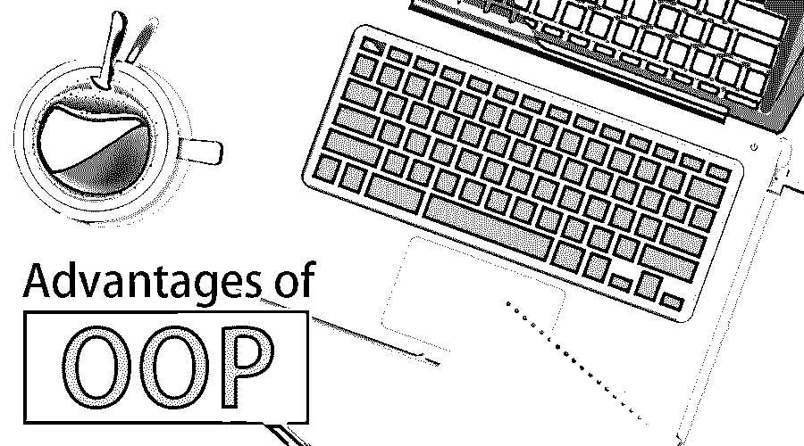

# 面向对象的优势

> 原文：<https://www.educba.com/advantages-of-oop/>

## OOP 是什么？

OOP ( [面向对象编程](https://www.educba.com/object-oriented-programming-in-java/))是一种完全基于‘对象’的编程范式。为了更好地理解,“物体”的一般解释——A 先生要用积木搭建一个罐子。默认情况下，块是一种测量单位，如高度、半径和形状。默认情况下，这些属性都在那里，这意味着如果您使用一个块，它有一些相关联的尺寸。现在，其他一些重要的属性还没有分配，比如颜色、材料和价格。所以，物体无非就是锅。我们通过在需要的时候给属性赋值来构建一个对象。块不过是对象的模板。在那里，我们写下对象应该如何吸引人(意思是看起来像)以及动作将如何发生。在 Java 中，我们称之为类。

### 面向对象的优势

谈到 OOP 的优势，我们想说有很多，因为这是被广泛接受的核心开发方法之一。让我们来看看面向对象编程给用户带来了什么好处。

<small>网页开发、编程语言、软件测试&其他</small>

#### 1.可重用性

这意味着重复使用一些设施，而不是一次又一次地建造它们。这是通过使用类来完成的。我们可以根据需要使用它 n 次。

#### 2.数据冗余

这是在数据存储位置(你可以说是数据库)创建的一个条件，其中相同的数据保存在两个不同的位置。所以数据冗余是 OOP 的最大优势之一。如果用户希望在多个类中有相似的功能，他/她可以为相似的功能编写公共的类定义并继承它们。

#### 3.代码维护

这个特性对于任何编程语言来说都是必不可少的；它从多方面帮助用户进行返工。通过合并新的变更来维护和修改现有的代码总是很容易和省时的。

#### 4.安全性

通过使用数据隐藏和抽象机制，我们过滤掉了有限的暴露数据，这意味着我们维护了安全性并提供了必要的数据供查看。

#### 5.设计优势

如果你在 OOPs 上练习，用户将会得到的设计好处是在设计和修复方面很容易，并且消除了风险(如果有的话)。在这里，面向对象的程序迫使设计者有一个漫长而广泛的设计阶段，这导致更好的设计和更少的缺陷。当程序达到某个临界极限一段时间后，单独对所有非面向对象的程序进行编程就更容易了。

#### 6.更高的生产率

鉴于上述事实，使用该应用程序肯定会提高其用户的整体生产力。这导致做更多的工作，完成一个更好的程序，有更多的内置功能，更容易阅读，写作和维护。一个面向对象的程序员可以拼接新的软件对象来制作全新的程序。大量功能丰富的函数库使这成为可能。

#### 7.简单的故障排除

让我们见证一些开发人员在工作中面临的常见问题。

*   这是 widget 文件的问题吗？
*   问题出在捕鲸者身上吗？
*   我需要费力地浏览那个“sewage.c”文件吗？
*   评论所有这些与代码相关的问题。

所以，很多时候，有些地方出错了，这对于开发人员来说是一次头脑风暴，看看错误在哪里。放松点。用 OOP 语言工作，你会知道去哪里找。这就是[在 OOP 中使用封装](https://www.educba.com/abstraction-vs-encapsulation/)的优势；所有的对象都是自我约束的。有了这种模态行为，IT 团队获得了很多工作上的好处，因为他们现在能够同时处理多个项目，并且没有代码重复的可能性。

#### 8.多态性灵活性

让我们看一个场景来更好地解释这种行为。

如果这个地方或周围发生了变化，你会有不同的表现。一个人在市场上会表现得像一个顾客，同样的人在学校会表现得像一个学生，在房子里会表现得像一个儿子/女儿。这里我们可以看到，同一个人在每次环境改变时表现出不同的行为。这意味着多态性是灵活的，并在许多方面帮助开发人员。

*   这很简单
*   展开性

#### 9.解决问题

将一个复杂的问题分解成更小的块或离散的组件是一个很好的实践。OOP 擅长于这种行为，因为它将[你的软件代码](https://www.educba.com/hardware-vs-software/)分解成小块——一次一个对象。损坏的组件可以在不同的其他问题(或简单或复杂)的解决方案中重用，或者它们可以被与具有实现细节的相同接口相关的未来模块替换。

一个通用的[可关联实时场景](https://www.educba.com/real-time-analytics/)——在高层次上，一辆汽车很快就可以分解成车轮、发动机和底盘。这些组件中的每一个都可以进一步分解成更小的原子组件，如螺钉和螺栓。发动机的设计不需要知道任何关于轮胎尺寸的信息，以提供一定量的功率(作为输出)，彼此之间没有什么关系。

### 推荐文章

这是 OOP 优势的指南。这里我们讨论什么是 OOP 以及 OOP 的优势。您也可以阅读以下文章了解更多信息:

1.  [编程语言 vs 脚本语言](https://www.educba.com/programming-languages-vs-scripting-languages/)
2.  Javascript 区分大小写吗？
3.  [CSS 是否区分大小写](https://www.educba.com/is-css-case-sensitive/)
4.  [Java 回调函数](https://www.educba.com/java-callback-function/)

