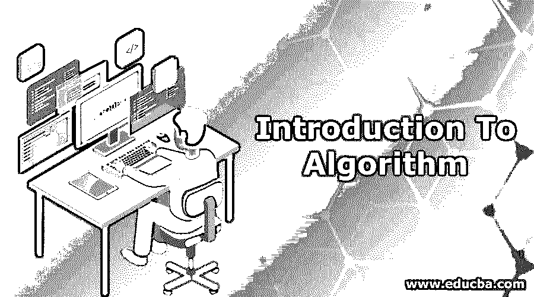

# 算法介绍

> 原文：<https://www.educba.com/introduction-to-algorithm/>

## 算法介绍

在本主题中，我们讨论了算法的介绍，它代表了解决任何问题的方法。理解一个普通人如何在日常生活中到处应用算法来完成任何工作是至关重要的；很常见。有效地完成工作是非常必要的。假设一个农民在市场上卖了一种作物，赚了一些钱；许多情况下，农民会考虑利润丰厚的最佳方法。

农民将检查市场价格、市场规模、需求-供应，农民还将考虑如何出售每公斤或每公担的作物以获得更多利润。这里，农民还应用一些逻辑和算法来完成工作以获得更多利润。这些想法来自相同或其他农民所面临的经验和挑战。用技术术语来说，如果我们谈论任何没有任何算法的编程语言，就不可能写出任何有效的逻辑。

<small>网页开发、编程语言、软件测试&其他</small>

在用任何编程语言编写任何逻辑之前，我们应该考虑以下事情。

*   **程序的正确性**:在任何条件下，你的输出都应该是正确的；在应用任何算法之前，确保你的输出是百分之百正确的；否则，算法或者你的程序就没有任何意义。
*   **时间**:时间在任何地方都是至关重要的；你只需要关心你的算法完成这项工作需要多少时间。
*   **复杂度:**你的算法在逻辑上，花费的时间上，完成工作所用的内存上，有多复杂？

### 算法的组件

正如我们在前面的算法介绍中所讨论的，它有不同的组成部分，在不同的情况下各不相同。

通常，算法包括四个部分:

#### 1.输入或反馈

正如我们所知，算法是为了得到某种输出而遵循的一系列步骤；我们需要为算法提供一些输入；日常生活中的一个很好的例子是，当我们需要糖作为产出时，我们必须给甘蔗作为投入。如今，智能手机配备了面部锁定功能，你必须站在摄像头前，你的面部将被作为输入，算法将通过使用你的面部切割、皱纹、毛发和不同的参数来判断你的面部，然后与存储的面部进行比较，这是第一次提供给移动设备。

#### 2.算法序列

有了输入和对算法的介绍之后，下一步是算法中出现的步骤的排序；根据我们想要的输出，我们必须安排算法中的步骤。

*   **条件:**有时候我们要根据输入来检查条件；例如，IRCTC(印度火车票预订应用程序)通过使用年龄作为输入算法检查一个人是否超过 65 岁，来检查一个人是否有资格根据年龄享受折扣。如果一个人超过 65 岁，那么他就有资格享受折扣。否则，不会。
*   **重复:**有时候有些步骤，我们必须重复，直到达到期望的输出。例如，如果我想在文件中搜索一条记录，我们必须将我们的输入与不同的文件进行比较，直到找到我们想要的输出；在这种情况下，重复相同的步骤，直到输出(文件)。

### 算法的应用

如果一个员工从办公室出来，他会想尽快到家，他会尽量走最短的路。

下面是一些使用该算法的非常重要的用例。

*   如果你下次在任何购物网站上搜索任何商品，你会得到一个相似类型的商品作为建议。
*   如果您下次在 YouTube 上观看任何视频，您将获得类似的类型建议，作为为您推荐的视频。
*   你有没有想过谷歌搜索引擎是如何工作的，为什么在几秒钟内，结果就出现了？
*   同理，[如果我们用了脸书](https://www.educba.com/facebook-ipo/)，我们会根据一些关键词如学校名称、学院名称、地点等得到朋友的建议。

### 推荐系统

如今，在我们的日常生活中，推荐系统直接或间接地根据活动进行工作是非常普遍的，这对提供者和使用者都非常有利。

**举例:**如果你在亚马逊上搜索任何鞋子，下次你会得到类似鞋子的推荐，这将使你很容易选择商品，对于亚马逊来说，你也有很好的机会购买鞋子，并根据用户的数据推荐系统工作，在这个推荐系统背后的机器学习算法工作。

### 算法的特点

以下是提到的特征:

*   **有限性:**一个算法应该在一个特定的时间内完成，这对于任何算法都是非常重要的；否则，你的算法将进入无限状态，永远不会完整。
*   **明确性:**每个算法都要清晰明确。
*   **有效性:**一个算法的每一行都应该是要领。我们应该试着用简单的方式来写，这样才是最基本的。
*   **输入:**每个算法都要带输入；它可以是零，也可以是一个或多个。所以，根据条件，用户可以使用它。
*   **输出:**任何工作，都要来点输出；这是必须的；否则，任何工作都没有意义。同样，每个算法应该生成一个或多个输出。
*   **通用性:**对于输入和需求的集合，算法应该是通用的，因此相同的算法可以根据用户的需求应用于多个地方。

### 算法的优缺点

下面是提到的优点和缺点:

#### 优势:

*   这些算法非常容易理解，可以用简单的语言编写，任何人都可以理解。
*   算法可以被分解成不同的部分，这在实践中很容易实现。
*   通过使用算法，我们可以很容易地理解处理中要遵循的顺序。

#### 缺点:

*   将复杂的任务转换成合适的算法并不容易。
*   这是一个耗时的过程，因为我们需要花费适当的时间编写算法，然后，我们需要用编程语言实现它。
*   展示算法介绍的每一步的功能很复杂，而且很难理解循环和分支术语中的每一个流程。

### 推荐文章

这是一本介绍算法的指南。这里我们讨论了算法导论的基本观点和特点。您也可以阅读以下文章，了解更多信息——

1.  [数据结构与算法面试题](https://www.educba.com/data-structures-and-algorithms-interview-questions/)
2.  [数据结构和算法 C++](https://www.educba.com/data-structures-and-algorithms/)
3.  [算法和密码学](https://www.educba.com/algorithms-and-cryptography/)
4.  [模式识别算法](https://www.educba.com/pattern-recognition-algorithms/)

