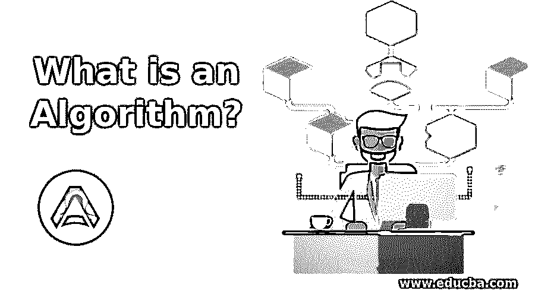
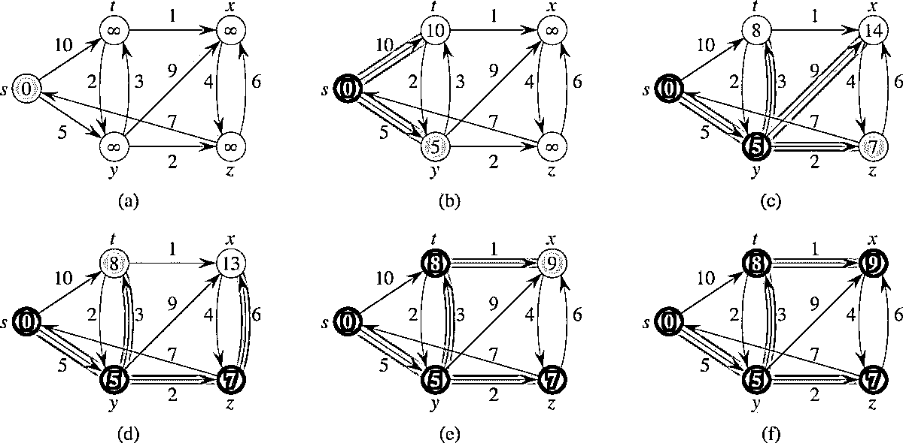
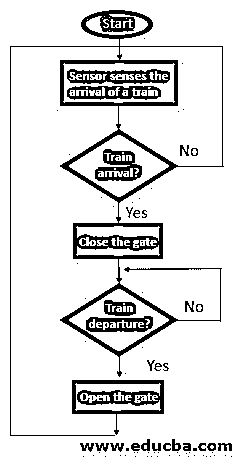
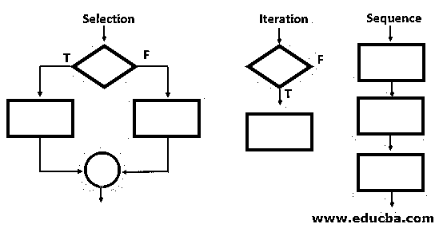

# 什么是算法？

> 原文：<https://www.educba.com/what-is-an-algorithm/>

## 什么是算法？

算法是由人或计算机执行来完成一个过程的一组或一系列指令。这些指令有助于解决复杂的问题或帮助执行数据计算。计算机应该按照这些指令进行计算或执行解题操作。简单的处理需要它们，比如两个数的乘法，或者复杂的搜索压缩文件内容的问题。程序员倾向于开发好的算法，以便以更好的方式解决问题。

例如，以铁路关口为例。

<small>网页开发、编程语言、软件测试&其他</small>

算法应该:

*   定义良好且有序——算法中提供的指令应该易于理解且定义良好。
*   具有明确的运算，即算法的每个步骤都应该足够简单，不需要任何进一步的简化
*   具有有效的可计算操作。

### 理解算法

现在，让我们用流程图来看看:

传感器感测火车的到达，其输出可以是 2 个结果。

*   火车就要到了
*   火车还没有到达

第一个结果的结果被传递给一个动作，在这个动作中，它建议关闭门，而第二个结果的结果通过将其发送给初始语句再次进行测试。此外，作为第一个条件的结果的动作输出被置于测试中，以检查列车是否已经完全离开。如果答案是肯定的，则大门敞开，如果答案是否定的，则大门保持关闭。我们将对此进行更多的讨论，并处理以下主题(子集/构建模块和算法的工作)。

### 它是如何让工作变得简单的？

我们知道，这是一个解决问题的计划。如果我们没有一个计划，我们解决一个复杂问题的方法在第一次尝试中就会失败，即使它解决了问题，它也不太可能是这个问题的最佳解决方案。

而另一方面，如果我们在解决任何问题之前创建一个算法，假设我们创建几个算法，并根据它们提供的最优解对它们进行排序；它将保证解决给定的问题。这就是为什么在任何地方，在解决任何问题之前，首先要创建一个算法。

### 顶级算法开发公司

打造一个伟大的产品需要一个真正好的设计。虽然我们不能用一种算法来比较两个不同的问题，但我们可以列出在整个 21 世纪向这个世界交付了一些优秀产品的公司的名称:

*   迪林杰先生
*   百度(全球最大的中文搜索引擎)
*   英伟达
*   云漫步
*   感知时间
*   谷歌
*   脸谱网
*   黑暗跟踪
*   威尔士的
*   国际商用机器公司
*   OpenAI
*   字节跳动
*   拥挤的街道
*   斑马医疗视觉
*   巴比伦
*   美国英特尔公司(财富 500 强公司之一ˌ以生产 CPU 芯片著称)
*   熨斗健康
*   肯定
*   暴发户
*   元素 AI
*   CloudMinds
*   数据机器人
*   Anki
*   齐格蒙特
*   UBTECH

### 算法的子集/构建块和工作

这些年来，事实证明它只需要三个构建模块就可以设计出来:

*   顺序
*   选择
*   循环

序列是为了解决问题而必须遵循的一系列指令，这些指令应该按顺序执行。

### 例子

以下是几个例子:

#### 1.两个数的相加

**第一步:**开始
**第二步:**获取两个数字作为输入并存储在一个变量中作为 a 和 b
**第三步:**将数字 a & b 相加并存储在变量 c 中
**第四步:**打印 c
**第五步:**停止

选择是一个程序，它允许我们从不同的动作中选择输出。正如我们在前面的铁路闸机示例中看到的，我们有一个条件框，它检查火车是否到达。

#### 2.找出两个数中最大的一个

**第一步:**开始
**第二步:**得到两个数字作为输入并存储在一个变量中作为 a 和 b
**第三步:**如果 a 大于 b，则
**第四步:**打印 a 大
**第五步:**否则
**第六步:**打印 b 大
S **第七步:**停止

重复或迭代，或循环是较小的程序，执行几次，直到满足条件。

#### 3.如果我们想计算一个数的阶乘

**第一步:**开始
**第二步:**声明变量 n、阶乘和 i
**第三步:**初始化变量，即阶乘 1 和 i1
**第四步:**读取 n 的值
**第五步:**重复上述步骤直到 n 次迭代
阶乘< -阶乘* I
I<-I+1

### 你能用算法做什么？

它是解决问题的一个函数或一系列函数。我们可以使用算法来解决世界上最简单的问题以及一些最棘手的问题。我们借助于“时间复杂度”来确定它是最优的。简单地说，时间复杂度是描述任何给定算法运行时间的一种方式。有最小运行时间(称为小' O ')、平均运行时间和最坏情况运行时间 O(N)(也称为大' O ')。计算机科学家和软件工程师喜欢思考算法，因为他们对评估和建立最佳实践的集合感兴趣，这样他们就不必对类似问题的每个实例从头开始。

下面是一个解决特定问题时可能遇到的不同时间复杂度的例子。这也意味着一个问题可能有多个解决方案，但是我们需要通过计算算法的时间复杂度来选择最优的一个。在面试中，你将被要求解决一个问题，此外，你将被要求优化它，即减少你的算法的运行时间。例如，您可能已经编写了具有两个“For”循环(迭代)的代码，但是也有可能仅仅使用一个“for”循环(迭代)就可以完成这项工作，但是您还没有达到这个解决方案，您需要找出更多的方法。

### 优势

它具有以下优点:

*   它是对任何给定问题的解决方案的逐步表示，这使得它易于理解。
*   它使用一个明确的程序。
*   它独立于任何编程语言，因此对于任何人来说都很容易理解，即使没有编程知识。
*   每一步都有自己的逻辑顺序；因此很容易调试。
*   通过使用它，问题被分解成更小的部分或步骤；因此，程序员更容易将其转换成实际的程序。

### 所需技能

为了设计一个健壮的和最佳时间复杂度的算法，一个人必须有良好的逻辑思维，并且应该擅长数学，并且应该知道至少一种[面向对象编程语言](https://www.educba.com/object-oriented-programming-in-java/)。还需要数据结构的知识。

*   **计算机**——了解数组、链表、[二叉树](https://www.educba.com/what-is-a-binary-tree-in-java/)、哈希表、图形、堆栈、队列、堆和其他基本数据结构。
*   **数学**–了解集合论、有限状态机、正则表达式、矩阵乘法、位运算、解线性方程以及其他重要概念，如排列、组合、鸽子洞原理。
*   **Big-O &运行时—**了解什么是 Big-O，以及如何分析算法的运行时间。

### 我们为什么要使用它，我们为什么需要它？

人们应该使用它，因为它简化了我们的工作，并为我们提供了最佳的解决方案。如果我们在解决任何复杂的问题之前不应用它，我们很可能会在解决方案方面失去方向。有了它，我们节省了解决问题的时间，而且我们确保了解算法的最优性，如前所述，独立于任何编程语言，所以任何人都可以设计算法，但是为了设计一个真正好的算法，一个人应该擅长逻辑和数学。它充当解决方案的原型。

例如，想象我们面前有两个魔方。其中之一，允许你使用算法(比如转多少次脸或者往哪个方向转)，另一个，你得自己想办法。哪条路会更快？当然，这将是第一次。

让我们举一个有趣的例子:

假设我们有一个元素数组，我们想按升序对它们进行排序。现在有一种不同的算法。我们将重点介绍其中 2 种的时间复杂度:[插入排序](https://www.educba.com/insertion-sort-in-javascript/)和归并排序。

**插入排序:**插入排序是一种简单的排序。
(时间复杂度为 O(N^2)。)

**

** 

**合并排序:**在合并排序中，我们使用分治法对元素进行排序。
时间复杂度为 O(N log N)。

如果您不遵循 an 并且不对其进行分析，这可能就是您会遇到的影响。

### 范围

通过学习和掌握它，你会知道“解决问题”的艺术。通过良好的实践和不断的学习，你应该能够解决复杂的问题。它是设计一些软件或代码的基础，因为代码的运行时间是决定特定任务执行的最重要因素之一。像谷歌和脸书这样的世界科技巨头会评判你解决问题的能力，在面试中，大多数问题都与算法设计和解决问题有关。你将被要求设计一个算法，并将其优化到尽可能好的复杂度。

**几个点:**

*   这将提高你解决问题的能力，从而使你在面试或在线考试中更有竞争力。
*   你会减少解决任何问题的时间。
*   几乎所有的科技巨头都会根据应聘者更好的解决问题的能力来雇佣他们。
*   人们可以通过学习如何构造和设计算法来充分利用编程语言。

### 谁是学习算法技术的合适受众？

从计算机科学的角度来看，任何做一点或多点编程的人都应该学习算法。如果您编写的代码没有解决您的问题，或者解决了问题，但却低效地使用了资源(例如，运行时间很长或者使用了太多的计算机内存)，那么您的代码就不是最优的。但是这些公司希望他们的软件或产品在尽可能短的时间内响应或执行。

任何正在开发东西的人都应该学会如何对算法进行分析，以确保最终产品的最佳功能。

### 这对你的职业发展有什么帮助？

算法的设计和分析不是一个角色(特定的)，但它是你工作的一部分，在代码开发中起着至关重要的作用。如果你设计了一个好的算法，你就能写出有最优解的好代码，最终，你交付给客户的最终产品是 excel。因此，如果你设计和/或开发软件，那么数据结构和算法的知识和经验是必不可少的。

假设您正在开发一个软件开发产品，它的响应应该被彻底测试(当然，您希望在将代码交给软件测试团队之前检查流程的运行时间)，这不是您可以事先几乎准确猜测的事情，但是您必须使用算法的分析来计算时间复杂性。

### 结论

正如我们已经看到的介绍性描述及其各个方面，我们已经看到解决特定问题可能有不同的方法，Big-O 和时间复杂性是帮助我们选择最佳解决方案的参数。通过研究大量的算法，你将从根本上增强对算法的分析，并且你应该能够轻松地设计和运行对算法的分析。

### 推荐文章

这是一本关于什么是算法的指南？在这里，我们讨论了算法的工作，范围，需要，所需的技能与例子及其各个方面。您也可以浏览我们推荐的其他文章，了解更多信息——

1.  [什么是 Tableau 服务器？](https://www.educba.com/what-is-tableau-server/)
2.  [大数据分析](https://www.educba.com/what-is-big-data-analytics/)
3.  [什么是 SQL Developer？](https://www.educba.com/what-is-sql-developer/)
4.  [什么是信息](https://www.educba.com/what-is-informatica/)

