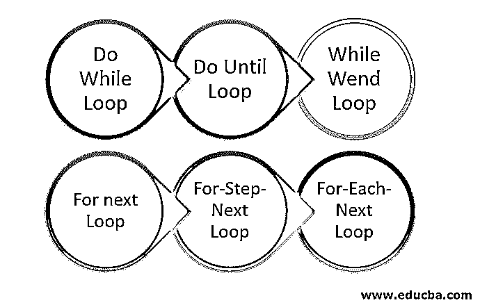

# VBScript 中的循环

> 原文：<https://www.educba.com/loops-in-vbscript/>


## VBScript 中的循环介绍

循环允许我们在代码中反复执行一组语句。循环重复这些语句，直到满足某个条件。这种情况可能导致 true 或 false，或者导致运行该语句的精确次数。有些循环运行时预先知道循环要进行的迭代次数，有些则不知道。根据这些条件，我们可以选择我们想要在程序中使用的循环。当我们知道我们想要重复代码块的次数时，使用 For 循环；当我们不知道我们想要迭代多少次时，使用 Do 循环，并且我们有一个特定的条件，该条件要么为真，要么为假，基于该条件我们终止循环。在本文中，我们将讨论 VBScript 中不同类型的循环。

### VBScript 中的循环类型

VBScript 中有以下循环:

<small>网页开发、编程语言、软件测试&其他</small>




1.  [Do While 循环](https://www.educba.com/do-while-loop-in-javascript/)
2.  执行直到循环
3.  While Wend 循环
4.  对于下一个循环
5.  下一步循环
6.  对于每下一个循环

#### 1.Do While 循环

当我们想要迭代一个代码块的次数不确定时，我们使用 Do While 循环。例如，如果我们想在控制台上打印“Hello ”,因为当变量值“a”小于 6 时，我们使用 Do While 循环。

**代码:**

```
<script type="text/vbscript">
Dim a
a=1
Do While a<6
document.write("Hello!")
a=a+1
Loop
</script>
```

在执行这段代码时，我们得到:

你好！你好！你好！你好！你好！

为了更好地理解，让我们看看代码的工作原理。随着“a”的值每次递增，循环中的代码执行五次。当“a”的值变为 6，并且不再满足条件 a<6 时，控制退出循环。如果我们不写行 a=a+1，我们的循环就变成了一个无限循环，因为我们的循环没有退出条件。无限循环会使我们的系统崩溃。因此，我们需要确保在循环代码中有一个退出条件。我们在 Do While 循环中有一个变体，其中循环总是至少执行一次。假设我们在起始变量中给变量 a 赋值 6。然后用上面的例子，循环代码连一次都不会执行。但是对于下面的变化，循环总是至少执行一次。

**代码:**

```
<script type="text/vbscript">
Dim a
a=6
Do
document.write("Hello!")
a=a+1
Loop While a<5
</script>
```

使用这段代码，我们得到的输出是‘Hello！’只打印一次。运行一次循环后，我们检查 Do While 循环的条件。

#### 2.执行直到循环

像 Do While 循环一样，Do Until 循环也在我们不知道循环中运行的迭代的确切数字时运行。区别在于语法和条件。

**代码:**

```
<script type="text/vbscript">
Dim a
a=1
Do Until a=6
document.write("Hello!")
a=a+1
Loop
</script>
```

这段代码给出了与 Do While 循环中第一个程序相同的结果。我们得到的结果显示为:你好！你好！你好！你好！你好！

我们在 Do Until 循环中也有类似的改变，就像我们在 Do While 循环中一样，循环至少执行一次。此外，我们可以选择在执行完成之前退出 Do 循环。我们可以使用 Exit Do 语句来退出循环。例如，如果我们想在“a”变为 4 时退出循环，那么我们可以插入 Exit Do 语句，如下所示:

**代码:**

```
<script type="text/vbscript">
Dim a
a=1
Do Until a=6
If a=4 Then Exit Do
document.write("Hello!")
a=a+1
Loop
</script>
```

这段代码的输出将是:

你好！你好！你好！

#### 3.While Wend 循环

虽然 Wend 循环类似于 Do While 循环，但是它的使用频率并不高。这是因为 While Wend 循环不如后者有组织。这也是开发者更喜欢 [Do While 循环](https://www.educba.com/do-while-loop-in-python/)的原因。

**代码:**

```
<script type="text/vbscript">
Dim a
a = 1
While a < 6
document.write("Hello!")
a=a+1
Wend
</script>
```

在执行这段代码时，我们得到:

你好！你好！你好！你好！你好！

#### 4.For-Next 循环

当我们知道想要执行代码块的次数时，就使用这个循环。在 For 循环中，我们有一个计数器变量，它告诉我们循环应该执行的次数。下一条语句将计数器变量加 1。

**代码:**

```
For i = 1 To 5
document.write(" & i & ")
Next
```

在执行这段代码时，我们得到:

One

Two

Three

Four

Five

#### 5.下一步循环

在这个循环中，计数器变量自动上升。我们可以指定计数器应该增加的值。

**代码:**

```
For i = 1 To 5
document.write(" & i &")
Next
</script>
```

这段代码的输出将是:

One

Three

Five

像 Do 循环一样，我们可以使用 Exit for 语句在中间退出 For 循环。例如:

**代码:**

```
<script type="text/vbscript">
For i = 1 To 5 Step 3
If i=4 Then Exit For
document.write(" & i & ")
Next
</script>
```

这段代码的输出将是:

One

#### 6.对于每下一个循环

当我们希望对集合或 VBS 数组中的每一项重复循环代码时，我们对每个下一个循环使用[。](https://www.educba.com/for-each-loop-in-java/)

**代码:**

```
<script type="text/vbscript">
Dim employees(3)
employees (0)="A"
employees (1)="B"
employees (2)="C"
employees (3)="D"
For Each i In employees
document.write(i)
Next
</script>
```

在执行上面的代码时，我们会得到:

英语字母表中第一个字母

英语字母表的第 2 个字母

英语字母表中第三个字母

英语字母表中第四个字母

循环可用于反复运行特定的代码块。当循环迭代的次数已知时，我们使用 Do 循环和 While 循环。当我们知道循环代码运行的确切时间时，我们使用 For 循环。

### 推荐文章

这是 VBScript 中循环的指南。这里我们讨论基本概念、语法、VBScript 中的循环类型、示例代码和输出。您还可以浏览我们推荐的其他文章——

1.  [VBScript 是什么？](https://www.educba.com/what-is-vbscript/)
2.  [VBScript 命令](https://www.educba.com/vbscript-commands/)
3.  [JavaScript vs VBScript](https://www.educba.com/javascript-vs-vbscript/)
4.  [VBScript 字符串函数](https://www.educba.com/vbscript-string-functions/)


