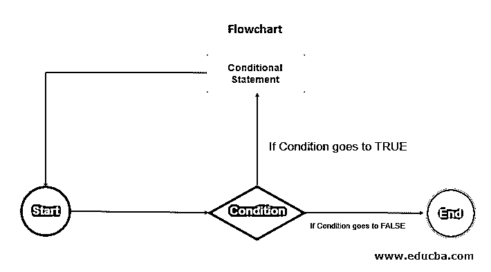
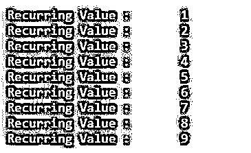
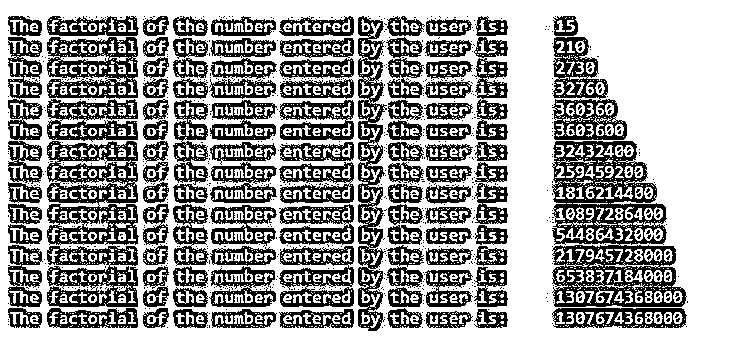

# Lua while 循环

> 原文：<https://www.educba.com/lua-while-loop/>

## Lua while 循环简介

Lua 是一种构建在 C 编程之上的嵌入式脚本语言，以高效、轻量以及面向对象和过程化特性而闻名。这种语言也可以用于复杂的系统和移动应用程序。Lua while 循环与编程语言中的任何 while 循环相同，其中将执行一组执行步骤，直到给定条件满足真值。

**语法:**

<small>网页开发、编程语言、软件测试&其他</small>

Lua while 循环的语法就像用 while 子句编写一个循环一样简单。

`while(conditionalCheck)
do
Executional Statements
end`

*   **conditionalCheck:** 任何结果为布尔值的值都会返回真或假的布尔值。
*   **执行语句:**这是我们希望在 while 循环返回 True 的情况下执行的一组语句。它可以是一个简单的语句，也可以是多个语句。

### 流程图

下面给出了提到的流程图:

### Lua 中的 while 循环是如何工作的？

因为 every while 循环在编程语言中的工作方式类似于 while 循环在 Lua 编程中的工作方式。Lua 编程将首先检查 while 条件，如果条件评估结果为真，那么 Lua 将执行 do 中的主体，并再次重复相同的过程。另一方面，如果 while 条件的评估结果为假，Lua 将结束循环并从那里退出，而不执行 do 循环中的主体。关于 Lua 中的 while 循环，需要注意的另一个有趣部分是，比如说，在第一次执行时——只有 while 循环中的条件求值结果为假，那么 do 中的任何步骤都不会被执行，在这种情况下就不会执行。

根据流程图，以下是 Lua Do while 循环的一些重要步骤:

*   **需要评估的条件检查:**这些圆括号内的条件代码用于评估 while 子句内需要开发人员应用的条件。如果这个求值条件得到满足，那么 do 子句中的 executed 语句将被执行。一个典型的例子是检查变量 x 是否小于 10。
*   **执行语句:**这里，我们添加了那些一旦 while 子句的条件得到满足，并且执行在 do 循环内部被启动时需要执行的代码。一个典型的例子是打印循环运行的变量的值。
*   **值的递增:**这里，一个简单的值被递增，以在循环重复一次时修改条件检查值。递增的变量值是循环执行时使用的变量。如果没有编写这一行，那么您的 do while 循环可能会以 invite 循环结束，应用程序可能会崩溃。

在这里，我们将讨论常规变量增量的例子，也将讨论一个阶乘程序，在这个程序中，减量值被设置为 while 循环中的条件检查，do 是基于该值执行的。

### Lua while 循环示例

下面给出了 Lua while 循环的例子:

#### 示例#1

写一个程序从 1 到 10 循环一个变量。

**代码:**

`local test = 1
while test < 10 do
print("Recurring Value : ",test)
test = test + 1
end`

这里我们初始化了一个名为 test 的局部变量，它的初始值被设置为 1。下一行使用 while 循环，条件为 test < 10。这意味着每次在循环中，Lua 都会检查测试的当前值是否小于 10。如果一个测试的值小于 10，那么 do 中的两个语句将被执行。首先，我们打印测试的值。下一条语句中，我们将测试值递增 1。如果一个测试的值大于 10，那么 Lua 程序执行直接跳转到 end 语句，而不执行 do 循环中的 2 行。

在 Lua 编程的最后，我们提到结束标签来退出程序。

**输出:**

#### 实施例 2

写一个程序，使用 while 循环打印 15 的阶乘。

**代码:**

`local i = 15
local factorial = 1;
while (i >= 1)
do
factorial = factorial * i;
i = i - 1;
print("The factorial of the number entered by the user is:", factorial)
end`

这里我们初始化了一个名为 I 和 factorial 的局部变量，这两个初始值都被设置为 1。下一行使用 while 循环，条件为(i >= 1)。这意味着每次在循环中，Lua 都会检查测试的当前值是否大于等于 10。如果 I 的值大于等于 1，那么 do 中的 2 条语句将被执行。所以我们将阶乘乘以值 I。下一个语句，我们将 I 值减 1。如果测试的值小于等于 1，那么 Lua 程序执行直接跳转到 end 语句，而不执行 do 循环中的 2 行并打印阶乘值。

在 Lua 编程的最后，我们提到结束标签来退出程序。

**输出:**

### 结论

由于循环是每种编程语言的基本构件，所以它们是 Lua 编程语言的重要组成部分，Lua 编程语言是建立在 C 编程语言之上的。While 循环有很多用例，开发人员需要根据某些条件来限制用例，一旦条件不满足，就停止执行并退出程序。Lua 编程语言还可以使用很多其他的循环。

### 推荐文章

这是一个 Lua while 循环的指南。这里我们讨论一下入门，while loop 在 lua 中是如何工作的？和示例。您也可以看看以下文章，了解更多信息–

1.  月球用户数据
2.  [Lua 返回](https://www.educba.com/lua-return/)
3.  [Lua 写入文件](https://www.educba.com/lua-write-to-file/)
4.  [Lua 迭代表](https://www.educba.com/lua-iterate-table/)

