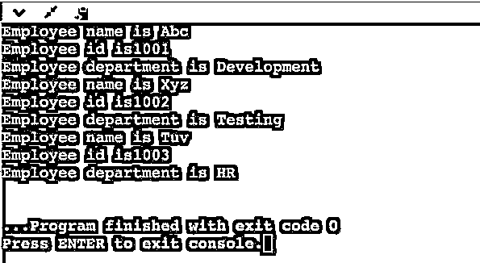

# 哎呀中的关联

> 原文：<https://www.educba.com/association-in-oops/>

## OOPs 中的关联介绍

OOPs 中的关联是两个独立类之间的关系，它是借助对象建立的。众所周知，在 OOPs(面向对象编程)中，对象相互通信以使用彼此的功能和服务。在关联中，类之间的关系可以是一对一、一对多、多对多。它指的是对象之间的“使用”关系。Associate 中的每个对象都有自己的生存期，并且没有所有者。

让我们考虑一个老师和学生的例子，一个老师可以有多个学生，一个学生可以有多个老师负责不同的科目。每个老师和学生按时更改(可以添加和删除学院)。简而言之，他们有自己的一生。

<small>网页开发、编程语言、软件测试&其他</small>

### 联合的形式

基本上有两种形式的关联:

#### 1.聚合

聚合是一种特殊类型的关联，它遵循两个相关对象之间的“有-无”关系。在聚合中，存在单向关系。关联中的两个实体相互独立，这意味着如果一个实体由于某些问题被删除或失败，不会影响另一个实体。在聚合中，实体之间是松散连接的，换句话说，它具有弱关联；它们是相互独立的。

例如，一个老师可以教一门课。如果教师被调离或搬出学院，对课程没有影响，反之亦然。

#### 2.作文

组合是一种受限的关联形式，但与聚合不同的是，实体之间是高度依赖的。它具有很强的关联性，这意味着如果父实体被破坏，子实体就没有存在的意义。它代表“部分”关系。

例如，一个图书馆有许多书，但如果学院的图书馆被摧毁，那么这些书就没有任何用处；这些书也被销毁了。

让我们借助一些理论上的例子来看看这种联系:

*   一个人可以有多辆车(一对多关系)。
*   一个系可以有很多学生，但是不能有两个或更多的系有一个学生。(多对一关系)。
*   一个人可以有一张合法的身份证(一对一的关系)
*   客户可以购买各种产品，许多客户可以购买一种产品。(多对多关系)。

### OOPs 中的关联是如何工作的，并附有示例

让我们看看这种关联在遵循 OOPs 概念的 Java 代码中是如何工作的，并给出一些例子:

#### 示例#1:聚合程序

**代码:**

`import java.util.*;
// Employee class having the Employee information
class Employee
{
String name;
int emp_id ;
String dept;
Employee(String name, int emp_id, String dept)
{
this.name = name;
this.emp_id = emp_id;
this.dept = dept;
System.out.println("Employee name is "+ name);
System.out.println("Employee id is" + emp_id);
System.out.println("Employee department is "+ dept);
}
}
// Department class having the department name and list of Employees working in various departments
class Department
{
String dept_name;
private List<Employee> emps;
Department(String name, List<Employee> emps)
{
this.dept_name = dept_name;
this.emps = emps;
}
public List<Employee> EmployeeRecord()
{
return emps;
}
}
// main method to drive the code
class Main
{
public static void main (String[] args)
{
Employee e1 = new Employee("Abc", 1001, "Development");
Employee e2 = new Employee("Xyz", 1002, "Testing");
Employee e3 = new Employee("Tuv", 1003, "HR");
// Constructing list of Development Department employees.
List <Employee> dev = new ArrayList<Employee>();
dev.add(e1);
//Constructing the list of Testing department employees.
List <Employee> test = new ArrayList<Employee>();
test.add(e2);
//Constructing the list of HR department Employees.
List <Employee> hr = new ArrayList<Employee>();
hr.add(e3);
}
}`

**输出:**

**说明:**

*   在上面的例子中，一个雇员在一个部门工作。它遵循“Has -a”，这是一种弱关系。Employee 类是用它的构造函数定义的，该构造函数具有雇员的属性，如姓名、id 和部门。每个部门都有几个员工在里面工作。
*   有一个部门类，包含部门名称(dept_name)和雇员列表。然后，在 main 函数中，通过传递所有值来创建 Employee 对象，并将特定的雇员添加到特定的部门中。最后，使用 System.out.println()在控制台上打印员工的详细信息。

#### 例子#2:合成程序

**代码:**

`import java.util.*;
//class Book with the properties name, author and book type
class Book
{
public String name;
public String author;
public String type;
Book(String name, String author, String type)
{
this.name = name;
this.author = author;
this.type = type;
}
}
//class College_Library having all the Books
class College_Library
{
private final List<Book> bks;
College_Library (List<Book> bks)
{
this.bks = bks;
}
public List<Book> totalBooks(){
return bks;
}
}
//Main function to drive the code
public class Main {
public static void main (String[] args)
{
Book b1 = new Book("A Passage to India.","XYZ", "Literature");
Book b2 = new Book("Beloved", " ABC", "Fiction");
Book b3 = new Book("the Making of the Modern World", "YUC", "History");
//creating the List of all the books
List<Book> bks = new ArrayList<Book>();
bks.add(b1);
bks.add(b2);
bks.add(b3);
College_Library lib = new College_Library(bks);
List<Book> books = lib.totalBooks();
for(Book bb : books){
System.out.println("Name of the book is : " + bb.name + " Book Author is : " + bb.author + " Book Type is : "+
bb.type);
}
}
}`

**输出:**

**说明:**

*   在上面的代码中，书和学院图书馆之间的关系是强关系。如果大学图书馆不存在，里面的书也就不存在。Book 类是用书的所有属性创建的，比如名称、作者和类型。College_Library 类是用其中的图书列表创建的。
*   在 main 函数中，书籍 b1、b2 和 b3 的对象是通过传递它们各自的属性值来创建的。接下来，使用 add()方法将书籍添加到 ArrayList 中。然后，使用 Java 的简单循环，在控制台上打印出书的细节。

### 结论

上面的描述清楚地解释了 OOPs 中的关联是什么，以及它是如何工作的，并且在任何 OOPs 编程语言(如 Java 代码)中实际上是如何实现的。关联是 OOPs 中最重要的概念之一，在程序中广泛使用它来借助对象创建类之间的关系。因此，对于一个程序员来说，了解关联的形式，即聚合和合成以及两者之间的区别是非常重要的。

### 推荐文章

这是 OOPs 中的联想指南。在这里，我们讨论了简介，关联的形式&它是如何在 OOPs 中工作的，以及一些例子。您也可以看看以下文章，了解更多信息–

1.  [哎呀 Java 面试问题](https://www.educba.com/oops-java-interview-questions/)
2.  [C 语言中的编程错误](https://www.educba.com/programming-errors-in-c/)
3.  [Lua 编程](https://www.educba.com/lua-programming/)
4.  [哈斯克尔编程](https://www.educba.com/haskell-programming/)

