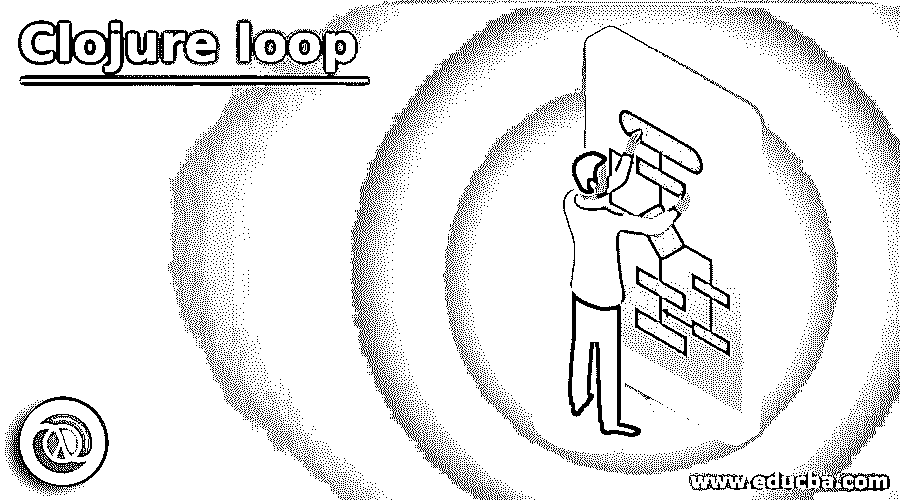
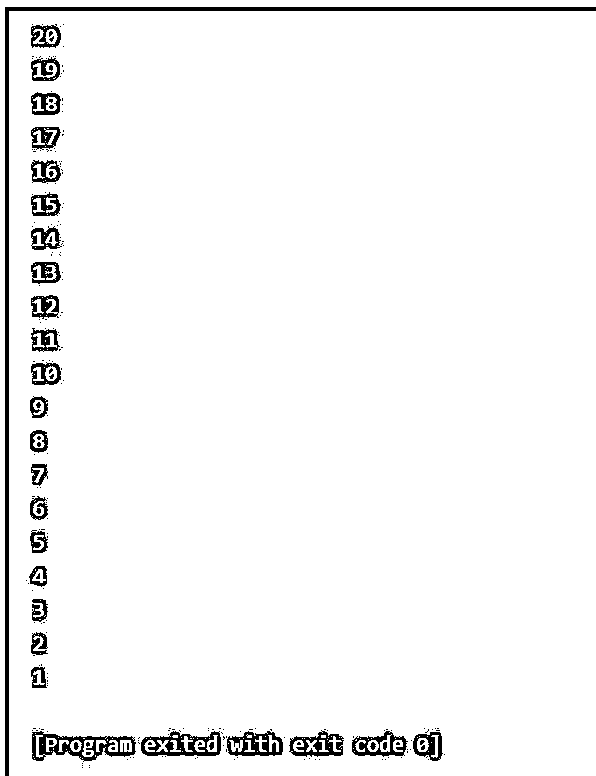
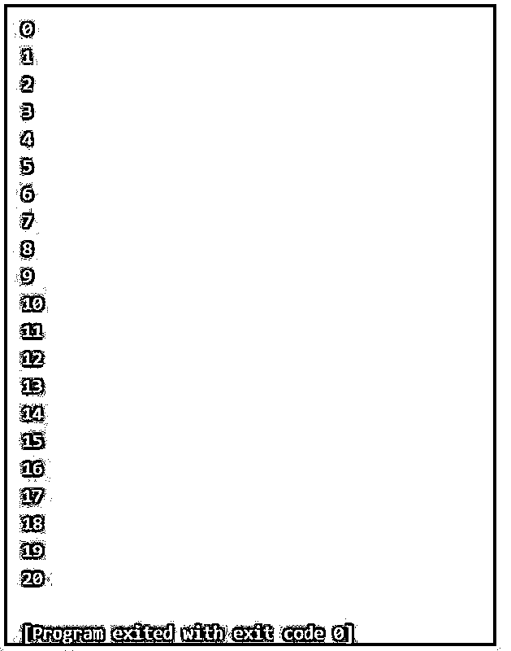
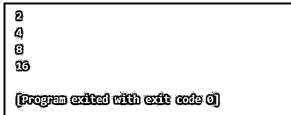
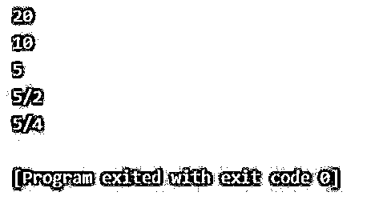
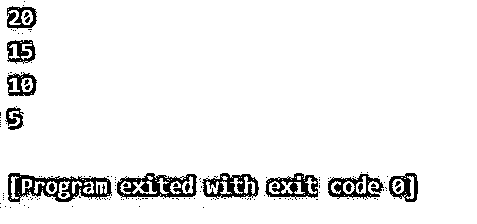

# Clojure 循环

> 原文：<https://www.educba.com/clojure-loop/>

## Clojure 循环介绍

Clojure 有一种特殊的循环，与其他编程语言不同，它通过使用 recurve 来设置递归点，这意味着 recurve 总是与循环相关联。当传递给循环的参数数量与循环的绑定数量相同时，循环就完成了，从而确保循环与循环同步。每个递归函数都有一个基本情况，基于这个情况循环停止，通过利用循环，我们暗示编译器尽最大努力优化递归代码。

**在 Clojure 中声明循环的语法:**

<small>网页开发、编程语言、软件测试&其他</small>

`loop [binding] (condition
(statement)
(recur (binding)))`**T2】**

Binding 是循环的绑定数，与递归函数参数相同。

### 流程图

Clojure 中循环的工作流程图如下:

### 在 Clojure 中运行循环

*   循环从绑定变量开始，随后是条件评估。
*   如果条件为真，控制转到条件中指定的语句并执行它们。
*   如果条件为假，循环停止。
*   在执行条件中的语句后，控制再次转到作为参数传递给 recur 函数的绑定变量，完成一个循环，并再次继续执行循环。
*   相同的过程继续，直到条件为假，循环停止。

### Clojure 循环的示例

下面给出了 Clojure 循环的例子:

#### 示例#1

Clojure 程序演示了一个循环，该循环使用 recur 函数打印从 20 开始、每步递减 1 的数字，并将其作为输出显示在屏幕上。

**代码:**

`;; defining a function called decrement to decrease the values by 1 starting from 20
(defn decrement [] (loop [y 20] (when (> y 0)
(println y)
(recur (- y 1)))))
(decrement)`

**输出:**

在上面的程序中，我们定义了一个名为 decrement 的函数，在每次迭代后将给定值减 1。循环的绑定值是 20，在递归函数中递减 1，直到变量 y 的值大于 0。

#### 实施例 2

Clojure 程序演示了一个循环，它使用 recur 函数打印从 0 开始每一步递增 1 的数字，并将其显示为屏幕上的输出。

**代码:**

`;; defining a function called increment to increase the values by 1 starting from 0 to 20
(defn increment [] (loop [y 0] (when (< y 21)
(println y)
(recur (+ y 1)))))
(increment)`

**输出:**

在上面的程序中，我们定义了一个名为 increment 的函数，用于在每次迭代后给定值加 1。循环的绑定值为 0，在递归函数中增加 1，并持续到变量 y 的值小于 21。

#### 实施例 3

Clojure 程序演示了一个循环，该循环使用 recur 函数在每个步骤中打印从 2 乘以 2 开始的数字，其结果一直持续到变量值小于 21，并在屏幕上显示为输出。

**代码:**

`;; defining a function called multiply to multiply the given value by 2 starting from 2 till the result value becomes less than 21
(defn multiply [] (loop [y 2] (when (< y 21)
(println y)
(recur (* y 2)))))
(multiply)`

**输出:**

在上面的程序中，我们定义了一个名为 multiply 的函数，在每次迭代后将给定的值乘以 2。循环的绑定值是 2，在递归函数中乘以 2，直到变量 y 小于 21。

#### 实施例 4

Clojure 程序演示了一个循环，该循环使用 recur 函数在每个步骤中打印从 20 除以 2 开始的数字，其结果一直持续到变量值小于 1，并在屏幕上显示为输出。

**代码:**

`;; defining a function called divide to divide the given value by 2 starting from 20 till the result value becomes less than 1
(defn divide [] (loop [y 20] (when (> y 1)
(println y)
(recur (/ y 2)))))
(divide)`

**输出:**

在上面的程序中，我们定义了一个叫做 divide 的函数，在每次迭代后将给定的值除以 2。循环的绑定值是 20，在递归函数中除以 2，直到变量 y 的值小于 1。

#### 实施例 5

Clojure 程序演示了一个循环，它使用 recur 函数打印从 20 开始每一步递减 5 的数字，并将其显示为屏幕上的输出。

**代码:**

`;; defining a function called decrement to decrease the values by 5 starting from 20
(defn decrement [] (loop [y 20] (when (> y 0)
(println y)
(recur (- y 5)))))
(decrement)`

**输出:**

在上面的程序中，我们定义了一个名为 decrement 的函数，在每次迭代后将给定值减少 5。循环的绑定值是 20，在递归函数中递减 5，直到变量 y 的值大于 0。

### 推荐文章

这是 Clojure 循环的指南。这里我们分别讨论 Clojure 中循环的介绍、工作原理以及例子。您也可以看看以下文章，了解更多信息–

1.  [什么是斯卡拉？](https://www.educba.com/what-is-scala/)
2.  [Scala 的用途](https://www.educba.com/uses-of-scala/)
3.  什么是 Groovy？
4.  [IntelliJ 备忘单](https://www.educba.com/intellij-cheat-sheet/)

