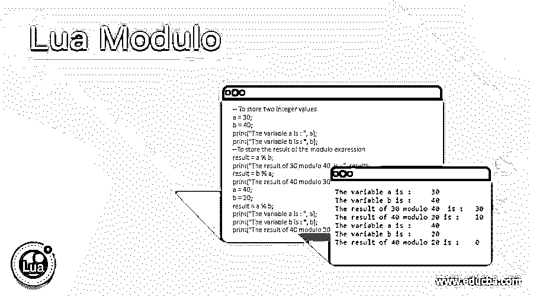
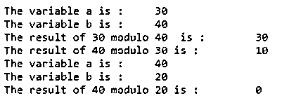
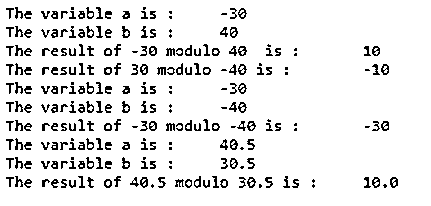

# Lua 模

> 原文：<https://www.educba.com/lua-modulo/>

## Lua 模运算简介

Lua 模运算符用于获得除法的余数。模运算符是 lua 编程中的内置运算符。Modulooperatoris 是一个数学运算符，用%符号表示。模运算返回整数余数，而不是除法结果。

**语法:**

<small>网页开发、编程语言、软件测试&其他</small>

lua 模运算符的语法:

`a % b`

**参数:**

*   **a:** 这不是可选的，指定操作数 an(作为被除数)，它是整数数据类型。
*   **b:** 这不是可选的，指定操作数 b(作为除数)，它是整数数据类型。

**返回值:**如果 a 能被 b 整除，lua 模运算符的返回值为 0，如果 a 不能被 b 整除，返回值可以在[ 1，a-1 ]范围内，如果 a 不能被 b 整除，模运算符也可以在 a 为 0 的情况下抛出错误(因为是被零除错误)。

### Lua 程序设计中模运算符的使用

lua 编程中模运算符的工作；

用于获得除法余数的模运算符。模运算符对两个操作数进行运算，左边的操作数作为被除数，右边的操作数作为除数。考虑一个例子“res = 6 % 2 ”,这里被除数是 6，除数是 2，6 除以 2 后，商将是 3，余数将是 0，所以这个表达式的输出将是 0 作为它返回的余数。

### Lua 模运算符示例

lua 编程中的模运算符示例，展示了模运算符的用法

#### 示例#1

**代码:**

`-- To store two integer values
a = 30;
b = 40;
print("The variable a is : ", a);
print("The variable b is : ", b);
--To store the result of the modulo expression
result = a % b;
print("The result of 30 modulo 40  is : ", result);
result = b % a;
print("The result of 40 modulo 30 is : ", result);
a = 40;
b = 20;
result = a % b;
print("The variable a is : ", a);
print("The variable b is : ", b);
print("The result of 40 modulo 20 is : ", result);`

**输出:**

在上面的 lua 程序中，a 和 b 变量被创建并存储一些不同的值来检查模操作符的行为。在第一种情况下“30 模 40 的结果是:30 ”(因为 30 除以 40 余数是 30 ),在第二种情况下“40 模 30 的结果是:10 ”,在第三种情况下“40 模 20 的结果是:0”。

#### 实施例 2

lua 编程中的模运算符示例，用于显示负数据类型和浮点数据类型的行为

**代码:**

`-- To store two integer values
a = -30;
b = 40;
print("The variable a is : ", a);
print("The variable b is : ", b);
--To store the result of the modulo expression
result = a % b;
print("The result of -30 modulo 40  is : ", result);
a = 30;
b = -40;
result = a % b;
print("The result of 30 modulo -40 is : ", result);
a = -30;
b = -40;
result = a % b;
print("The variable a is : ", a);
print("The variable b is : ", b);
print("The result of -30 modulo -40 is : ", result);
a = 40.5;
b = 30.5;
result = a % b;
print("The variable a is : ", a);
print("The variable b is : ", b);
print("The result of 40.5 modulo 30.5 is : ", result );`

**输出:**

与上面的 lua 程序一样，a 和 b 变量被创建并存储一些不同的负值和浮点值，以检查模操作符的行为。第一种情况“30 模 40 的结果是:10”，第二种情况“30 模 40 的结果是:-10”，第三种情况“30 模 40 的结果是:-30”，第四种情况“40.5 模 30.5 的结果是:10”。

#### 实施例 3

lua 编程中的模运算符示例，展示了模运算符的用法，以确定数字是偶数还是奇数

**代码:**

`-- create a variable and initialize by some value
num = 20
print("The number is : ", num)
-- checking whether the number is even or odd
if (num % 2 == 0) then
print("The Number is even.")
else
print("The Number is odd.")
end`

**输出:**

在上面的 lua 程序中，创建 num 变量是为了将数字存储为 20，接下来在代码中，num 变量使用 if 语句检查它是偶数还是奇数。如果数字是偶数，则打印“该数字是偶数”，否则打印“数字是奇数”,我们也可以在输出中看到。

### 推荐文章

这是一个 Lua 模的指南。在这里，我们还讨论了 lua 中模操作符的引入和工作，以及不同的例子和它的代码实现。您也可以看看以下文章，了解更多信息–

1.  [C++类和对象](https://www.educba.com/c-plus-plus-class-and-object/)
2.  [C 语言中的表达式求值](https://www.educba.com/expression-evaluation-in-c/)
3.  [Python 系统模块](https://www.educba.com/python-sys-module/)
4.  [Python mkdir](https://www.educba.com/python-mkdir/)

