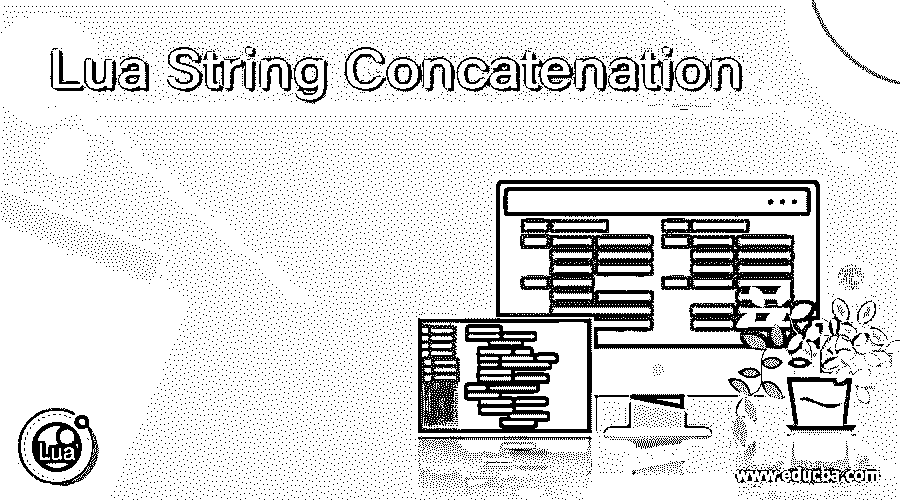
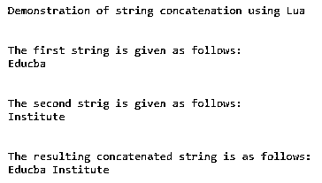

# Lua 字符串串联

> 原文：<https://www.educba.com/lua-string-concatenation/>

## Lua 字符串连接介绍

Lua 字符串连接被定义为使用 Lua 编程语言提供的字符串运算符连接两个字符串。.)用于将给定的字符串连接成一个字符串。Lua 中的字符串是被认为是不可变的字符序列，因此每当字符串连接发生时，它被定义为两个单独字符串的连接，这导致包含源字符串副本的新字符串，该新字符串显示为作为输出的单个字符串，并且该过程通过在字符串之间使用两个点来将它们连接成单个字符串来完成，并且它不会修改任何操作数，因为字符串是不可变的。

**语法:**

<small>网页开发、编程语言、软件测试&其他</small>

在 Lua 中，字符串的连接是使用字符串运算符两个点或两个句点来完成的，例如(。.)所以语法如下所示:

`local variable_result= variable_str1 . . variable_str2`

在上面的语法中，我们可以看到存储连接字符串的变量是使用“local”声明的，即 variable_result，需要连接的字符串分别存储在 variable_str1 和 variable_str2 中。然后我们可以看到我们正在使用(。.2)两点运算符，它是用于将两个字符串连接或串接成一个字符串的字符串运算符，其中该两点运算符必须放在要串接的字符串之间，

### Lua 中的字符串串联是如何工作的？

在 Lua 中，字符串连接是一个非常简单的过程，在其他编程语言中，字符串连接是使用两个点运算符(。.)或者也称为两段运算符，它是用于连接字符串的字符串运算符。

字符串连接的确切工作方式如下:首先，需要连接的字符串用不同的名称在单独的变量中声明，或者我们可以直接使用字符串和两点运算符进行连接。然后，得到的字符串存储在另一个单独的变量中，该变量只包含一个字符串。因此，第一个字符串后跟两点运算符(。.)，并且该运算符后面跟有另一个需要与第一个字符串连接的字符串。然后，生成的字符串被连接起来，在应用两点运算符后显示为一个单独的字符串。现在让我们用 Lua 编程代码在下面的例子中演示一下。

### 例子

让我们讨论 Lua 字符串连接的例子。

#### 示例#1

**代码:**

`print("Demonstration of string concatenation using Lua")
print("\n")
local first_str = "Educba"
print("The first string is given as follows: ")
print(first_str)
print("\n")
local second_str = "Institute"
print("The second strig is given as follows: ")
print(second_str)
print("\n")
print("The resulting concatenated string is as follows: ")
local result_str = first_str .. " " .. second_str
print(result_str)`

**输出:**

在上面的程序中，我们可以看到，我们首先使用变量名称为“first_str”和“second_str”的 local 声明了两个字符串，我们正在打印声明的字符串，然后我们可以看到，我们声明了另一个名为“result_str”的变量来存储连接的字符串，并且连接是使用两个点运算符(..)在字符串之间，这里是作为 first_str 完成的。." " ..second_str 表示 first_str (Educba)与空格连接，这个空格又与 second_str (Institute)连接。因此，我们可以在上面的程序输出中看到，上面的屏幕截图中显示“Educba Institute”作为输出。我们使用空格是为了更好地阅读输出，以类似的方式，我们也可以使用其他特殊字符或字符串进行连接，而不是在字符串运算符和字符串之间使用空格进行连接。

现在让我们看看下面的另一个例子，我们可以直接使用字符串连接，而不用声明任何字符串。

#### 实施例 2

**代码:**

`print("Demonstration of string concatenation without separate string declaration using Lua")
print("\n")
local first_str = "Educba"
print("The first string is given as follows: ")
print(first_str)
print("\n")
local second_str = "Institute"
print("The second strig is given as follows: ")
print(second_str)
print("\n")
print("The resulting concatenated string is as follows: ")
local result_str = first_str .. " " .. second_str .. "," .. " " .. "India"
print( result_str)`

**输出:**

在上面的程序中，我们可以看到我们声明的前两个字符串，但是在输出中，我们可以看到我们打印了 3 个字符串。因此，我们可以看到，当我们在上面的程序中连接时，它是这样完成的:我们连接第一个字符串，然后是双点运算符，然后是空格，然后是双点运算符，然后是第二个字符串，然后是双点运算符，然后是“，”和空格，最后我们可以看到，第三个字符串是直接用双引号(" ")声明的，看起来像“India”。上面程序的输出如上面截图所示。

我们应该注意，在任何编程语言和 Lua 编程中，字符串总是用双引号或单引号声明。在 Lua 编程语言中，由于字符串被认为是不可变的，因此 Lua 不会改变或更改在连接期间声明的操作数，并且输出将产生单个字符串，而不会影响字符串。

### 结论

在本文中，我们得出结论，Lua 编程语言中的字符串连接与其他编程语言一样，是以一种非常简单的方式完成的。在这里，我们可以看到串联意味着连接字符串，我们使用称为两点运算符的字符串运算符将一个字符串附加到另一个字符串。.)之间的字符串进行串联。

### 推荐文章

这是一个 Lua 字符串连接的指南。在这里，我们讨论介绍，语法，如何在 Lua 中工作字符串连接？和代码实现示例。您也可以看看以下文章，了解更多信息–

1.  [C 语言中的字符串串联](https://www.educba.com/string-concatenation-in-c/)
2.  [Java 字符串串联](https://www.educba.com/java-string-concatenation/)
3.  [C#字符串插补](https://www.educba.com/c-sharp-string-interpolation/)
4.  [JavaScript 串联字符串](https://www.educba.com/javascript-concat-string/)

