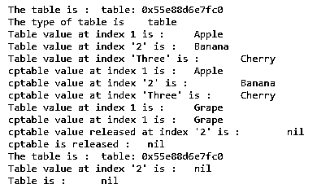
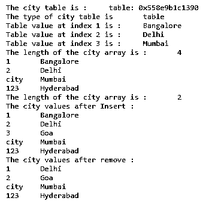

# Lua 表

> 原文：<https://www.educba.com/lua-table/>

## Lua 表的定义

Lua 表是数据结构。表是 Lua 编程中唯一的数据结构，在它的帮助下，我们可以创建不同的结构，如字典和数组。表是关联数组，存储一组键值对。关联数组键-值对存储键的值，以后可以通过使用键来检索该值，这就是为什么表也被称为字典的原因。表格大小不固定，可以根据需要增加。关键字或索引可以是数字、字符串，但不能为零。Lua 编程中的表用于所有的表示，甚至是包表示，例如，如果我们访问一个方法字符串。格式，这意味着字符串包中的格式函数正在访问。

**语法:**

<small>网页开发、编程语言、软件测试&其他</small>

表初始化的语法–

`table = {}`

表值赋值的语法–

`table[ key ]= "value"`

移除引用的语法–

`table = nil`

**参数:**

*   key–这不是可选的类型参数，它指定存储关联值的键或索引。它可以是数字或字符串类型，但键不支持 nil。
*   value–该参数指定要为特定键存储的值。

### Lua 编程中表结构是如何工作的？

编程中用于创建数组和字典的表数据结构。在 Lua 中，表是由{}创建的，如 table = {}，它创建一个空表或用元素创建非空表。创建一个表后，可以将一个元素作为键-值对添加，如 table1[key]= "value "。

### 例子

编程中的表结构示例。

#### 示例 1–创建和初始化表格的 Lua 编程

**代码:**

`-- create an empty table and assign it to variable "table1"
table1 = {}
print("The table is : ", table1)
print("The type of table is ", type(table1))
table1[1]= "Apple"
table1["2"] = "Banana"
table1["Three"] = "Cherry"
print("Table value at index 1 is : ", table1[1])
print("Table value at index '2' is : ", table1["2"])
print("Table value at index 'Three' is : ", table1["Three"])
-- cptable and table1 refers to same table
cptable = table1
print("cptable value at index 1 is : ", table1[1])
print("cptable value at index '2' is : ", table1["2"])
print("cptable value at index 'Three' is : ", table1["Three"])
-- cptable key 1 value change
cptable[1] = "Grape"
print("Table value at index 1 is : ", table1[1])
print("cptable value at index 1 is : ", table1[1])
cptable["2"] = nil
print("cptable value released at index '2' is : ", table1["2"])
-- only variable released but not table
cptable = nil
print("cptable is released : ", cptable)
print("The table is : ", table1)
-- table1 is still accessible
print("Table value at index '2' is : ", table1["2"])
table = nil
print("Table is : ", mytable)`

**输出:**

与上面的 Lua 程序代码一样，使用键-值对创建并初始化一个空表，其中 1 "2 "、" 3 "是键，而" Apple "、" Banana "、" Cherry "是关联值，通过使用键可以打印得更远，正如我们在输出中看到的。更远的表引用或副本被创建，所以表的副本也包含相同的元素。当表的副本被删除时，唯一的副本表也被删除，而原始表仍然存在。此外，我们还可以看到，如果我们释放单个元素，那么只有单个元素被删除，而不是结构。

#### 示例 2–创建数组的 Lua 编程

**代码:**

`-- create a city table as an array and assign values to it
city = { "Bangalore", "Delhi", "Mumbai", "Hyderabad" }
print("The city table is : ", city)
print("The type of city table is ", type(city) )
-- still table is a key-value association.
print("Table value at index 1 is : ", city[1] )
print("Table value at index 2 is : ", city[2] )
print("Table value at index 3 is : ", city[3] )
print("The length of the city array is : ", #city )
-- mix the array syntax with the usual key-value syntax
city = { "Bangalore", "Delhi", city = "Mumbai", [123] = "Hyderabad" }
-- print key value in for loop
for key, value in pairs(city) do print( key, value ) end
-- the length of an array get by using the # operator
print("The length of the city array is : ", #city )
-- table.insert to insert an element
table.insert( city, 3, "Goa" )
-- print key value in for loop
print("The city values after Insert :")
for key, value in pairs(city) do print( key, value ) end
-- table.remove to remove an element
table.remove( city, 1 )
-- print key value in for loop
print("The city values after remove :")
for key, value in pairs(city) do print( key, value ) end`

**输出:**

在上面的 Lua 程序代码中，创建了一个非空表，它是一个没有任何键的城市数组，默认情况下，它接受键的索引号，因此 1 2，3，4 是键，而“Bangalore”，“Delhi”，“Mumbai”，“Hyderabad”是关联值，通过使用键可以打印得更远，正如我们在输出中看到的。使用“#”运算符打印表格长度。此外，我们还可以看到，元素是从数组中添加和移除的。

### 结论

Lua 表是 Lua 编程中的内置数据结构，用于在 Lua 中创建数组和字典。

### 推荐文章

这是一个 Lua 表的指南。这里我们分别讨论 Lua 编程中表结构的介绍、语法、如何工作以及代码实现的例子。您也可以看看以下文章，了解更多信息–

1.  [PostgreSQL 变更表](https://www.educba.com/postgresql-alter-table/)
2.  [SQL 重命名表](https://www.educba.com/sql-rename-table/)
3.  [截断表 MySQL](https://www.educba.com/truncate-table-mysql/)
4.  [SQL 克隆表](https://www.educba.com/sql-clone-table/)

