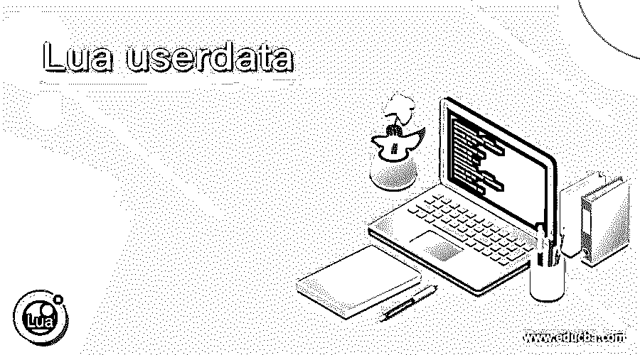
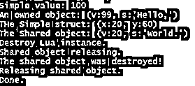

# Lua 用户数据

> [https://www . educba . com/Lua-user data/](https://www.educba.com/lua-userdata/)

## Lua 用户数据简介

Lua userdata 表示可以在 Lua 中使用的任意 C/C++数据。userdata 是 Lua 中的基本类型之一，它允许任意的 C/C++数据存储在 Lua 变量中。userdata 的值是指向原始内存块的指针。在 simple to hold 中，使用了对 c 有用并且应该从 Lua 管理的数据。它们有关键的特性，它们各自的亚稳态将 C 或 C++对象绑定到 Lua。我们可以使用 C/C++方法来填充它的元表，它们可以访问、修改或使用用户数据的内容。例如，io 库在用户数据中有 C FILE *指针，通过这些指针，它提供了到它的方法 lie write、read 方法的绑定。io 库通过在收集关联文件*时实现 __gc 元方法，确保其文件对象之一关闭该关联文件。

注意–有两种用户数据。

<small>网页开发、编程语言、软件测试&其他</small>

1.  轻量级用户数据——这里的内存块由主机管理。
2.  full user data——这里的内存块由 Lua 管理。

我们可以使用 lua_newuserdata()方法从 C/C++ API 创建一个 userdata，该方法创建 userdata 并将其推送到堆栈，然后返回指向其内容的指针来初始化它。

### Lua 编程中用户数据类型的使用

userdata 表示可以在变量中使用的任意 C/C++数据，这意味着用 C/C++创建的数据可以在程序中访问。可以使用 lua_newuserdata()函数创建用户数据，它创建指定大小的内存块，然后将用户数据推送到堆栈上，并给出块的地址，因此我们可以在程序中通过调用 C/C++中定义的函数来访问这个用户数据。

### Lua 用户数据类型的示例

Lua 编程中的用户数据类型示例，展示了如何在 C++中创建用户数据

**程序示例#1**

`#include <memory>
#include <stdio.h>
#include <string>
#include <stdlib.h>
extern "C" {
#include <lua.h>
#include <lauxlib.h>
#include <lualib.h>
}
namespace {
void PushSimpleValue(lua_State* lua, int value) {
// Creating userdata value which will be shared between C++ and Lua.
// This userdata is a pointer which point to memory allocated by Lua.
auto& udata = *(int*)lua_newuserdata(lua, sizeof(int));
// This is a simple value. Lua just allocates the memory to it, but we need to initialize it with some value.
udata = value;
// creating the metatable for the userdata by which the userdata can be access or call
// in the Lua such as function and return the stored value of the userdata.
lua_newtable(lua);
lua_pushstring(lua, "__call");
lua_pushcfunction(lua, {
auto& udata = *(int*)lua_touserdata(lua, 1);
lua_pushinteger(lua, udata);
return 1;
});
lua_settable(lua, -3);
lua_setmetatable(lua, -2);
}
struct Struct {
int x = 0;
int y = 0;
};
void PushSimpleStruct(lua_State* lua, const Struct& s) {
// Simple Struct userdata value which will be shared between C++ and Lua.
auto& udata = *(Struct*)lua_newuserdata(lua, sizeof(Struct));
// Lua just allocates the memory to it, but we need to initialize it.
udata = s;
// creating the metatable for the userdata by which the userdata can be access or call
// in the Lua such as function and return the stored value of the userdata.
lua_newtable(lua);
lua_pushstring(lua, "__index");
lua_pushcfunction(lua, {
auto& udata = *(Struct*)lua_touserdata(lua, 1);
const std::string key = lua_tostring(lua, 2);
if (key == "x") {
lua_pushinteger(lua, udata.x);
} else if (key == "y") {
lua_pushinteger(lua, udata.y);
} else {
lua_pushnil(lua);
}
return 1;
});
lua_settable(lua, -3);
lua_setmetatable(lua, -2);
}
struct TObject {
int v;
std::string s;
};
void OwnedObjectPush(lua_State* lua, TObject&& t) {
// TObject userdata value which will be shared between C++ and Lua.
auto udata = (TObject*)lua_newuserdata(lua, sizeof(TObject));
new (udata) TObject(std::move(t));
// Create a metatable for the userdata through that object can be access in 2 ways- "__gc" and "__index"
lua_newtable(lua);
lua_pushstring(lua, "__gc");
lua_pushcfunction(lua, {
(void)printf("Releasing shared object.\n");
auto udata = (TObject*)lua_touserdata(lua, 1);
udata->~TObject();
return 0;
});
lua_settable(lua, -3);
lua_pushstring(lua, "__index");
lua_pushcfunction(lua, {
auto& udata = *(TObject*)lua_touserdata(lua, 1);
const std::string key = lua_tostring(lua, 2);
if (key == "v") {
lua_pushinteger(lua, udata.v);
} else if (key == "s") {
lua_pushlstring(lua, udata.s.c_str(), udata.s.length());
} else {
lua_pushnil(lua);
}
return 1;
});
lua_settable(lua, -3);
lua_setmetatable(lua, -2);
}
void PushShared(lua_State* lua, const std::shared_ptr< TObject >& t) {
// Create TObject userdata value
//
// The "std::shared_ptr" allows the shared object to own its own reference in Lua .
auto urdata = (std::shared_ptr< TObject >*)lua_newuserdata(
lua,
sizeof(std::shared_ptr< TObject >)
);
// allocate the memory and initialize it.
new (urdata) std::shared_ptr< TObject >(t);
lua_newtable(lua);
lua_pushstring(lua, "__gc");
lua_pushcfunction(lua, {
(void)printf("Shared object releasing.\n");
auto urdata = (std::shared_ptr< TObject >*)lua_touserdata(lua, 1);
urdata->~shared_ptr< TObject >();
return 0;
});
lua_settable(lua, -3);
lua_pushstring(lua, "__index");
lua_pushcfunction(lua, {
auto& urdata = **(std::shared_ptr< TObject >*)lua_touserdata(lua, 1);
const std::string key = lua_tostring(lua, 2);
if (key == "v") {
lua_pushinteger(lua, urdata.v);
} else if (key == "s") {
lua_pushlstring(lua, urdata.s.c_str(), urdata.s.length());
} else {
lua_pushnil(lua);
}
return 1;
});
lua_settable(lua, -3);
lua_setmetatable(lua, -2);
}
// load the "chunck" (the bloack of code of the lua script), insert and execute.
void WithLua(lua_State* lua, const char* chunk, int nargs) {
(void)luaL_loadstring(lua, chunk);
lua_insert(lua, -nargs - 1);
(void)lua_call(lua, nargs, 0);
}
}
int main() {
// Lua instance creating ..
const auto lua = luaL_newstate();
// Lua libraries load
lua_gc(lua, LUA_GCSTOP, 0); // Temporarily disable the garbage collector
luaL_openlibs(lua);
// enable the garbage collector
lua_gc(lua, LUA_GCRESTART, 0);
// calling to the function with as a Lua userdata and give it to a Lua script to use.
PushSimpleValue(lua, 100);
WithLua(lua, R"lua(
local urdata = ...
print("Simple value: " .. urdata())
)lua", 1);
// object sharing to Lua by the userdata
TObject Tbobj1;
Tbobj1.v = 99;
Tbobj1.s = "Hello,";
OwnedObjectPush(lua, std::move(Tbobj1));
WithLua(lua, R"lua(
local urdata = ...
print("An owned object: (v:" .. urdata.v .. ", s:'" .. urdata.s .. "')")
)lua", 1);
Struct st;
st.x = 20;
st.y = 60;
PushSimpleStruct(lua, st);
WithLua(lua, R"lua(
local urdata = ...
print("THe Simple struct: (x:" .. urdata.x .. ", y:" .. urdata.y .. ")")
)lua", 1);
std::shared_ptr< TObject > Tbobj2{
new TObject(),
[&](TObject* p){
delete p;
(void)printf("The shared object was destroyed!\n");
}
};
Tbobj2->v = 50;
Tbobj2->s = "Hello!";
PushShared(lua, Tbobj2);
Tbobj2->v = 20;
Tbobj2->s = "World.";
Tbobj2.reset();
WithLua(lua, R"lua(
local urdata = ...
print("The Shared object: (v:" .. urdata.v .. ", s:'" .. urdata.s .. "')")
)lua", 1);
// Lua instance destroy.
(void)printf("Destroy Lua instance.\n");
lua_close(lua);
(void)printf("Done.\n");
// finished
return EXIT_SUCCESS;
}`

**输出:**

与上面的 C++程序一样，创建用户数据是为了在程序中共享和拥有。每个步骤都在上面的注释中解释过了。

### 结论

用户数据是 Lua 中的基本类型之一。Userdata 表示可以在 Lua 中使用的任意 C/C++数据。

### 推荐文章

这是 Lua 用户数据指南。在这里，我们讨论了用户数据类型在 Lua 编程中的工作，并给出了例子。您也可以看看以下文章，了解更多信息–

1.  [C 语言中的编程错误](https://www.educba.com/programming-errors-in-c/)
2.  [Java 中的函数式编程](https://www.educba.com/functional-programming-in-java/)
3.  [c++中的套接字编程](https://www.educba.com/socket-programming-in-c-plus-plus/)
4.  [什么是 Rust 编程？](https://www.educba.com/what-is-rust-programming/)

