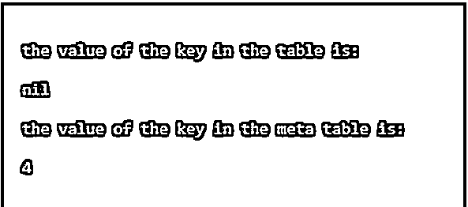
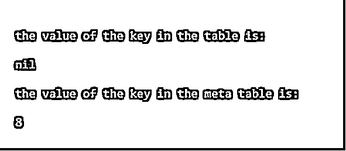

# Lua 元表

> 原文：<https://www.educba.com/lua-metatable/>

## Lua 元表简介

Lua 中的表与另一个称为元表的表相关联，元表通过使用键集和元方法来帮助改变表的行为，元方法提供了强大的功能，使我们能够添加或改变表中存在的操作符的功能，并在键不可用时使用 __index 来查找元表，并且有两个重要的元方法来处理元表，即 setmetatable(table， metatable ),使用它可以为一个表设置亚稳态；以及 getmetatable(table ),使用它可以获得该表的亚稳态。

**语法:**

<small>网页开发、编程语言、软件测试&其他</small>

`table_whose_metatable_must_be_set = {}
table_to_be_set_as_metatable = {}
setmetatable = (table_whose_metatable_must_be_set, table_to_be_set_as_metatable)
getmetatable(metatable)`

*   其中 table _ whoser _ metatable _ must _ be _ set 是必须为其设置元表的表，
*   table_to_be_set_as_metatable 是将被设置为 table _ who _ meta table _ must _ be _ set 表的元表的表，
*   metatable 是给定表的元表，可以使用 getmetatable(亚稳态)方法获得。

### 在 Lua 中使用元表

Lua 中元表的工作方式如下:

*   Lua 中的一个表与另一个名为元表的表相关联，元表通过使用键集和元方法来帮助改变表的行为。
*   元方法提供了强大的功能，使我们能够向表中的操作符添加或更改功能。
*   __index 是元方法之一，用于在表中没有键时查找元表。
*   __newindex 是一种元方法，用于在表中没有键时向表中添加新键。
*   __newindex 元方法更新表中已经存在的键，并且仅当表中没有键时才添加新键。
*   处理元表的两个重要元方法是 setmetatable(table，metable)和 getmetatable(table)。
*   setmetatable(table，metatable)元方法用于为给定的表设置元表。
*   getmetatable(table) meta 方法用于获取给定表的元表。

### Lua 元表的示例

下面是一些例子:

#### 示例#1

Lua 程序演示元表，其中我们创建一个空表，并尝试在空表中查找一个键，然后创建一个元表，并在空表中没有键时使用 __index meta 方法查找元表，并将结果显示为屏幕上的输出:

**代码:**

`--defining an empty table called square
square = { }
--trying to look up for a value in the empty table
print("the value of the key in the table is:\n")
print(square[2])
--creating a meta table called metatablesquare for the empty table square
metatablesquare = {}
setmetatable( square, metatablesquare )
--defining a __index meta method in the meta table
metatablesquare.__index = function(value, key)
return key * key
end
--trying to l0ok up a value in the meta table and it accesses the meta method __index to display the result on the screen
print("\nthe value of the key in the meta table is:\n")
print(square[2])`

**输出:**

在上面的程序中，我们创建了一个名为 square 的空表。然后我们试图在表中查找一个键，因此返回的输出为零。然后，我们使用 setmetatable 方法为 tablesquare 创建一个名为 metatablesquare 的元表，其中我们使用 __index 元方法定义了一个函数。然后，我们再次访问 table square 来查找一个键，这一次从元表中查找值，并返回结果，结果显示为屏幕上的输出。输出显示在上面的快照中。

#### 实施例 2

Lua 程序演示元表，其中我们创建一个空表，并尝试在空表中查找一个键，然后创建一个元表，并在空表中没有键时使用 __index meta 方法查找元表，并将结果显示为屏幕上的输出:

**代码:**

`--defining an empty table called add
add = { }
--trying to look up for a value in the empty table
print("the value of the key in the table is:\n")
print(add[4])
--creating a meta table called metatablesadd for the empty table add
metatableadd = {}
setmetatable( add, metatableadd )
--defining a __index meta method in the meta table
metatableadd.__index = function(value, key)
return key + key
end
--trying to look up a value in the meta table and it accesses the meta method __index to display the result on the screen
print("\nthe value of the key in the meta table is:\n")
print(add[4])`

**输出:**

在上面的程序中，我们创建了一个名为 add 的空表。然后我们试图在表中查找一个键，因此返回的输出为零。然后，我们使用 setmetatable 方法为表 add 创建一个名为 metatableadd 的元表，其中我们使用 __index 元方法定义了一个函数。然后，我们再次访问表 add 来查找一个键，这一次从元表中查找值，并返回结果，在屏幕上显示为输出。输出显示在上面的快照中。

### 结论

在本文中，我们通过元类的定义、语法和工作方式，以及 Lua 中的元方法，学习了 Lua 中元类的概念，并给出了相应的编程示例和输出来演示它们。

### 推荐文章

这是 Lua 元表的指南。这里我们还讨论了 lua 中元表的引入和工作，以及不同的例子和代码实现。您也可以看看以下文章，了解更多信息–

1.  [元数据库与表格](https://www.educba.com/metabase-vs-tableau/)
2.  [蜂巢表](https://www.educba.com/hive-table/)
3.  [数据 vs 元数据](https://www.educba.com/data-vs-metadata/)
4.  [表格尺寸与尺寸](https://www.educba.com/tableau-dimension-vs-measure/)

