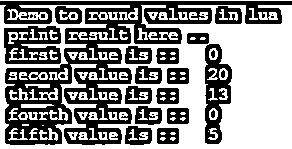
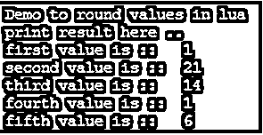

# Lua 回合

> 原文：<https://www.educba.com/lua-round/>

## Lua 回合的定义

Lua 为我们提供了一些舍入函数，用于对数值进行舍入。没有一个函数叫做 round，我们有一些选项，比如数学库中的 floor，ceil。舍入函数帮助我们得到更精确的数字，不包括小数，它可以向正无穷大或负无穷大移动，这取决于我们在 Lua 中用来舍入值的函数。round 函数用于将 lng 小数四舍五入为用户可读的近似值。这些 round 函数在 lua 内置库中可用，我们不需要为此使用任何外部库。在本教程的下一节中，我们将详细了解 round 函数，以便在 Lua 编程时理解和实现它。

**语法:**

<small>网页开发、编程语言、软件测试&其他</small>

如前所述，我们在 lua 中没有一个名为 round()的特定函数，但是我们仍然有一个 lua 的数学库，它可以帮助我们获得想要的结果。让我们看看它的语法，我们如何在我们的程序中使用和实现它，见下文；

1.装天花板

`math.ceil(your-_variable to be round off)`

**2。楼层**

`math.floor(your-_variable to be round off)`

正如您在上面的语法行中看到的，我们有两个选项可用于 lua 中的舍入值。让我们举一个实践例子来更好地理解它，见下文；

**举例:**

`math.ceil(10.6789)
math.floor(10.6789)`

在本教程的下一节，我们将讨论 lua 中可用的 round 函数的内部工作方式，以便初学者更好地使用。

### Lua 中的 Round 函数是如何工作的？

正如我们已经知道的，在 lua 中，我们有两个选项可以在不使用任何外部库的情况下对 Lua 中的值或数字进行舍入。Lua 为我们提供了数学库支持，可以有效地处理数值的舍入。我们可以使用数学库中的任何方法，只要记住我们必须使用' math '关键字来调用和使用它们。在本节中，我们将看到 Lua 中 round 函数的内部工作方式，见下文；

#### 1.地板

此函数用于舍入大小数的值。这个函数是由 math 库提供的，在程序中非常容易使用，我们不需要编写任何 import 语句来使用它，我们可以直接调用 math 上的 floor 函数。当我们使用 floor 函数舍入任何值时，它会给出负无穷大的下一个数，假设你有一个数，比如说 0.5，在这种情况下，它会给出 0，这意味着下面有一个数，让我们看看它的用法；

**方法签名:**

数学。floor(number):正如您在方法签名中看到的，它在函数中接受一个参数，该参数表示要舍入的值。它总是返回不带小数的数字。让我们举一个简单的例子:

**举例:**

`math.floor(10.4567)`

这样我们就可以使用它了，我们可以直接在里面传递变量，这将在计算后给我们正确的值。

#### 2.装天花板

该函数还用于将值四舍五入到最接近的值。lua 中的数学库也提供了这个函数，为了使用这个函数，我们在程序中使用它时不需要任何 import 语句。当我们使用 ceil 方法并在里面传递变量时，它总是会给我们正无穷大的下一个值，这意味着一个更大的数。假设我们有一个要舍入的值，即“0.5”，那么在 ceil 空间中，它将返回 1 而不是 0，就像上面的 floor 函数一样。

**方法签名:**

math.ceil(number):正如您在方法签名中看到的，它在函数中接受一个参数，该参数表示要舍入的值。它总是返回不带小数的数字。让我们举一个简单的例子:

**举例:**

`math.ceil(10.4567)`

在 lua 中使用 round 函数时需要记住的几点；

*   lua 中没有名为 round 函数的函数，我们必须使用数学库来实现它。
*   我们有地板和天花板功能。
*   一个会返回负无穷大的值，一个会返回正无穷大的值。

### Lua 回合示例

在下面的例子中，我们正在比较两个函数，如果我们试图在 lua 中使用不同的函数传递相同的值，它们会返回什么。它将展示它们之间的差异，现在您可以决定使用哪个函数。

#### 示例#1

在本例中，我们使用下限法将数值四舍五入为下一个整数。这是一个示例，适合初学者使用数学函数在 lua 中对值进行舍入。

**代码:**

`print("Demo to round values in lua ")
val1 = math.floor(0.5)
val2 = math.floor(20.45667)
val3 = math.floor(13.6547)
val4 = math.floor(0.789)
val5 = math.floor(5.872)
print("print result here ..")
print("first value is ::" , val1)
print("second value is ::" , val2)
print("third value is ::" , val3)
print("fourth value is ::" , val4)
print("fifth value is ::" , val5)`

**输出:**

#### 实施例 2

在本例中，我们使用 ceil 方法将数值四舍五入到下一个整数。这是一个示例，适合初学者使用数学函数在 lua 中对值进行舍入。

**代码:**

`print("Demo to round values in lua ")
val1 = math.ceil(0.5)
val2 = math.ceil(20.45667)
val3 = math.ceil(13.6547)
val4 = math.ceil(0.789)
val5 = math.ceil(5.872)
print("print result here ..")
print("first value is ::" , val1)
print("second value is ::" , val2)
print("third value is ::" , val3)
print("fourth value is ::" , val4)
print("fifth value is ::" , val5)`

**输出:**

### 结论

通过使用 round 函数，我们可以去掉数字的小数部分，它将返回下一个整数。这些功能在程序中很容易使用和实现。通过使用这种方法，以可读的形式向用户显示值，并执行计算以得到结果。

### 推荐文章

这是一个 Lua 回合的指南。这里我们也讨论一下 lua 中 round 函数的定义和工作原理？以及不同的示例及其代码实现。您也可以看看以下文章，了解更多信息–

1.  [PHP 中的函数](https://www.educba.com/functions-in-php/)
2.  [c#中的数学函数](https://www.educba.com/math-functions-in-c-sharp/)
3.  [Python 内置函数](https://www.educba.com/python-built-in-functions/)
4.  [Java 中的数学函数](https://www.educba.com/math-functions-in-java/)

