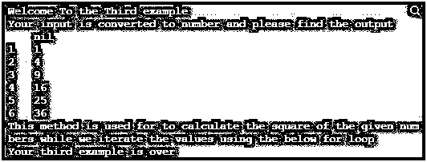

# Lua tonumber

> 原文：<https://www.educba.com/lua-tonumber/>

## Lua tonumber 简介

**Lua to number 是 Lua 脚本的基本功能之一，主要用于将参数转换为数字格式。通过使用 tonumber 方法，参数将已经是字符串或数字格式。它转换为数字类型，并且总是返回数字，否则将返回空值。可选参数将指定编译和解释的基数。基值可以是整数或介于某些数字范围之间的数字类型。如果参数是字符串类型，则除了基值只接受无符号整数之外，它还接受大写和小写字符。**

 ****语法:**

<small>网页开发、编程语言、软件测试&其他</small>

在 Lua 脚本中，我们使用了大量的默认方法、关键字和函数来按照要求实现应用程序。像 tonumber()是内置函数之一，用于将其他类型转换为数字格式。

`type(local) variable = values
type var = tonumber(variable)
-----some lua script code logics depends upon the user requirement-----`

上面的代码是将一种类型的值转换成另一种类型的值的基本语法，例如数字格式。使用 tonumber()方法，我们可以将值转换成数字或整数格式。

### tonumber 函数在 Lua 中如何工作？

tonumber()方法用于将参数转换为数字格式，参数可以是任何类型，如字符串等。如果假设自变量或参数已经是数字或字符串格式，如果值是字符串格式，则意味着它将使用 tonumber()方法转换为数字格式。否则，如果输入类型已经是数字类型，如果脚本上还需要使用 tonumber()方法，则意味着它将返回相同的数字，否则它将返回 nil 值。可选参数或非必需参数也指定解释数字字符的基值。此外，字符串类型输入值可能支持大写或小写字符，如果基值大于 10，数字格式会自动更改为大写字母字符，如“and 11 是“B ”,如十六进制格式。但是这里使用了 A 到 Z，并用 A=10 这样的数字表示，所以它继续并随机地将数字分配给大写字母，如 Z=35。但基数始终是 10，这是十进制数的默认值，也是可选的指数部分，但在其他基数中，仅支持无符号整数。

#### 示例#1

**代码:**

`local stringnumber = "10"
local a = tonumber(stringnumber)
print(a + 10)
local a = "10"
print(type(a))
local num = tonumber(a)
print(type(num))
i = 1
while (i <= 20) do
io.write(i)
i = i + 1
if i == 13 then break end
end
print("\n Please continue your inputs")
repeat
io.write("Welcome To My Domain its a first example we have used the tonumber() method for to convert the string or any other types to number formats:")
rslt = io.read()
until tonumber(rslt) == 17
for i = 1, 20, 3 do
io.write(i)
end
print("Your inputs are validated and continue with our next step process")
mnths = {"January", "February", "March", "April", "May",
"June", "July", "August", "September", "October", "November",
"December"}
for k, v in pairs(mnths) do
io.write(v, " Your input values are iterated and its validated using the key, value pair process ")
end
print("Your first example is over")`

**输出:**

在上面的例子中，我们在基本逻辑中使用了 tonumber()方法，就像我们用局部类型声明了变量 stringnumber，并用双引号给数值赋值一样。因此，输入值将把它作为字符串类型。通过使用 tonumber()方法，我们可以将字符串转换为数字类型，并在输出控制台上打印出来。

#### 实施例 2

本地 ip = '1234.957 欢迎请更改您的密码在您的系统和任何地方使用和不正确的。否则我们会忘记提醒你，你的密码不正确，请输入正确的密码。或者请使用忘记密码选项'

**代码:**

`local num = tonumber(ip)
print(num)
eg1=0
eg2 = io.read()
eg3 = io.read()
reslt = {}
for i=1,tonumber(eg2) do
reslt[i]=io.read()
end
eg4 = {}
for i=1,tonumber(eg2)*2+1 do
eg4[i]=0
end
for i=1,tonumber(eg2) do
eg4[tonumber(eg2)+1+tonumber(reslt[i])]=eg4[tonumber(eg2)+1+tonumber(reslt[i])]+1
end
eg5 = {}
l = 1
for i=1, 3*tonumber(eg2)+1 do
if eg4[i] >= tonumber(k) then
eg5[l]=i-tonumber(eg2)-1
l=l+1
end
end
io.write(l-1,"Your input numbers are iterated")
for i=1,l-1 do
io.write(tostring(eg5[i])," ")
end
print("Your second examples are completed and thanks for calculating the string value to numbers")
local rt=tonumber(ip)
print(rt)`

**输出:**

在第二个例子中，我们将变量 ip 指定为本地类型，其值类似于数字和字符串类型。但是当我们使用 tonumber()方法时，它只返回 nil 作为输出，因为输入包含字符串字符，所以它返回 nil 值。

#### 实施例 3

**代码:**

`local vars
print("Welcome To the Third example")
local result=tonumber(vars)
print("Your input is converted to number and please find the output\n",result)
function demo(vars1,vars)
if vars<vars1
then
vars = vars+1
return vars, vars*vars
end
print("This method is used for to calculate the square of the given numbers while we iterate the values using the below for loop")
end
for i,num in demo,6,0
do
print(i,num)
end
print("Your third example is over")`

**输出:**

在最后一个例子中，我们用来计算数字的平方。通过使用 for 循环，我们可以迭代这些值，并对数字进行平方。同样，在第一行中，我们声明了带有变量的局部类型，如 vars，我们没有提到任何值，我们还声明了另一个变量 result，通过使用 tonumber()方法，我们可以将 vars 类型值转换为 number 类型，这是一个正在执行的转换，但这里我们没有分配任何输入值，因此它返回 nil 输出。

### 结论

Lua 脚本中的 tonumber()方法通常会将其用于转换目的，即用户为输入值分配的其他类型，如字符串、数组等。可以借助 tonumber()方法将其转换为数字。就像 Lua 脚本使用了许多转换方法，其中 tonumber 是帮助将数据转换成数字格式常用方法之一。

### 推荐文章

这是 Lua tonumber 的指南。这里我们讨论定义、语法、参数，以及 tonumber 函数如何在 Lua 中工作？以及代码实现的例子。您也可以看看以下文章，了解更多信息–

1.  [红移 Row_NUMBER()](https://www.educba.com/redshift-row_number/)
2.  [SQL 行号](https://www.educba.com/sql-row_number/)
3.  [JavaScript 号](https://www.educba.com/javascript-number/)
4.  [MySQL ROW_NUMBER()](https://www.educba.com/mysql-row_number/)

**