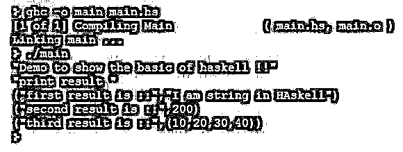

# 哈斯克尔使用

> 原文：<https://www.educba.com/haskell-uses/>

## Haskell 简介

下面的文章提供了 Haskell 用法的概要。Haskell 也是一种通用编程语言，但它是一种函数式编程语言，它也基于 lambda 演算。它于 1990 年推出。如果我们用 Haskell 编写一个程序，它将总是以数学函数的形式表示，这些函数有它们的好处。Haskell 像 java、c、c++一样是严格类型的语言，所以只在编译时检查错误是非常容易的。函数式编程语言越来越并行，因此也提供了更好的性能。Haskell 被开发来非常有效地处理多线程。

### 不同的 Haskell 用法

Haskell 是一种函数式编程语言，它提供了许多功能，例如 lambda 演算，支持强大的多线程，这使它可以很好地用于各种应用领域，Haskell 也是一种通用编程语言，可以用于任何领域。

<small>网页开发、编程语言、软件测试&其他</small>

我们有一些最适合开发人员使用的领域:

**1。数据分析:**众所周知，数据分析是我们通过应用定义的一些步骤来获取有用信息的过程。在这个过程中，我们试图对数据进行建模、转换、检查和清理，以获得我们想要的输出，因此 Haskell 在数据分析应用程序中非常有用。通过使用数据分析，我们可以更有效地做出商业决策。

**2。性能:**众所周知，它是一种函数式编程语言，对多线程编程的良好支持有助于我们获得应用程序的良好性能，所以我们可以在最需要快速和种子需求的地方使用 Haskell。此外，在银行领域，我们需要有良好支持的并发编程，所以我们可以说 Haskell 对于这个领域也是一个不错的选择。

**3。可伸缩性:如果我们谈论现实世界中任何应用程序都非常需要的可伸缩性，我们可能会有一些不同的需求，因此我们的系统应该是可伸缩的，并且不太依赖于模块。所以 Haskell 为我们提供这个特性也是为了让系统在我们需要的时候可以伸缩，这也是现在大多数应用程序的需求。**

4.自营业务

5.快速原型制作

**6。增强和改进现有的软件应用程序:**通过使用 Haskell，我们可以改进现有的应用程序，使其更具可伸缩性，提高其性能，还可以加快开发速度，从而提高开发人员的工作效率，并帮助我们更快地交付应用程序。

**7。数据密集型:**首先让我们看看什么是数据密集型应用程序，这些应用程序负责处理大量数据，这些数据以 Pb 和 TB 为单位，并且这些数据集存储在不同的位置。因此，如果我们有这种必须处理这么多数据的应用程序，那么我们可以选择 Haskell。在这种情况下，让我们看看一些已经开始使用 Haskell 的数据密集型行业的名称。

*   在线消费者
*   大型制药公司
*   生物技术
*   金融服务
*   石油和天然气

**8。研发项目:**这个也可以用 Haskell 编程来完成。

9.在医疗保健领域的应用众所周知。

10。帮助调试应用程序非常容易: Haskell 是一个函数式编程，正如我们现在已经知道的，所以这提供了易于维护的优势，也提供了应用程序的高度可修改性。Haskell 提供的另一个优势是，如果你想在 Haskell 中开发规范或原型，那么可以很容易地执行、调试和测试。

### Haskell 使用示例

下面给出的是 Haskell 使用的例子:

这是一段我们如何使用 Haskell 编写一个基本程序的样本代码。同样在这个例子中，我们尝试使用 Haskell 中的各种数据类型。

**代码:**

`main = do
print("Demo to show the basic of haskell !!")
let demovar1  =  "I am string in HAskell"
let demovar2  =  200
let demovar3  =  (10, 20 , 30, 40)
print("print result ")
print("first result is ::", demovar1)
print("second result is ::", demovar2)
print("third result is ::", demovar3)`

**输出:**

### 使用 Haskell 的好处

下面给出了在任何应用领域中使用 Haskell 的好处:

1.在 Haskell 中，程序是作为一系列高级概括编写的，这有助于我们知道目的是什么，以及执行后打算做什么。

2.它是一种强静态类型的编程语言，只在编译时帮助我们识别错误，Haskell 编译器强制纠正代码，清理代码并使其正确。

3.许多公司都使用它，其中一些公司如下所述:

*   主要经营银行）
*   安进
*   脸书、谷歌、微软和推特的研发项目。

4.它还用于医疗保健行业，开发人员为医生和患者编写应用程序，帮助他们跟踪活动。

5.Haskell 编程语言使用并提供迭代方法。

*   利用这一点，我们可以动态地更新和修改程序。
*   还为控制结构提供支持。

### 结论

正如我们上面所讨论的，Haskell 被用在许多领域，它还提供了各种各样的内置特性，这使得它成为任何领域的开发者的好选择。为了理解它的用法，我们应该非常熟悉它提供的功能，我们也已经看到了 Haskell 中的一些例子和标准，以编写和开始编程。

### 推荐文章

这是 Haskell 使用指南。这里我们分别讨论介绍，不同的 haskell 用途，例子和好处。您也可以看看以下文章，了解更多信息–

1.  [哈斯克尔在哪里](https://www.educba.com/haskell-where/)
2.  [哈斯克尔编程](https://www.educba.com/course/haskell-course-for-programming/)
3.  [哈斯克尔也许](https://www.educba.com/haskell-maybe/)
4.  [哈斯克尔滤波函数](https://www.educba.com/haskell-filter-function/)

