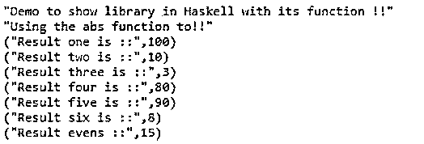

# 哈斯克尔图书馆

> 原文：<https://www.educba.com/haskell-library/>

## Haskell 库简介

在 Haskell 中，我们有如此多的库，它们各有其重要性，它们为我们提供了各种功能，用于在需要时执行各种操作。这个库提供了不同的包，这些包包含一个执行逻辑和操作的动作列表。在程序中使用时，可能需要导入一些库。但是在 Haskell 中，我们有 Prelude 这是 Haskell 的隐式库，默认导入；不应该有任何显式的导入语句，我们可以直接使用它。

### Haskell 库是如何工作的？

正如我们已经知道的，Haskell 中有许多不同的库，它们都有自己的重要性；我们可以使用直接或使用 import 语句在代码中使用它们。

<small>网页开发、编程语言、软件测试&其他</small>

在这里，我们将看到 Haskell 中可用于执行不同操作的不同库。

*   Haskell 中的平台库:在 Haskell 中，我们有一个平台库，包括对网络、快速检查等的支持。在发布这个库之前，它们已经过很好的测试和预安装。他们为此向我们提供了额外的包，其中有一个 Haskell 平台库。
*   Haskell 中的 2010 库:这个库也为我们提供了所有 Haskell 库都应该支持的各种包；这个库为我们提供了基本的功能，可以用于 monad、数据列表、io 等等。
*   **Haskell Prelude 库:**这是 Haskell 最重要的库，用于对我们在 Haskell 中拥有的数据结构和数据类型进行更基本的操作。

在这里，我们将看到该库的详细信息和各种功能及其语法:

这些模块除了包含所需的库之外什么都不是，这是用 Haskell 或任何其他编程语言编写 basic 程序所非常需要的。

在这里，我们将看到该模块中可用的功能。使用这个模块时，我们不需要导入任何语句或依赖项，同时使用 Haskell 的 prelude 模块中的默认函数。

让我们看看所有的方法:

#### 1.丙烯腈-丁二烯-苯乙烯

这是 prelude 模块中可用的函数，可以通过其名称直接访问。基本上，这个函数将返回输入作为参数传递给我们的绝对值。

**语法:**

`print(abs (-1))`

#### 2.全部

prelude 中的这个函数用于检查列表或数组中的所有元素是否满足给定的条件。它总是根据条件的评估返回布尔值。如果所有元素都满足条件，那么它将返回 true，否则，它将返回 False。

**语法:**

`all predicate your_list`

#### 3.天花板

这个来自谓词的函数用于返回整数值，它是传递参数的下一个可能的近似值。

**语法:**

`ceiling your_value`

#### 4.儿童健康研究（Child Health Research 的缩写）

谓词模块中的这个函数用于获取 0 到 255 范围内的特定字符的 ASCII 值。

**语法:**

`chr your integer value between 0 to 255`

#### 5.比较

这是 prelude 模块中的一个函数，用于比较两个相同类型的值。它将基于比较的评估返回三个结果，即 EQ，GT，LT。所有这些都有一定的意义，如果两个值相等，则返回 EQ，如果第一个值小于或等于传递的第二个值，则返回 LT，如果第一个值大于传递的第二个值，则返回 GT。

**语法:**

`compare value1 value2`

#### 6.串联

prelude 中的这个函数用于将两个列表连接在一起。它也非常容易使用和实现。

**语法:**

`concat [value to be concate]`

#### 7.差异

prelude 模块中的这个函数用于计算传递参数的整数除法。

**语法:**

`val1 `div` val2`

#### 8.滴

这是 prelude 模块中的一个函数，用于从列表或数组中删除指定的元素。

**语法:**

`drop yournumber [list] or varibale`

### Haskell 库的例子

下面给出的是 Haskell 库的例子:

这个基本的例子展示了 Haskell 库的用法，并详细说明了如何使用它们的功能。

**代码:**

`main = do
print("Demo to show library in Haskell with its function !!")
let val1 = 100
let val2 = -10
let val3 = -3
let val4 = 80
let val5 = -90
let val6 = 8
let val7 = 15
print("Using the abs function to!!")
let result1 = abs val1
let result2 = abs val2
let result3 = abs val3
let result4 = abs val4
let result5 = abs val5
let result6 = abs val6
let result7 = abs val7
print("Result one is ::", result1)
print("Result two is ::", result2)
print("Result three is ::", result3)
print("Result four is ::", result4)
print("Result five is ::", result5)
print("Result six is ::", result6)
print("Result evens ::", result7)`

**输出:**

### 结论

在 Haskell 或任何其他编程语言中，我们有如此多的内置库，或者我们可以使用外部库来获得更好的性能。但是在 Haskell 中，我们有 Prelude 模块，它包含了用 Haskell 编写程序所需的所有必要的东西；此外，这些库非常易于使用，可读性强，易于开发人员理解。

### 推荐文章

这是哈斯克尔图书馆的指南。这里我们讨论引言；Haskell 库是如何工作的？和示例。您也可以看看以下文章，了解更多信息–

1.  [哈斯克尔在哪里](https://www.educba.com/haskell-where/)
2.  [哈斯克尔编程](https://www.educba.com/course/haskell-course-for-programming/)
3.  [哈斯克尔数组](https://www.educba.com/haskell-array/)
4.  哈斯克尔取函数

