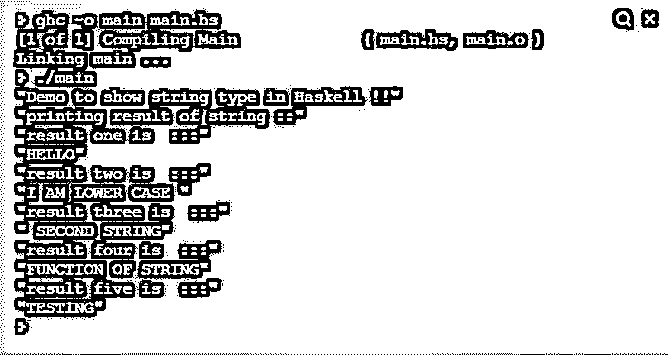
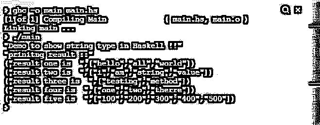

# 哈斯克尔字符串

> 原文：<https://www.educba.com/haskell-string/>

## Haskell 字符串介绍

Haskell string 是一种数据类型，用于以字符串的形式存储变量的值，在 Haskell 或任何其他编程语言中，字符串都是由字符序列表示的。Haskell 中的 String 提供了不同的函数来操纵 string 对象的值，或者对它执行任何操作。在 Haskell 中，它也是可以使用的最简单的数据类型，易于处理和创建。字符串可以通过使用双引号("")来创建，在这里我们可以写我们的字符串或值，我们希望字符串类型为我们保留。

### Haskell 字符串的语法

为了在编程时更好地使用，我们将更仔细地研究它的语法。

<small>网页开发、编程语言、软件测试&其他</small>

`varibaleName  :: String_type
varibaleName = “some value here”`

正如你在上面几行语法中看到的，它非常容易使用，我们也可以使用字符串直接给变量赋值。

为了让程序更清晰，我们来练习一下语法:

`abc  :: String_type
abc = “my string”`

通过上面几行代码，我们现在可以理解如何在 Haskell 中定义一个字符串。

### 字符串类型在 Haskell 中是如何工作的？

现在我们已经知道 String 是 Haskell 中的一种类型，用于存储 Haskell 中的字符序列，它非常容易创建和处理。我们可以在 Haskell 中使用字符串文字创建字符串。像其他编程语言一样，我们使用""双引号来表示我们的字符串，如果我们不使用正确的表示来括住我们的字符串，它将会给我们带来错误。在 Haskell 中，我们有不同的函数可以用于字符串类型。

让我们看看这些函数的定义和用法:

#### 第一个 toUpper

这个函数用于将字符串转换成大写，如果你传递小写的字符串，它会相应地转换成大写。这个函数总是返回 us 字符串，如果传递的字符串已经是大写的，那么它将返回相同的结果。

**用途:**

toUpper 文件夹

在上面提到的方法中，我们可以使用它。

#### 2.降低

这个函数用于将字符串转换成小写，如果你用大写传递字符串，它会相应地转换成小写。这个函数总是返回我们的字符串，如果传递的字符串已经是小写的，那么它将返回相同的结果。

**用途:**

映射到下方

在上面提到的方法中，我们可以使用它。

#### 3.消息

该函数用于断开字符串，在定义字符串时用空格分隔。这个函数将总是返回包含输出的字符串数组。

**用途:**

单词“你的字符串在这里..”

#### 4.未磨损

这个函数是 Haskell 中 string 的 word 函数的反义词，它将给出由元素数组组成的单个字符串。我们总是将字符串对象作为这个函数的返回值。

**用途:**

unwords "您的数组放在这里/。"

#### 5.线

这个函数也用来在换行符处断开字符串。在这里，如果我们使用' \n '，那么它将从那里断开字符串，并创建一个包含字符串结果的数组。这个函数也返回数组作为结果。

**用途:**

lines "您的字符串由换行符分隔。

#### 6.非直线

这个函数与 Haskell 中的 lines 函数相反，它将连接字符串并返回字符串对象。此函数的返回类型是连接后的字符串值。它还会追加\n 或者我们可以在每个字符串后添加一个换行符作为结果。

**用途:**

取消“您的阵列将放在这里”的链接

### Haskell 字符串的示例

以下是 Haskell 字符串的示例:

#### 示例#1

在这个例子中，我们试图使用 Haskell 中的字符串函数 to upper case 将字符串类型转换为大写。

**代码:**

`import Data.Char
democovertupperacse :: String -> String
democovertupperacse = map toUpper
main = do
print("Demo to show string type in Haskell !!")
let result1 = democovertupperacse "hello"
let result2 = democovertupperacse "I am lower case "
let result3 = democovertupperacse " second string"
let result4 = democovertupperacse "function of string"
let result5 = democovertupperacse "testing"
print("printing result of string ::")
print("result one is  :::")
print(result1)
print("result two is  :::")
print(result2)
print("result three is  :::")
print(result3)
print("result four is  :::")
print(result4)
print("result five is  :::")
print(result5)`

**输出:**

#### 实施例 2

在这个例子中，我们试图在创建时将字符串转换为由空格分隔的数组，为此我们使用了字符串中的 words 函数。

**代码:**

`main = do
print("Demo to show string type in Haskell !!")
let val1  = "hello all world"
let val2  = "i am string value"
let val3  = "testing method"
let val4  = "one two therre "
let val5  = "100 200 300 400 500"
let result1 = words val1
let result2 = words val2
let result3 = words val3
let result4 = words val4
let result5 = words val5
print("prinitng result ::")
print("result one is  ", result1)
print("result two is  ", result2)
print("result three is  ", result3)
print("result four is  ", result4)
print("result five is  ", result5)`

**输出:**

### 结论

String 是 Haskell 或任何其他编程语言中最常见和最常用的类型，因为它简单易用。它也是 Haskell 中内置的 Ans 类型，提供了许多不同的函数，它们可以一起用来组成我们想要的字符串。对于开发人员来说也非常易读、简单和方便。

### 推荐文章

这是一个 Haskell 字符串的指南。这里我们讨论一下引言，string type 在 haskell 中是如何工作的？和示例。您也可以看看以下文章，了解更多信息–

1.  [哈斯克尔在哪里](https://www.educba.com/haskell-where/)
2.  [哈斯克尔编程](https://www.educba.com/course/haskell-course-for-programming/)
3.  [JavaScript UUID](https://www.educba.com/javascript-uuid/)
4.  [JavaScript 鼠标悬停](https://www.educba.com/javascript-mouseover/)

