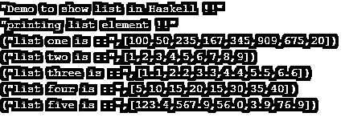

# 哈斯克尔 do 符号

> 原文：<https://www.educba.com/haskell-do-notation/>

## Haskell do 符号介绍。

如果你想在 Haskell 中处理输入和输出操作，那么我们可以使用 do 符号。Do 符号只是为了处理 Haskell 中的 IO 操作而设计的。为了表示 do 符号，我们可以简单地使用“do”关键字；在此之后，我们可以编写我们想要执行的代码。在 Haskell 最常见的通用编码实践中，它通常与主模块一起出现。这个主模块应该总是跟在 do 符号或任何其他逻辑(如果有的话)后面。在本教程的下一节中，我们将看到 do 符号内部工作的更多细节，以便更好地理解它。此外，我们还将看到它的用法和实现，以便初学者更好地理解它。

### 句法

下面详细说说它的语法；我们在 Haskell 中定义了很多方法来使用这种符号；正如已经讨论过的，它用于输入输出操作，所以让我们用 Haskell 中的 do 符号来处理这个语法，见下文；

<small>网页开发、编程语言、软件测试&其他</small>

**1。main = do:** 这个是 Haskell 中 do 记号的基本用法；在本教程的下一部分，我们将详细讨论这一点。

**2。做{操作 1；操作二；操作 3；等等..}:** 这是在 Haskell 中使用 do 符号和{}花括号的另一种方式。我们还将在本教程的下一节详细讨论这一点。
让我们来练习一下语法，让初学者更好地理解它见下文；

例如:

main = do
//你的逻辑到此为止..

如您所见，在 Haskell 中使用它来执行输出和输入操作非常容易，没有任何障碍。在 do 符号的下一节中，我们将看到关于它的一些细节。此外，在 Haskell 中使用 do 符号的工作示例让初学者更好地理解它，并在用 Haskell 编码时开始使用。

### 如何在 Haskell 中使用 do 符号？

正如我们现在已经知道的，Haskell 中的 do 符号非常容易使用和实现。这些都是 Haskell 的内置函数，所以我们可以直接使用它们，没有任何依赖性，也不需要为此安装任何库。基本上，正如我们所讨论的，这个 do 符号用于处理 Haskell 中的输入和输出操作；我们也有更多的方法来处理这些操作，但是在 Haskell 中，do 符号非常容易使用和实现。在这一节中，我们将首先详细讨论在 Haskell 中使用 do 符号的不同方法，并给出各自的例子。下面我们开始看；

#### 1.做{操作 1；操作二；操作 3；等等..}:

do 符号的语法非常容易使用。这里我们使用' {} '花括号来实现和处理 Haskell 中使用 do 符号的 IO 操作。首先，我们使用了' do '关键字，后跟{}花括号。在这些括号里，我们可以写我们想要执行的逻辑或者代码。我们可以在其中编写任意数量的输入输出操作，但是记住应该用“；”分隔我们已经介绍过的分号。让我们举一个初学者使用 Haskell 的示例，这将有助于他们更好地理解它。

例如:

`do { putStr "abc to test" ; putStr " i am do block" ; putStr "statement 2" ; putStr " statement 3"}`

所以我们用 Haskell 中的 do 符号在花括号内写了这么多操作；这将一个接一个地执行操作。在输出的最后，我们可以在控制台中看到几行字符串作为消息。如您所见，它非常容易使用和执行。我们也没有使用或进口任何包来使用这一点。我们可以简单地在 Haskell 编辑器中运行它。

#### 2.main = do:

这是在 Haskell 中使用 do 的另一种方式。在这种方法中，我们使用与 do 符号相关的主模块，这意味着它将处理我们将要在 do 块中编写的代码。此外，在这个 do 块之后，我们可以按照我们想要的方式编写代码，就像 Haskell 中的任何其他普通代码一样。我们必须使用主模块，后面紧跟着 do 符号。让我们仔细看看用 Haskell 编写的简单代码，让初学者更好地理解它。见下文；

例如:

`main = do
print("Hello I am using main do ")`

正如你在上面的代码行中看到的，我们在 Haskell 中使用带有 do 符号的主模块；它易于使用和执行。我们只是在他们阻塞后写了代码或我们的逻辑，所以它会像他们写的那样一个接一个地执行。

### Haskell do 符号示例。

在下面的例子中，我们试图在 Haskell 中使用 do 符号。这是一个样例，供初学者在用 Haskell 编码时开始使用。此外，我们刚刚展示了在 Haskell 中编码时如何定义和使用它；我们还没有使用任何 import 语句来使用它。

**代码:**

`main = do
print("Demo to show list in Haskell !!")
let list1 = [100, 50, 235, 167, 345, 909, 675, 20] let list2 = [1, 2, 3, 4, 5, 6, 7, 8, 9] let list3 = [1.1, 2.2, 3.3, 4.4, 5.5, 6.6] let list4 = [5, 10, 15, 20, 15, 30, 35, 40] let list5 = [123.4, 567.9, 56.0, 3.9, 76.9] print("printing list element !!")
print("list one is ::" , list1)
print("list two is ::" , list2)
print("list three is ::" , list3)
print("list four is ::" , list4)
print("list five is ::" , list5)`

**输出:**

### 结论

如您所见，如果我们想执行输入和输出操作，我们必须在 Haskell 编程中使用 do 符号。它非常容易使用和操作，开发者也很容易读懂。在用 Haskell 编程时，我们不需要包含或导入任何包来使用它。

### 推荐文章

这是一个 Haskell do 符号的指南。在这里，我们讨论如何在 Haskell 中进行符号工作，并给出例子和输出。您也可以看看以下文章，了解更多信息–

1.  [哈斯克尔编程](https://www.educba.com/haskell-programming/)
2.  [哈斯克尔在哪里](https://www.educba.com/haskell-where/)
3.  [哈斯克尔滤波函数](https://www.educba.com/haskell-filter-function/)
4.  [哈斯克尔映射](https://www.educba.com/haskell-map/)

