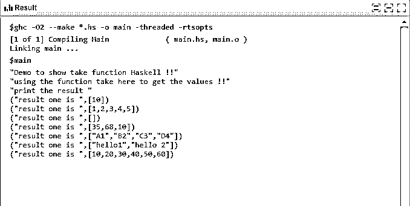

# 哈斯克尔函数

> 原文：<https://www.educba.com/haskell-take-function/>

## Haskell take 函数简介

我们在 Haskell 中定义了一个函数，用于从现有列表中获取值，或者它只是从现有的可用值中获取值，并为我们创建一个新的变量列表。我们必须从现有的或原始的数组或列表中指定我们想要放入结果列表的值的数量。此外，我们可以使用 Haskell 库中的现有函数来创建列表或数组，然后我们也可以从中获取值。在本教程的下一部分，我们将详细讨论 take 函数的内部工作、用法和实现，以便初学者更好地理解它，并在需要时有效地使用它。

**语法**

<small>网页开发、编程语言、软件测试&其他</small>

正如我们已经讨论过的，take 是 Haskell 中的一个函数，用于从现有的数据结构中获取值。要使用它，我们不需要导入任何库，因为它是一个内置的 Haskell 函数，可以直接使用。让我们仔细看看 Haskell 中可用的 take 函数的语法，这将使初学者更容易使用，见下文；

`take param1 [param2]`

正如您在上面的语法行中看到的，这个函数接受两个参数作为输入参数。让我们来看一下代码语法的练习部分，这将使它更容易理解(见下文);

例如:

取 2 [1，2，2]

正如你所看到的，它非常容易使用。在本教程的下一节，我们将看到它的内部工作细节，这将使它更好地理解，因为开始。

### Haskell 中如何使用 take 函数？

到目前为止，我们已经知道 Haskell 中使用了 take 函数来根据我们传递的参数获取一些值。这个函数通常将两个参数作为输入参数，我们将在本教程的下一节中讨论。Take function 是 Haskell 中的内置函数，因此可以直接使用它，而无需任何导入语句、依赖项或任何外部库。另一方面，这个函数非常容易使用，语法也非常简洁。在这一节中，我们首先将看到 Haskell 为 take 函数给出的函数签名，为了更好地理解，让我们从下面开始吧；

方法签名:

1)Int->[a]-->[a]:这是 Haskell 网站官方文档给出的 take 函数的签名类型。正如你所看到的，它很简单，对开发者来说可读性也很强。现在我们将看到这个函数所在的模块，以及我们如何在用 Haskell 编写的程序中访问它。让我们开始更好的使用和实现，见下文；

2)模块:如果我们谈论包含这个功能的模块，那么它被称为“前奏”模块。这是 Haskell 中的默认模块，它包含了在 Haskell 中开始编码所需的所有必要函数，我们可以像在其他语言中一样称它为 Haskell 的基本模块。

3)现在我们将更详细地讨论参数及其语法，这将给出我们如何通过 para 来获得想要的值的想法，作为我们想要看到的结果如下；

例如:

取帕拉默 1[帕拉默 2]

正如您在上面的代码行中看到的，我们使用 take 函数传递了两个参数。同样，要使用 take 函数，我们只需在我们传递的参数的开头使用' take '关键字。让我们从参数细节开始，见下文；

a) param 1 或 value:这里 take 函数中的第一个 para 负责或用于表示我们要从原始数组或列表等中取出的值的数量。这个参数将总是返回我们从数组中传递到这里的相同数量的元素。让我们举一个例子。

例如，take 3 []:因此这将返回给我们结果数组或列表只包含原始数组或列表中的三个值。

b) param 2 或 value 2:这里，take 函数的第二个参数用于传递数组或列表变量，我们希望从该变量创建一个包含所需值的新列表或数组。它将始终表示要传递的原始 pram。下面我们举个例子来获得更好的思路看看；

例如，以 3 [1，2，2 ]为例:我们在这里传递的第二个参数是原始变量形式，它将向我们返回结果。

在 Haskell 中使用 take 函数时要记住以下几点:

1)这存在于 Haskell 的 Prelude 模块中。

2)它可以与 Haskell 中可用的任何类型的数据类型一起使用，但是要记住第一个参数总是整数类型。

3)但是第二个参数可以是任何类型，与传递的第一个整数无关。

4)总是返回新的列表或数组作为结果。

### Haskell take 函数示例

1)简单的例子是展示 take 函数的用法和实现，适合初学者。

**代码:**

`main = do
print("Demo to show take function Haskell !!")
let list1 = [10, 20, 30, 40 , 50 , 60, 70] let list2 = [1, 2, 3, 4, 5, 6, 7, 8, 9] let list3 = [1.1, 2.2, 3.3, 4.4 , 5.5, 6.6, 7.7] let list4 = [35, 68, 10, 67, 69, 25, 67, 23] let list5 = ["A1", "B2", "C3", "D4", "E5"] let list6 = ["hello1", "hello 2", "hello 3", "hello 4"] let list7 = [10, 20, 30, 40 , 50 , 60, 70] print("using the function take here to get the values !!")
let result1 = take 1 list1
let result2 = take 5 list2
let result3 = take 0 list3
let result4 = take 3 list4
let result5 = take 4 list5
let result6 = take 2 list6
let result7 = take 6 list7
print("print the result ")
print("result one is ", result1)
print("result one is ", result2)
print("result one is ", result3)
print("result one is ", result4)
print("result one is ", result5)
print("result one is ", result6)
print("result one is ", result7)`

**输出:**

### 结论

正如我们所见，Haskell 中的这个函数非常容易使用和处理，对开发人员来说也非常易读。在使用它之前，我们不需要导入任何东西，因为它在 Haskell 的 Prelude 模块中是可用的，在 Haskell 编程中很容易访问。

### 推荐文章

这是一个 Haskell take 函数的指南。这里我们详细讨论 take 函数的内部工作、用法和实现。您也可以看看以下文章，了解更多信息–

1.  [哈斯克尔编程](https://www.educba.com/haskell-programming/)
2.  [哈斯克尔滤波函数](https://www.educba.com/haskell-filter-function/)
3.  [哈斯克尔替代方案](https://www.educba.com/haskell-alternatives/)
4.  [哈斯克尔在哪里](https://www.educba.com/haskell-where/)

