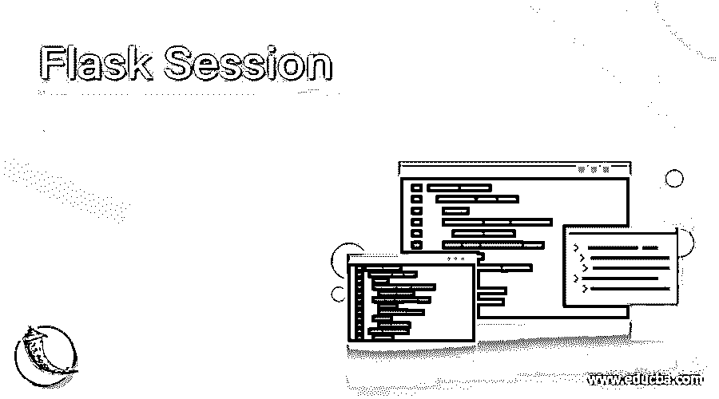
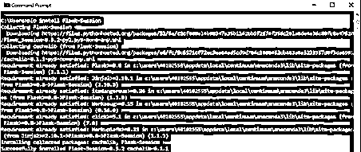
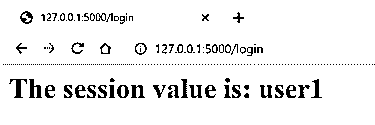
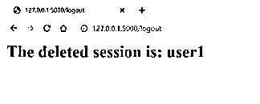

# 烧瓶会话

> 原文：<https://www.educba.com/flask-session/>

## Flask 会话的定义

**Flask session** 被定义为 flask utility 中的一种技术，它作为一种扩展，为构建的 Flask 应用程序中的服务器端会话提供支持。但是，我们知道烧瓶是什么吗？简而言之，Flask 是一个轻量级框架，或者换句话说，是允许构建 web 应用程序的微框架。Flask 中的会话具有非常类似于 cookie 的概念，即包含识别网络上的计算机的标识符的数据，除了会话数据存储在服务器中的事实。包含数据的实例化对象是一个 dictionary 对象，它包含会话变量的键值对和相应的值。

**语法:**

<small>网页开发、编程语言、软件测试&其他</small>

在本节中，我们将介绍一些重要的语法，这些语法考虑到了 flask 会话的基本实用程序，同样重要的是，在我们了解 flask 会话的工作原理之前先浏览一下，这样理解 flask 会话的工作原理就不会有任何痛苦。

`Installing the Flask cache extension through any terminal:
easy_install Flask-Session
OR
pip install Flask-Session
Set a certain value to the session:
Session[<variable name>] = <value>
Remove a session variable:
session.pop(<variable name>, none)
Define the validity of a session for x minutes:
app.permanent_session_lifetime = timedelta(minutes=<numerical minutes>)
Define the validity of a session permanently:
session.permanent = True`

### Flask 中的会话是如何工作的？

在简介中，我们简要了解了会话是在特定于用户的请求之间存储数据的另一种方式。会话的时间间隔是从客户端登录到服务器的时间开始，直到它退出，并与会话 id 相关联。因此，需要对会话用户进行的任何标识都存储在数据中。

flask 中会话的工作是从使用它开始的。要使用会话，必须设置一个密钥。该密钥是应用程序中参数的设定值，用于任何需要认证的情况，以防止任何攻击和篡改。使用 session 对象可以设置或获取会话数据。现在，当用户使用会话时，数据被存储为一个 cookie，这个 cookie 有一个特殊的名称，称为会话 cookie。它之所以被命名为一个特殊的 cookie，并使自己不同于普通的 cookie，是因为这个 cookie 是由 Flask 加密签名的。加密签名意味着任何人都有权查看 cookie 中的内容，但不能修改它。只有拥有用于签署 cookie 的密钥，修改才是可能的。

既然已经设置了会话 cookie，那么对于每个后续的服务器请求，都会验证 cookie 的真实性。这种验证是通过用与签名时相同的密钥取消签名来完成的。如果取消签名失败，cookie 的内容将被丢弃，一个新的 cookie 将被发送到浏览器并成为一个会话 cookie！

如果我们可以通过一个简单的用户进入会话的例子来了解会话的工作情况，那么就更容易理解了，在用户退出之前，会话的详细信息将被保存。

首先，我们将使用以下命令在 Flask 中导入会话对象:

`from flask import Flask, redirect, url_for, render_template, request, session`

现在，我们需要传递创建会话对象时用于签署 cookie 的密钥。这通过以下方式实现:

`app.secret_key = "27eduCBA09"`

下一步是创建会话数据。从前面的段落中我们知道，会话是 python 中的字典，由键和值组成，因此我们分配一个新的字典键，如下所示:

`session["<newKey>"] = ‘<value01>’`

接下来，如果我们在任何步骤中需要会话的信息，我们可以轻松地获取该信息并将其存储在一个变量中，就像我们在下面的方法中看到的那样:

`Variable = session["<name of Key>"]`

现在假设，如果某个用户从某个 web 页面注销，我们将需要从字典中删除会话密钥，以便从变量空间中删除关于会话的所有信息。我们使用下面提到的方法:

`session.pop("<name of Key>", None)`

至此，我们对会话是如何工作的有了清晰的理解。另外，我们应该能够管理一个会话持续多长时间，默认情况下，只要浏览器是打开的。但是作为开发人员，我们可以将该会话设为永久的(基本上 30 天有效)或者将会话的持续时间定义为:

**预定时间:**

`app.permanent_session_lifetime = timedelta(minutes=<numerical minutes>)`

**对于永久会话:**

`session.permanent = True`

### 例子

让我们讨论烧瓶会议的例子。

#### 示例#1

通过任何终端安装 Flask 缓存扩展。

**语法**

`pip install Flask-Session`

**输出:**

#### 示例# **2**

为会话设置某个值。

**语法**

`from flask import Flask, redirect, url_for, render_template, request, session
from datetime import timedelta
appFlask = Flask(__name__)
appFlask.secret_key = "27eduCBA09"
appFlask.permanent_session_lifetime = timedelta(minutes=5)
@appFlask.route("/login")
def login():
session["user"] = "user1"
return '''<h1>The session value is: {}</h1>'''.format(session["user"])
if __name__ == "__main__":
appFlask.run(debug=True)`

**输出:**

#### 实施例 3

移除会话变量。

**语法**

`from flask import Flask, redirect, url_for, render_template, request, session
from datetime import timedelta
appFlask = Flask(__name__)
appFlask.secret_key = "27eduCBA09"
appFlask.permanent_session_lifetime = timedelta(minutes=5)
@appFlask.route("/login")
def login():
session["user"] = "user1"
return '''<h1>The session value is: {}</h1>'''.format(session["user"])
@appFlask.route("/logout")
def logout():
variable = session["user"] session.pop("user", None)
return '''<h1>The deleted session is: {}</h1>'''.format(variable)
if __name__ == "__main__":
appFlask.run(debug=True)`

**输出:**

### 结论

在本文中，随着会话的深入工作，我们获得了会话如何在 Flask 中工作的实际经验。我们需要确保我们使用的秘密代码不能被轻易猜到，否则 cookies 中的敏感信息肯定会被泄露。Rest，session 是部署准备好的应用程序的最安全的方式，现在读者可以进行试验了！

### 推荐文章

这是一个烧瓶会话的指南。在这里，我们讨论介绍，语法，会话如何在 Flask 中工作？和代码实现示例。您也可以看看以下文章，了解更多信息–

1.  [Python Rest 服务器](https://www.educba.com/python-rest-server/)
2.  Django vs Flask
3.  [Python 断言错误](https://www.educba.com/python-assertionerror/)
4.  [Python Virtualenv](https://www.educba.com/python-virtualenv/)

