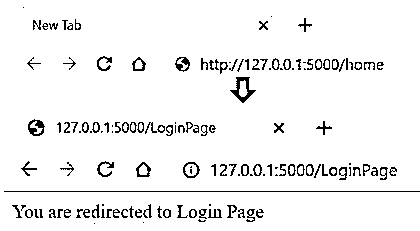
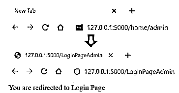

# 烧瓶重定向

> 原文：<https://www.educba.com/flask-redirect/>

## 烧瓶重定向简介

Flask redirect 被定义为 Flask 中的一个函数或实用程序，它允许开发人员将用户重定向到一个指定的 URL 并分配一个指定的状态代码。当调用这个函数时，将返回一个响应对象，重定向到目标位置，状态代码为。当一个网站被访问时，服务器收到一个请求，经过处理后，用一个三位数的代码(称为 HTTP 代码)来响应请求。在编程世界中，作为响应返回的状态代码被称为错误。错误和重定向功能是相辅相成的。

### Flask 重定向的语法

在 web 应用程序界面的情况下，如果需要路由到指定的 URL，重定向是一个重要的步骤。路由世界中有各种方法，我们将更详细地了解这些方法，但在本节中，我们将首先了解语法。

<small>网页开发、编程语言、软件测试&其他</small>

1.导入重定向和中止函数。

`from flask import redirect, abort`

2.Flask 重定向的实例化。

`flask.redirect(<location>,<status-code>, <response> )`

这里，

*   **<位置> :** 表示来自重定向的响应将被路由到的 URL 位置。
*   **<状态码> :** 表示除了来自服务器的响应之外，发送到浏览器头部的状态码。
*   **<响应> :** 对于项目未来的任何引用或要求，这是引用的实例。

3.使用 abort 函数退出代码循环，结合重定向。

`flask.abort( <code> )`

这里的代码指的是一组代码，它们会产生一些错误，并停止应用程序的进一步执行。

### Flask 中的重定向函数是如何工作的？

重定向函数是 Flask 中三大路由解析之一。我们知道任何 Flask 函数都有通过多个 URL 提供内容的概念。路由是提供内容的 URL，视图是指其中的内容。此外，另一部分是 route decorator 使用户能够列出端点以及人们期望会在端点中发生的方法的附加功能。现在假设有多个用户，我们需要根据他们的用户名创建一个动态 URL。为此，我们可以使用动态路由的概念。利用动态路由和可变规则，动态 URL 被创建并可以被访问。既然路由片段已经清楚了，我们就需要理解视图响应。Flask 应用程序中的视图响应有三种常见的方式，即页面模板、响应和重定向。我们将把前 2 篇文章留给其他文章，但这里我们将深入讨论重定向。

在这个函数中，我们发送一个字符串，该字符串对应于用户将被重定向到的路径。该字符串可以是相对路径、绝对路径，甚至是外部 URL。该函数搜索作为参数传递的字符串的相应匹配，并相应地呈现所需的模板并将其放在用户面前。

redirect 函数的另一个变体，也是使用最广泛的一个，因为它是编程方面的最佳实践之一，是通过名称进行路由，而不是通过发送重定向 URL 的路径。为此，我们使用一个名为 url_for()的内置函数，在另一篇文章中会详细讨论。我们将视图函数的名称传递给这个函数，url_for()函数负责将视图函数的名称转换成相应的 url 模式。我们从中获得的一个额外好处是防止页面之间的链接断开。

现在，作为重定向的一部分，有状态代码可以很容易地用于与服务器的通信。

以下是状态列表及其所指的内容:

| **状态代码** | **信息重要性** |
| Three hundred | 代码指的是表明请求有多个响应的消息。 |
| Three hundred and one | 这表明资源被永久移动。 |
| Three hundred and two | 这是默认消息，表示找到了资源。 |
| Three hundred and three | 这是为了通知响应不会重定向到新的内容，而是另一个页面。 |
| Three hundred and four | 这是为了通知不需要重传资源。 |
| Three hundred and five | 这是一个贬值的代码，通常指示服务器连接到代理。 |
| Three hundred and six | 这个代码现在已经不用了。 |
| Three hundred and seven | 与 301 不同，这里的资源是临时移动的。 |

对于正在构建的应用程序和需要完成的重定向消息传递类型，可以方便地使用上面的代码。

现在让我们看一个具有重定向功能的 flask 应用程序。

### 烧瓶重定向示例

以下是烧瓶重定向的示例:

#### 示例#1

重定向功能的示例代码。

**语法:**

`from flask import Flask, redirect, url_for
appFlask = Flask(__name__)
@appFlask.route("/home")
def home():
return redirect(url_for('LoginPage'))
@appFlask.route("/LoginPage")
def LoginPage():
return "You are redirected to Login Page"
if __name__ == "__main__":
appFlask.run(debug=True)`

**输出:**

#### 实施例 2

使用中止功能描述未授权登录。

**语法:**

`from flask import Flask, redirect, url_for, abort
appFlask = Flask(__name__)
@appFlask.route("/home/<user>")
def home(user):
if user == 'admin':
return redirect(url_for('LoginPageAdmin'))
else:
abort(401)
@appFlask.route("/LoginPageAdmin")
def LoginPageAdmin():
return "You are redirected to Login Page"
if __name__ == "__main__":
appFlask.run(debug=True)`

**输出:**

**管理员登录:**

**另一个用户登录:**

这里我们看到，当 URL 有一个名为 admin 的参数时，我们被重定向到 admin 的相应 URL。在任何其他用户的情况下，我们得到一个关于用户未被授权重定向的事实的未授权访问。

### 结论

总之，在本文中，我们已经了解了重定向函数的简单工作方式，以及中止函数是如何与重定向函数一起工作的。该功能的使用留给读者在 Flask 应用程序中尝试这些概念。此外，这里的错误代码列表将方便我们的读者使用正确的功能。

### 推荐文章

这是一个指导烧瓶重定向。这里我们讨论一下入门，重定向函数在 flask 中是如何工作的？和示例。您也可以看看以下文章，了解更多信息–

1.  [烧瓶 URL 参数](https://www.educba.com/flask-url-parameters/)
2.  [烧瓶 HTTPS](https://www.educba.com/flask-https/)
3.  [烧瓶数据库迁移](https://www.educba.com/flask-db-migrate/)
4.  [烧瓶会话](https://www.educba.com/flask-session/)

