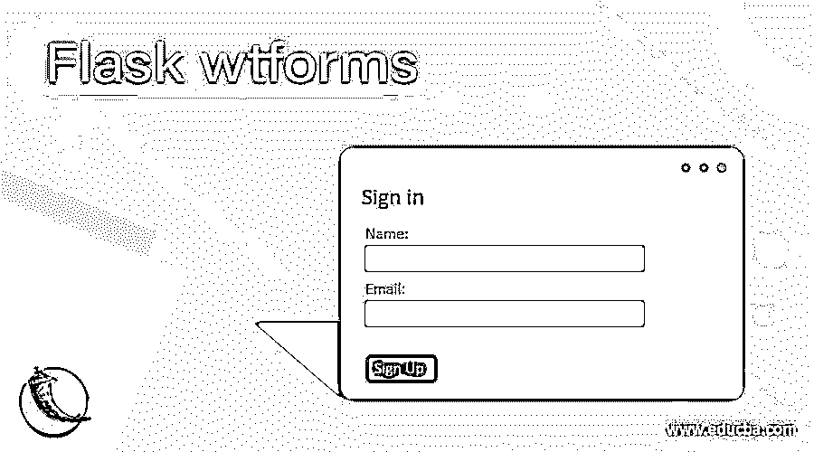
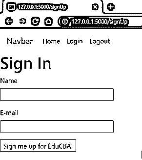

# 烧瓶 wtforms

> 原文：<https://www.educba.com/flask-wtforms/>

## 烧瓶形状的定义

Flask WTForms 被定义为一个插件，它支持并简化了 Flask web 应用程序中的表单设计过程。该库旨在为用户开发此类表单提供一个交互界面。在对提交给浏览器的表单数据进行编码的过程中，代码很快变得非常难以阅读。这个库存在于 Flask 插件中，可以使用 pip 命令安装。多年来，WTForms 在处理表单方面一直是无可争议的赢家，并且仍然是使用最广泛的，原因是它易于呈现和验证，并且非常灵活。但是有一点需要注意，flask-WTF 插件依赖 WTForms 插件，并且两者可以一起使用！

**语法:**

<small>网页开发、编程语言、软件测试&其他</small>

在 web 应用程序的情况下，界面对于用户来说是一个重要的元素，在 HTML

<form>中，标签提供了界面设计，以及与文本输入、单选按钮、选择等的配对。它被适当地用来完成应用程序的实用程序的需求。在这一节中，我们将介绍使我们能够实现 Flask WTForms 的语法。所以，事不宜迟，让我们看看相同的语法:</form>

`Installation of Flask WTForms
pip install flask-WTF
Instantiating the FlaskForm object from Flask WTForms:
from flask_wtf import FlaskForm
Importing fields from wtforms library ( In this syntax we will take an example of TextField ):
from wtforms import TextField
Importing validators for Form validation:
from wtforms.validators import ValidationError, DataRequired`

### wtforms 在 Flask 中是如何工作的？

在我们学习 Flask wtforms 之前，我们必须从它的父类 wtforms 学习一些关键概念，许多实用程序都是从这个父类继承的。有 4 个关键概念对烧瓶 wtforms 同样重要，它们如下:

*   WTForms 的核心容器是表单，它将自身表示为字段的集合，并通过表单字典样式或属性样式进行访问。
*   web 应用程序中的繁重工作是由字段完成的。在这里，每个字段都代表一种数据类型，这种数据类型能够将表单输入强制转换为该数据类型。例如，IntegerField 和 StringField 表示两种不同的数据类型，并且不可互换。有标签、描述等重要属性。这在开发 web 应用程序时会派上用场。
*   小部件实例是该字段的另一个元素。HTML 表示由小部件呈现，这是小部件的主要工作。每个字段都有一个附加的小部件实例。
*   最后一个组件是用于指定字段验证规则的验证器。在我们的一个例子中，我们将通过一个表单验证规则来解释表单验证规则的实际实现。

有了上面讨论的 4 个组件，它们以序列化的方式工作，Form 是 WTForms 的发起者，现在我们将研究 WTForms 的两个重要用法，这两个用法在 Flask 应用程序构建中广泛使用。第一个是创建表单:

*   有了上面讨论的 4 个组件，通过将 Flask-WTF 与 WTForms 集成，可以很容易地创建一个表单。在最新版本中，这些字段需要专门从 WTForms 导入。这样，创建的表单被添加到 HTML 模板中，以便可以在网页上呈现。此外，还可以使用 CSRF 令牌，这是一个隐藏字段，也是自动生成的。一旦表单被添加到 HTML 模板中，我们就将表单添加到视图函数中，以便在呈现时可以很容易地引用它。
*   下一个重要的部分是验证，它是 WTForms 不可或缺的一部分，因为它保护了所有 Flask 应用程序，使其不会落入跨站点请求伪造攻击的陷阱。一组验证器被传递给 WTForms，以便运行它来确保表单通过字段构造函数的第二个参数得到验证。对照自变量集和自变量标准来验证输入。如果满足标准，则移动到下一页，如果不满足，则导致验证错误。

有了上面这种 wtforms 常用的类型，我们对 Flask WTF 的工作以及从 WTForms 模块继承的功能有了一个大致的了解。

### 例子

在这一节中，我们将查看 Flask 应用程序中 WTForms 的所有用法，因为到目前为止，我们已经查看了 Flask 应用程序中 WTForms 的语法和工作方式。这将是对我们上面所学理论的亲身体验。

#### 示例#1

安装砂箱模板

**语法:**

`pip install flask-WTF`

**输出:**

#### 实施例 2

从 Flask WTForms 实例化 FlaskForm 对象

**语法:**

`from flask_wtf import FlaskForm
FlaskForm`

**输出:**

#### 实施例 3

使用 WTForms 和验证器构建一个小 Flask 应用程序

**语法:**

在这里，我们需要建立 3 个不同的代码和 HTML 文件需要在一个模板文件夹。此外，我们需要确保 Flask-WTF 已安装。另外，这两个代码也需要在同一个文件夹中。

`Forms.py
from flask_wtf import FlaskForm
from wtforms import SubmitField, StringField, validators
class EduCBASignUp(FlaskForm):
nameField = StringField('Name', [validators.Length(min=1)])
emailField = StringField('E-mail', [validators.Length(min=6, max=35)])
newsletterField = SubmitField('Sign me up for EduCBA!')
wtForms.py
from flask import Flask, render_template
from forms import EduCBASignUp
appFlask = Flask(__name__)
appFlask.secret_key = 'TheEduCBAway'
@appFlask.route('/signUp')
def signUp():
form = EduCBASignUp()
return render_template('login.html', title='Sign In', form=form)
if __name__ == "__main__":
appFlask.run(debug=True)
login.html


<h1>Sign In</h1>
<form action="" method="post" novalidate>
{{ form.hidden_tag() }}

{{ form.nameField.label }} 
{{ form.nameField(size=32) }}

{{ form.emailField.label }} 
{{ form.emailField(size=32) }}

{{ form.newsletterField() }}

</form>
`

**输出:**

### 结论

在本文中，我们已经了解了 Flask WTForms 的工作原理，以及它如何与验证器一起工作。如果输入不符合验证规则，我们可以在验证规则中传递错误，以便显示自定义消息。现在，在构建 Flask 应用程序的同时应用这些规则就在读者的手中了！

### 推荐文章

这是一个关于 Flask wtforms 的指南。这里我们讨论定义，wtforms 在 Flask 中是如何工作的？以及代码实现的例子。您也可以看看以下文章，了解更多信息–

1.  [烧瓶环境变量](https://www.educba.com/flask-environment-variables/)
2.  [烧瓶 URL 参数](https://www.educba.com/flask-url-parameters/)
3.  [烧瓶 HTTPS](https://www.educba.com/flask-https/)
4.  [烧瓶数据库迁移](https://www.educba.com/flask-db-migrate/)

