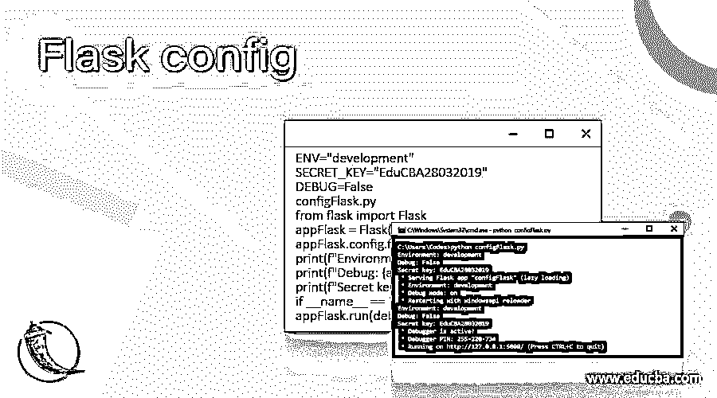

# 烧瓶配置

> 原文：<https://www.educba.com/flask-config/>

## 烧瓶配置介绍

Flask config 被定义为根据运行的性质、数量和正在构建的 web 应用的主要特征，使功能单元能够一起运行的安排系统。硬件、软件、固件等的选择。配置系统以实现其最佳性能的方法非常广泛。因此，我们可以合理地假设配置的变化会影响 Flask 开发的 web 应用程序的性能和功能。了解配置是 Flask 应用程序最重要的部分，因为没有配置，应用程序甚至可能无法运行。如今，随着即插即用功能的出现，对于最小运行，配置是自动执行的，但是对于最佳运行，修改是不可避免的！

### 如何在 Flask 中执行配置？

在我们学习执行配置的方法之前，我们需要理解一些关于配置含义的概念。根据应用程序运行的环境、调试模式切换、密钥设置、特定于环境的事情等等，配置有不同的方面需要干预。当应用程序启动时，需要读取配置，这可以通过三种方式实现，我们将在本文中详细讨论。简单地说，我们可以在代码中硬编码配置，这对于小型应用程序来说是可以的，但是如果应用程序是一个巨大的代码库或者包含许多参数来使应用程序以其优化的方式运行，那么在进行更改时就变成了一项艰巨的任务。不管配置是如何加载的，都有一个对象值来存储为运行应用程序而加载的配置值。Flask 放置值的地方是 Flask 对象的 config 属性。config 属性不仅允许存储 Flask 配置，还允许存储扩展的配置值。config 属性就像 dictionary 的一个 sib 类，可以像任何其他 dictionary 一样使用键-值对的概念进行修改。

<small>网页开发、编程语言、软件测试&其他</small>

现在是时候让我们知道如何在 Flask 中执行配置了。正如我们在上一段中提到的，有 3 种方法:

#### 1.内嵌配置

虽然这是一个指针，在我们的列表中排在第一位讨论，但它是一个非常不鼓励的。这是最好的软件开发实践之一。现在，如果我们能够理解这样一个清楚的事实，即当我们已经在代码中创建了 Flask app 对象时，为什么还要等待设置 Flask environment 这样的变量，那么我们称之为最佳软件开发实践的原因就很容易理解了。配置以实现最佳运行方式的整个要点受到了阻碍。不仅如此，想想在代码本身中改变巨大的变量，这对代码的可读性和调试造成很大的威胁。最后但并非最不重要的是，我们在代码库中的某个地方暴露了高度敏感的值，如密钥！然而，这篇文章的职责是让你了解情况，因此一开始就让我们把它作为不使用的免责声明！为了改进我们的配置方式，让我们在接下来的两点中探索比这更好的选择。

#### 2.来自. py 文件的配置

内联代码参数化的最佳替代方案是什么？也许看起来完全一样的东西，代码感觉也一样。为此，既然 flask 应用程序是用 python 编写的，那么将所有配置放在一个. py 文件中，然后允许包含 Flask 应用程序的代码库首先获取参数，执行它们，然后开始构建 Flask 应用程序，怎么样？这从此解决了由于代码库中如此多的参数而造成的混乱。Flask 会立即识别这些变量，并以自己的方式实现它们。但是我们仍然面临敏感信息被泄露的问题。为此，我们可以设置一个环境变量，并允许 Flask 应用程序从环境变量中获取该参数。在运行 flask 应用程序之前，我们通过使用命令 export <variable name="">来实现这一点。因此，我们有了一个更干净和安全的配置变量的方法！</variable>

#### 3.通过类对象进行配置

在模块化的范围内，通过类对象使用来自配置的变量。我们在代码中使用一个类对象来创建 config.py，我们可以将 config 设置提升到比。py 法。使用不一刀切的概念，我们可以为不同的情况定制配置，比如一个用于开发，一个用于生产。可以使用方法或者代码< Flask App Object >. config . from _ object(< Config Class >)来检索配置。< Config group >’)。在这里，配置组从替换< Config Class >的基类扩展函数，并将其添加到< Config group >类中的函数中。

### 烧瓶配置示例

下面是下面提到的例子

#### 示例#1

从代码中设置配置:

**语法:**

**从烧瓶导入烧瓶**

`appFlask = Flask(__name__)
appFlask.config['ENV'] = 'development'
appFlask.config['SECRET_KEY'] = 'Am12979019Ky'
appFlask.config['DEBUG'] = False
print(appFlask.config)
if __name__ == '__main__':
appFlask.run(debug = True)`

**输出:**

#### 实施例 2

从设置配置。py 文件:

**语法:**

**devConfig.py**

`ENV="development"
SECRET_KEY="EduCBA28032019"
DEBUG=False
configFlask.py
from flask import Flask
appFlask = Flask(__name__)
appFlask.config.from_pyfile('devConfig.py')
print(f"Environment: {appFlask.config['ENV']}")
print(f"Debug: {appFlask.config['DEBUG']}")
print(f"Secret key: {appFlask.config['SECRET_KEY']}")
if __name__ == '__main__':
appFlask.run(debug = True)`

**输出:**

### 结论

在本文中，我们已经了解了在用 Python 构建 Flask 应用程序时配置的各种方式。不仅如此，我们还知道在构建 Flask 应用程序时不要做什么，并记住这一点，而且我们还构建 Flask 应用程序来实现它的效用！

### 推荐文章

这是一个烧瓶配置指南。在这里，我们将讨论如何在 Flask 中执行配置，以及示例和输出。您也可以看看以下文章，了解更多信息–

1.  [烧瓶服务器](https://www.educba.com/flask-server/)
2.  [烧瓶缓存](https://www.educba.com/flask-cache/)
3.  [Python 中的烧瓶](https://www.educba.com/flask-in-python/)
4.  [烧瓶 HTTPS](https://www.educba.com/flask-https/)

