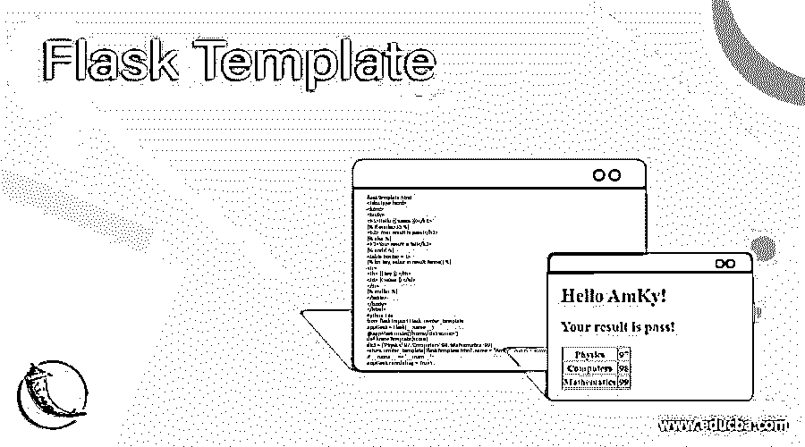
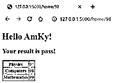
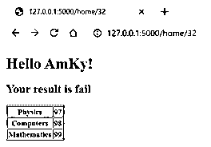

# 烧瓶模板

> 原文：<https://www.educba.com/flask-template/>

## 烧瓶模板上的定义

Flask template 被定义为一种方法，使开发人员能够在正在构建的 Flask web 应用程序中重用可视化内容。视觉效果的重用使开发人员不仅能够利用已经成功的用户体验的输入，从而不再重新发明轮子，而且还有助于划分业务逻辑和表示部分。例如，我们正在构建一个 web 应用程序，我们希望页面保持相同的页眉和页脚，以便网页看起来一致，并且一些数据如联系人、电子邮件 id、地址出现在每个页面上，最终指向相同的设计。这可以通过模板来实现。让我们看看如何！

**语法:**

<small>网页开发、编程语言、软件测试&其他</small>

正如我们所知，模板需要一些静态数据和动态数据的占位符。动态数据是通过 python 文件中的参数发送的，用于生成最终文档。在这一节中，我们将从语法的角度学习一些，这样当我们知道模板的工作原理时，就可以更容易地将它与这里学到的语法对应起来，从而对讨论的主题有一个完整的了解。我们还需要理解，模板文件需要存储在**flask**包中的“**templates”**目录下。

**定义 HTML 模板:**

`<html>
<head>
<title>{{ < variable 1 > }}</title>
</head>
<body>
<h1> {{ < variable 2 > }}</h1>
</body>
</html>
Importing the rendering library:
from flask import render_template`

**在 URL 端点中使用渲染模板:**

`render_template('< template file name>', < variable_1> ='< value of the variable 1 >', <variable 2>=< value of the variable 2 >)`

这里“< >”中的所有内容都需要替换为作为 HTML 模板文件输入的变量。

**在 HTML 模板中使用 if 循环:**

`

`

**在 HTML 模板中使用 for 循环:**

`
`

### 如何在 Flask 中创建和使用模板？

在我们开始创建和使用模板之前，让我们更详细地了解一下 Flask 模板的后端。通过 python 生成 HTML 数据，尤其是当数据是动态的时，需要从 HTML 中进行大量的转义，因为这需要放置条件或循环。现在，利用名为 Jinja2 template engine 的引擎的优势，我们可以使用 render_template()函数进行渲染，而不是从函数中返回硬编码的 HTML。在函数本身中，可以创建循环并在模板中添加 if 语句。因此，flask 函数将变量值发送给 Jinja 引擎，后者从预定义的 HTML 模板中提取模板。Jinja 引擎是 Python 的一个全功能模板引擎，它用 Flask 服务器共享的动态数据替换模板中的变量，并最终返回包含替换值的页面。

现在我们了解了工作原理，让我们看看如何在 Flask 中创建模板。为此，我们需要遵守下面提到的一些先决条件:

1.  机器上的本地 Python 3 编程环境，我们将在其中构建 Flask 应用程序。
2.  对数据类型、条件语句等 python 概念有一些简单的理解。

具备了上述先决条件后，我们现在就可以在 Flask 中构建模板了。为此，我们需要遵循以下步骤:

**第一步:安装砂箱**

第一步是在我们创建的 Python 环境中安装 Flask。我们可以通过 pip 安装命令来实现这一点，即 pip 安装 flask。

**步骤 2:创建基础应用**

一旦安装了所需的模块，我们将需要创建一个基本的 Flask 应用程序，它将足以运行 Flask 服务器。这可以简单到在“/”处有一个 URL 端点，以便我们确保在系统上运行 Flask 服务器没有问题。为了测试应用程序是否正在运行，我们可以进入命令窗口，输入命令 **python < filename.py >。**这样，web 服务器将启动，所需的 URL 将出现在命令提示符中。

**第三步:HTML 模板构建**

在这里，我们构建了 HTML，以一种我们想象的网页的方式。Jinja 模板提供了一些定界符，这些定界符提供了动态数据的使用，可以根据需要创建动态数据。

*   用于语句的
***   {{ … }}打印到模板输出*   不属于模板输出的{# … #}条注释*   # … ##用于行声明**

 ****步骤 4:构建模板渲染的 URL 端点**

一旦模板被固定，我们将设置 URL，在那里我们将调用 render_template()函数并将必要的值传递给我们在模板中使用的变量。这就是 python 文件使用模板的方式，模板文件名和变量一起被提供给最终输出的渲染模板。模板现在可以用于表示目的，并确保业务逻辑和表示部分是分离的，我们保持一致的布局！

**步骤 5:运行最终的 python 文件**

因为我们已经测试了我们的应用程序运行，所以我们将使用类似的方法最后一次运行它，并在带有所需 URL 的 web 页面上期待结果。

### 例子

使用模板解释、动态数据、if 循环和 for 循环的 Flask 应用程序:

#### 示例#1

**语法**

`flaskTemplate.html
<!doctype html>
<html>
<body>
<h1>Hello {{ name }}!</h1>

<h2> Your result is pass!</h2>

<h2>Your result is fail</h2>

<table border = 1>

<tr>
<th> {{ key }} </th>
<td> {{ value }} </td>
</tr>

</table>
</body>
</html>
Python File
from flask import Flask, render_template
appFlask = Flask(__name__)
@appFlask.route('/home/<int:score>')
def homeTemplate(score):
dict = {'Physics':97,'Computers':98,'Mathematics':99}
return render_template('flaskTemplate.html',name = "AmKy", marks = score, result = dict)
if __name__ == '__main__':
appFlask.run(debug = True)`

**输出:**

当输入分数为 **98** 时:

当输入分数为 **32** 时:

### 结论

总之，在本文中，我们已经了解了如何创建和使用 Flask 模板。现在，正如我们通常所说的，读者可以使用这里讨论的基础来构建一些令人敬畏的网页，并扩展他们的知识视野！注意一些错误，比如 TemplateNotFound 错误，确保将 HTML 放在 templates 文件夹中！

### 推荐文章

这是一个烧瓶模板指南。这里我们讨论一下 Flask 中模板的定义，语法，如何创建和使用模板？以及代码实现的例子。您也可以看看以下文章，了解更多信息–

1.  [烧瓶 URL 参数](https://www.educba.com/flask-url-parameters/)
2.  [烧瓶 HTTPS](https://www.educba.com/flask-https/)
3.  [烧瓶数据库迁移](https://www.educba.com/flask-db-migrate/)
4.  [烧瓶环境变量](https://www.educba.com/flask-environment-variables/)

**