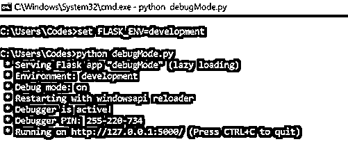
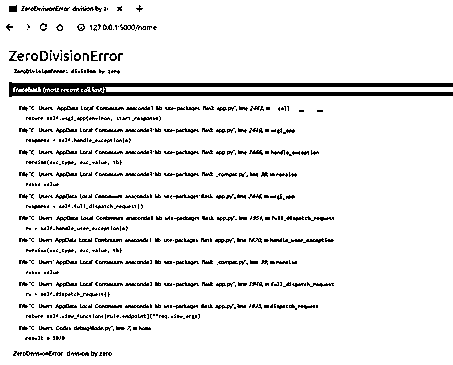

# 烧瓶调试模式

> 原文：<https://www.educba.com/flask-debug-mode/>

## 烧瓶调试模式介绍

Flask 调试模式被定义为一个模块，该模块确保在 Flask 应用程序的开发期间关于作为 Flask 的扩展而被推送的调试的洞察力。在开发服务器中开发任何 Flask 应用程序时，这种功能作为开发工具的一部分，并可在生产环境中启用。交互式回溯是许多伟大见解中的一个，它允许任何开发人员回顾代码并评估哪里出错了，以便有效地改进和修复代码。一个有效且通常被认为是最佳实践的方法是在开发环境中使用调试器，尽管人们也可以选择在生产环境中使用它，但只是暂时使用它！

### 为什么我们需要一个烧瓶来调试模式？

为了有效地发现并消除正在开发的应用程序中的错误，我们最需要的是调试模式，这样一旦错误被修复，应用程序就有资格成为最有价值的产品，而无 bug 应用程序极大地增加了其自身的价值。调试模式不仅有助于提高代码质量，还能帮助您到达代码中可能出现代码中断的地方。

<small>网页开发、编程语言、软件测试&其他</small>

通过一个简单的例子让我们知道可能的错误。在我们的代码中，有一个数学计算，我们将 2 个数字相除。假设在某些情况下分母为零。在这种情况下，整数数据类型可能无法处理这种情况。现在，在一个有多个模块的代码中，如果几乎不可能找到错误是从哪里产生的，甚至在更高的层次上，是什么错误。现在，在 Flask 服务器的情况下，如果调试模式没有打开，我们只会看到类似 404 的错误代码，或者在某些情况下是内部服务器错误等。现在，找出错误的类型和错误产生的位置是一项艰巨的任务！现在，如果在 Flask 中以调试模式运行代码，我们将能够追溯错误发生的位置以及错误是什么。

Flask server 还提供了一个交互式工具来实际了解错误发生前的值，因为它具有从浏览器执行 python 代码的功能，并且使用该交互式工具可以轻松进入最细粒度级别来找到问题，然后修复它。现在，作为一种最佳实践，我们不应该在生产中使用调试模式。原因如下:

*   最主要的原因是性能。当使用调试模式时，随着 RAM 利用率的增加，执行速度可能会显著降低。
*   下一个原因是在使用调试模式的情况下可能会出现安全漏洞，尽管有一个 PIN 附加到追溯，但安全漏洞的可能性确实存在，而且在生产数据中也存在！

### Flask 调试模式是如何工作的？

现在是我们研究 Flask 调试模式工作的时候了，因为此时我们知道了 Flask 调试模式的需要。作为参考，我们将使用 Flask 应用服务器(即 Werkzeug 开发服务器)内置调试器的摘录。建议仅在开发阶段使用内置调试器。在生产环境中，调试器允许执行任意 python 代码，尽管受 PIN 保护，但其安全性并不可靠。

首先，我们需要通过设置 FLASK_ENV 变量将环境设置为开发。这通过执行以下命令来实现:

`set FLASK_ENV=development`

一旦设置了这个环境，当出现错误时，调试器将自动弹出。启用调试模式的另一种方法是在 python 代码本身中传递 debug=True。现在，当调试器运行时，当遇到错误时，它会从代码行开始，试图追溯到主函数。通过这种方式，我们可以完整地追溯错误发生的位置，以及执行错误的代码所在的所有从属函数。

除了内置调试器之外，根据实用程序，我们确实可以为 Flask 应用程序使用永久调试器！

### 优点和缺点

并不是每个概念都是完美的，因此都有利弊。让我们在这里回顾一下 Flask 调试模式的优缺点:

#### 优势

*   Flask 调试模式允许开发者通过记录错误的回溯来定位任何可能的错误以及错误的位置。
*   Flask 调试模式还使开发人员能够交互式地运行任意 python 代码，以便能够解决并找到错误发生的根本原因。
*   调试模式的所有实用程序都允许开发人员节省时间和精力。
*   除了回溯之外，一个错误指出的文本也可以很容易地解释！

#### 不足之处

*   Flask 的调试模式，如果在生产中打开，会导致性能问题。
*   在生产中，使用调试模式会导致安全问题，因为用户可以运行任意 python 代码来侵入敏感的“生产”数据。
*   仅限开发环境使用！

### 例子

下面举几个例子

**例#1**

将环境作为开发来运行:

**语法** (debugMode.py 是包含 flask 应用程序的 python 代码)

在命令行中:

`set FLASK_ENV=development
python debugMode.py`

**输出:**

**例 2**

将环境作为生产环境运行:

**语法** (debugMode.py 是包含 flask 应用程序的 python 代码)

在命令行中:

`set FLASK_ENV=production
python debugMode.py`

**输出:**

**例 3**

运行时出现代码错误:

**语法** (debugMode.py 是一个 python 代码，包含一个带有故意错误的 flask 应用程序)

在 python 代码中:

`from flask import Flask
appFlask = Flask(__name__)
@appFlask.route('/home')
def home():
result = 10/0
return 'We are learning HTTPS @ EduCBA'
if __name__ == "__main__":
appFlask.run(debug=True)`

**输出:**

### 结论

通过这篇文章，我们了解了调试器如何工作的本质，以及在开发服务器中使用调试器的优点和缺点。我们还查看了一个故意的错误，以了解错误的堆栈跟踪，特别是指出错误的生成点！

### 推荐文章

这是一个烧瓶调试模式的指南。在这里，我们讨论了 Flask 调试模式是如何工作的，以及它的例子、优点和缺点。您也可以看看以下文章，了解更多信息–

1.  [烧瓶会话](https://www.educba.com/flask-session/)
2.  [烧瓶数据库迁移](https://www.educba.com/flask-db-migrate/)
3.  [烧瓶 URL 参数](https://www.educba.com/flask-url-parameters/)
4.  [烧瓶 HTTPS](https://www.educba.com/flask-https/)

