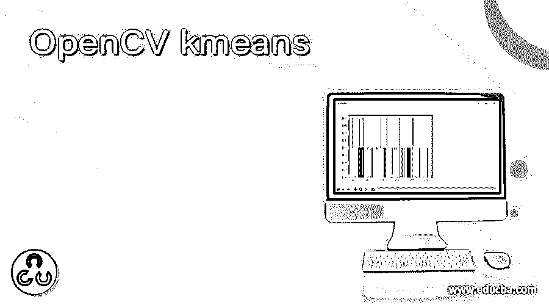
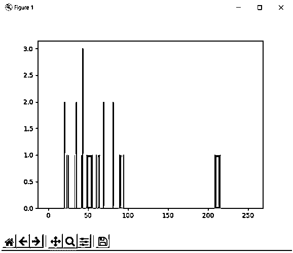

# OpenCV kmeans

> 原文：<https://www.educba.com/opencv-kmeans/>

## OpenCV kmeans 简介

Kmeans 算法是一种迭代算法，用于将给定的数据集聚类成不同的组，通过随机选择数据点作为质心 C1、C2 等，然后计算数据集中每个数据点到质心的距离，基于该距离，所有靠近每个质心的数据点用 0、1 等标记，然后所有数据点的平均值用 0 标记， 1 等等分别计算，并作为新的质心 C1、C2 等等，重复相同的过程，直到质心收敛到固定点。

**语法:**

<small>网页开发、编程语言、软件测试&其他</small>

`cv.kmeans(samples, nclusters(k), criteria, attempts, flags)`

其中样本是将被分组到聚类中的数据集，

*   nclusters(k)是给定数据集必须被分组到的聚类的数量，
*   标准是算法迭代终止所基于的标准，
*   尝试次数指定算法用不同的质心执行的次数
*   标志指定如何选择质心。

### kmeans 算法在 OpenCV 中的工作？

OpenCV 中 kmeans 算法的工作原理如下:

*   kmeans 算法从随机选择数据点作为质心 C1、C2 等开始。
*   然后计算数据集中每个数据点到质心的距离。
*   然后，通过用 0、1 等标记更靠近每个质心的所有数据点来对它们进行分组。
*   然后分别计算标有 0、1 等的所有数据点的平均值，并将结果作为新的质心 C1、C2 等。
*   重复相同的过程，直到质心收敛到一个固定点。
*   每个数据点与其对应的质心之间的距离总和必须最小。
*   要使用 kmeans 算法聚类到不同组中的数据集必须是 np.float32 数据类型。
*   迭代终止的标准是三个参数的元组，即 type、max_iter 和 epsilon。
*   参数类型指定了终止标准的类型，它有三个标志。
*   终止标准类型的三个标志是 cv。TERM_CRITERIA_EPS，cv。术语 _ 标准 _ 最大值 _ITER 和 cv。TERM_CRITERIA_EPS + cv。术语 _ 标准 _ 最大 _ITER。
*   参数类型 max_iter 指定最大迭代次数。
*   参数类型ε规定了所需的精度。
*   参数试图返回紧凑性作为输出。
*   最初使用两个标志来选择质心，它们是 [KMEANS_PP_CENTERS](https://docs.opencv.org/master/d5/d38/group__core__cluster.html#gga276000efe55ee2756e0c471c7b270949a78ddd00a99cd51db10ed63c024eb1e62) 和 [cv。KMEANS_RANDOM_CENTERS](https://docs.opencv.org/master/d5/d38/group__core__cluster.html#gga276000efe55ee2756e0c471c7b270949adfa80a38dfc0aef0de888c3164f33faf) 。

### 例子

让我们讨论 OpenCV kmeans 的例子。

#### 示例#1

python 中的 OpenCV 程序，通过创建由单个要素组成的数据集来演示 kmeans 算法的应用，然后应用 kmeans()函数，通过指定终止标准、最大迭代次数、ε、尝试次数和标志的类型，将创建的数据集分组为两个聚类，并绘制生成的聚类及其相应的质心，作为屏幕上的输出:

**代码:**

`#importing the modules numpy, cv2 and pyplot
import numpy as np
import cv2 as cv
from matplotlib import pyplot as plt
#creating a two dimensional array consisting of 50 elements in the range 0-255
first = np.random.randint(20, 100, 25)
second = np.random.randint(170, 255, 25)
#stacking the two arrays into a single array
resarray = np.hstack((first, second))
#reshaping the resulting array to a column vector
resarray = resarray.reshape((50, 1))
#converting the type of the resulting array to np.float32
resarray = np.float32(resarray)
#defining the termination criteria with type, max_iter and epsilon
criteria = (cv.TERM_CRITERIA_EPS + cv.TERM_CRITERIA_MAX_ITER, 20, 2.0)
# specifying the flag to choose the centroids
flags = cv.KMEANS_RANDOM_CENTERS
#applying kmeans function to cluster the given set of date into two clusters
compactness, labels, centers = cv.kmeans(resarray, 2, None, criteria, 20, flags)
#plotting the graph of two clusters against labels with one cluster in black color, another cluster in yellow color and centroids in red color
cluster1 = resarray[labels==0] cluster2 = resarray[labels==1] plt.hist(cluster1, 256, [0, 256], color='black')
plt.hist(cluster2, 256, [0, 256], color='yellow')
plt.hist(centers, 32, [0, 256], color='red')
plt.show()`

上面程序的输出显示在下面的快照中:

在上面的程序中，我们创建了一个二维数组，并将其转换为一个列向量，然后对创建的数据集应用 kmeans()函数，将数据集分成两个簇，得到的两个簇及其对应的质心绘制在一个图形中，并作为输出显示在屏幕上。

#### 实施例 2

python 中的 OpenCV 程序，通过创建由单个要素组成的数据集来演示 kmeans 算法的应用，然后应用 kmeans()函数，通过指定终止标准、最大迭代次数、ε、尝试次数和标志的类型，将创建的数据集分组为三个聚类，并绘制生成的聚类及其相应的质心，作为屏幕上的输出:

**代码:**

`#importing the modules numpy, cv2 and pyplot
import numpy as np
import cv2 as cv
from matplotlib import pyplot as plt
#creating a two dimensional array consisting of 50 elements in the range 0-255
first = np.random.randint(0, 100, 30)
second = np.random.randint(100, 255, 30)
#stacking the two arrays into a single array
resarray = np.hstack((first, second))
#reshaping the resulting array to a column vector
resarray = resarray.reshape((60, 1))
#converting the type of the resulting array to np.float32
resarray = np.float32(resarray)
#defining the termination criteria with type, max_iter and epsilon
criteria = (cv.TERM_CRITERIA_EPS + cv.TERM_CRITERIA_MAX_ITER, 20, 2.0)
# specifying the flag to choose the centroids
flags = cv.KMEANS_RANDOM_CENTERS
#applying kmeans function to cluster the given set of date into two clusters
compactness, labels, centers = cv.kmeans(resarray, 3, None, criteria, 20, flags)
#plotting the graph of three clusters against labels with one cluster in black color, another cluster in yellow color and the last cluster in green color and centroids in red color
cluster1 = resarray[labels==0] cluster2 = resarray[labels==1] cluster3 = resarray[labels==2] plt.hist(cluster1, 256, [0, 256], color='black')
plt.hist(cluster2, 256, [0, 256], color='yellow')
plt.hist(cluster3, 256, [0, 256], color='green')
plt.hist(centers, 32, [0, 256], color='red')
plt.show()`

上面程序的输出显示在下面的快照中:

在上面的程序中，我们创建了一个二维数组，并将其转换为一个列向量，然后对创建的数据集应用 kmeans()函数，将数据集分组为三个簇，得到的三个簇及其对应的质心绘制在一个图形中，并作为输出显示在屏幕上。

### 结论

在本文中，我们通过 kmeans 算法的定义、语法和工作原理了解了 kmeans 算法的概念，并用相应的编程示例及其输出来演示。

### 推荐文章

这是一个 OpenCV kmeans 的指南。这里我们讨论一下 OpenCV 中 kmeans 算法的描述，工作原理？示例分别用代码实现。您也可以看看以下文章，了解更多信息–

1.  [KMP 算法](https://www.educba.com/kmp-algorithm/)
2.  [冒泡排序算法](https://www.educba.com/bubble-sort-algorithm/)
3.  [极大极小算法](https://www.educba.com/minimax-algorithm/)
4.  [人工智能中的搜索算法](https://www.educba.com/search-algorithms-in-ai/)

