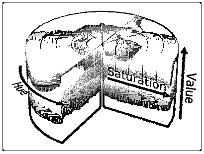
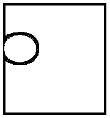

# OpenCV HSV

> 原文：<https://www.educba.com/opencv-hsv/>

## OpenCV HSV 简介

OpenCV HSV 函数被缩写为色调饱和度值，它是由系统提供的一种标度，以适应相对于准确颜色名称 we 的数值读出，该准确颜色名称 we 正好对应于提供给系统进行分析的图像中存在的颜色。颜色的色调以标准的度数单位(0 度到 360 度之间)来衡量。OpenCV 库有一个公共函数，用于识别。

色彩的光谱与色调和饱和度的磨损定义存在。必须注意，OpenCV 库中有超过 150 种转换方法可用于色彩空间转换。让我们观察最常用于 HSV 保存的功能。

<small>网页开发、编程语言、软件测试&其他</small>

### HSV 应用程序使用的语法和函数

以下是用于实现 OpenCV HSV 函数的语法:

`cv2.cvtColor(src, code[, dst[, dstCn]])`

**OpenCV HSV 应用参数:**

以下是用于定义 cvtColor 函数的参数，该函数用于将图像转换为 HSV 格式:

| **参数** | **所用参数的描述** |
| **src** | 用户输入的原始图像作为输入源，其颜色空间必须改变。 |
| **代码** | 该参数定义了用于所提供图像的色彩空间转换应用的特定代码。 |
| **夏令时** | 与原始源图像或 src 相比，由系统产生的输出图像具有相同的深度和大小。 |
| **dstCn** | 该参数定义了在目标位置生成的图像中存在的通道总数。如果该参数未被指定，并且默认值被设置为 0，在这种情况下，通道的总数默认是自动的，并且从给定的代码和对原始源图像的分析中导出。此参数是可选参数。 |
| **返回值** | 它是应用该功能后由系统产生的最终图像或图像文件类型。(输出图像) |

### OpenCV HSV 函数如何执行？

由于色调浓度的通道说明了颜色类型，因此该函数对于使用图像处理的程序或具有相关任务的程序非常有用，这些任务基于颜色浓度和色调变化在区分对象的执行模型上工作。颜色饱和度的变化在未饱和(代表灰色的各种阴影)到完全饱和(不含白色成分的颜色)之间变化。该函数的值通道参数负责描述图像中不同部分的亮度，或者说颜色强度。

例如，假设给定的图片有一部分用青色填充，这种颜色在 181 度到 240 度之间，而另一种颜色品红在 301 度到 360 度之间，这取决于图像中使用的颜色的强度和色调。

上面提供的图像是以圆柱格式表示的色调饱和度值模型。

### OpenCV HSV 示例

下面是提到的例子:

下面的示例使用 Python 3 编程语言中的 OpenCV 库说明了色调饱和度值(OpenCV HSV)方法的使用。

**代码:**

`# command used to import the OpenCV library to utilize the Hue Saturation Value function
import cv2 as cv_2
import numpy as np1
cap_1 = cv_2.VideoCapture(0)
while(1):
# Capturing each frame of image that is provided by the user
# command cap.read is used in order to read the image which is being sourced by the programmer
_, frame1 = cap.read()
# Converting the BGR format to HSV format
hsv_1 = cv_2.cvtColor1(frame, cv.COLOR_BGR2HSV)
# defining the range of the color BLUE in HSV format
lower_blue1 = np1.array([110,50,50])
upper_blue1 = np1.array([130,255,255])
# Threshold of the feature for HSV image to result in the output image which contains blue colors only
mask1 = cv_2.inRange(hsv_1, lower_blue1, upper_blue1)
# Bitwise-AND mask and original image
res1 = cv_2.bitwise_and(frame1, frame1, mask1 = mask1)
# the resultant image is displayed which is showed together the difference in the images after HSV filter is applied which has been performed on it
cv_2.imshow('frame',frame1)
cv_2.imshow('mask',mask1)
cv_2.imshow('res',res1)
k = cv_2.waitKey(5) & 0xFF
if k1 == 27:
break
cv_2.destroyAllWindows()`

**输出:**

**显示原始图像:**

**显示带有 HSV 支出的输出图像:**

**Note:** At times the image that is processed as to final output image capture some noise during the application of the function, generally in such images for the processes have to be performed especially if the object present in the image is not structured or irregular.

### 结论

色调饱和度值或 HSV 函数是 OpenCV 库中存在的一个非常重要的功能，该功能由系统提供，以满足与精确颜色名称 we 相关的数值读出，该名称与提供给系统进行分析的图像中存在的颜色相对应。由于色调浓度的通道说明了颜色类型，因此该函数对于使用图像处理的程序或具有相关任务的程序非常有用，这些任务基于颜色浓度和色调变化在区分对象的执行模型上工作。颜色饱和度的变化在不饱和到完全饱和之间变化。它是一个非常重要的功能，在涉及图像检测和帧扫描或图像检测的应用中被广泛使用。

### 推荐文章

这是一个 OpenCV HSV 的指南。这里我们讨论一下入门，OpenCV HSV 函数是如何执行的？和示例。您也可以看看以下文章，了解更多信息–

1.  [OpenCV kmeans](https://www.educba.com/opencv-kmeans/)
2.  [Python 断言错误](https://www.educba.com/python-assertionerror/)
3.  [Python 数组长度](https://www.educba.com/python-array-length/)
4.  [Python 索引错误](https://www.educba.com/python-indexerror/)

