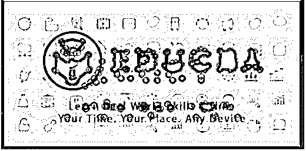
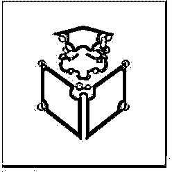

# OpenCV ORB

> 原文：<https://www.educba.com/opencv-orb/>

## OpenCV ORB 简介

下面的文章提供了 OpenCV ORB 的概要。用于从给定图像中检测特征以及该图像的方向和描述符的算法被称为 ORB 算法，并且它是快速关键点检测器和摘要描述符的组合，其中由摘要执行的旋转由 ORB 根据关键点的方向来旋转以找到旋转矩阵，并且在计算成本、性能、特征提取和专利方面， 与 SIFT 和 SURF 算法相比，ORB 算法是最佳选择，我们使用 ORB()函数通过创建 ORB 对象来实现 ORB 算法。

**OpenCV 中定义 ORB()函数的语法:**

<small>网页开发、编程语言、软件测试&其他</small>

`ORB_object = cv.ORB_create()
keypoints = ORB_object.detect(input_image)
keypoints, descriptors = ORB_object.compute(input_image, keypoints)`

在哪里，

*   ORB_create()用于创建一个 ORB 对象 ORB_object。
*   ORB_object.detect()函数用于检测给定图像 input_image 中的关键点。
*   ORB_object.compute()函数用于计算给定输入图像 input_image 的描述符。

### 利用 OpenCV 中的 ORB()实现 ORB 算法

*   ORB 算法可以应用于图像，以检测图像的特征以及方向和描述符。
*   ORB 算法可以使用一个名为 ORB()函数的函数来实现。
*   ORB 算法的实现是通过创建 ORB()函数的对象来实现的。
*   然后，我们使用一个名为 ORB_object.detect()的函数来检测给定图像中的关键点。
*   然后，我们使用一个名为 ORB_object.compute()的函数来计算给定图像的描述符。
*   然后，具有绘制在图像上的计算出的关键点的图像作为输出被返回。

### OpenCV ORB 示例

以下是 OpenCV ORB 的示例:

#### 示例#1

python 中的 OpenCV 程序实现 ORB 算法使用 ORB()函数检测给定图像的关键点并在图像上绘制关键点，并将结果图像作为输出显示在屏幕上。

**代码:**

`#importing the required module
import cv2 as cv
#reading the image whose key points are to detected using imread() function
imageread = cv.imread('C:/Users/admin/Desktimg/logo.png')
#creating an object of ORB() function to detect the key points in the image
ORB_object = cv.ORB_create()
#detecting the key points in the image using ORB_object.detect() function
keypoints = ORB_object.detect(imageread)
#computing the descriptors for the input image using ORB_object.compute() function
keypoints, descriptors = ORB_object.compute(imageread, keypoints)
#using drawKeypoints() function to draw the detected key points on the image
imageresult = cv.drawKeypoints(imageread, keypoints, None, color=(255,0,0), flags=0)
#displaying the resulting image as the output on the screen
cv.imshow('ORB_image', imageresult)
cv.waitKey()`

**输出:**

在上面的程序中，导入了所需的模块 cv2。然后，我们使用 imread()函数读取要检测关键点的图像。然后我们创建一个 ORB()函数的对象来检测图像中的关键点。然后我们使用 ORB_object.detect()函数检测图像中的关键点。然后，我们使用 ORB_object.compute()函数计算输入图像的描述符。然后，我们使用 drawKeypoints()函数在图像上绘制检测到的关键点。然后，我们将结果图像作为输出显示在屏幕上。输出显示在上面的快照中。

#### 实施例 2

python 中的 OpenCV 程序实现 ORB 算法使用 ORB()函数检测给定图像的关键点并在图像上绘制关键点，并将结果图像作为输出显示在屏幕上。

**代码:**

`#importing the required module
import cv2 as cv
#reading the image whose key points are to detected using imread() function
imageread = cv.imread('C:/Users/admin/Desktimg/educba.jpg')
#creating an object of ORB() function to detect the key points in the image
ORB_object = cv.ORB_create()
#detecting the key points in the image using ORB_object.detect() function
keypoints = ORB_object.detect(imageread)
#computing the descriptors for the input image using ORB_object.compute() function
keypoints, descriptors = ORB_object.compute(imageread, keypoints)
#using drawKeypoints() function to draw the detected key points on the image
imageresult = cv.drawKeypoints(imageread, keypoints, None, color=(255,0,0), flags=0)
#displaying the resulting image as the output on the screen
cv.imshow('ORB_image', imageresult)
cv.waitKey()`

**输出:**

在上面的程序中，导入了所需的模块 cv2。然后，我们使用 imread()函数读取要检测关键点的图像。然后我们创建一个 ORB()函数的对象来检测图像中的关键点。然后我们使用 ORB_object.detect()函数检测图像中的关键点。然后，我们使用 ORB_object.compute()函数计算输入图像的描述符。然后，我们使用 drawKeypoints()函数在图像上绘制检测到的关键点。然后，我们将结果图像作为输出显示在屏幕上。输出显示在上面的快照中。

#### 实施例 3

python 中的 OpenCV 程序实现 ORB 算法使用 ORB()函数检测给定图像的关键点并在图像上绘制关键点，并将结果图像作为输出显示在屏幕上。

**代码:**

`#importing the required module
import cv2 as cv
#reading the image whose key points are to detected using imread() function
imageread = cv.imread('C:/Users/admin/Desktimg/educbalogo.jpg')
#creating an object of ORB() function to detect the key points in the image
ORB_object = cv.ORB_create()
#detecting the key points in the image using ORB_object.detect() function
keypoints = ORB_object.detect(imageread)
#computing the descriptors for the input image using ORB_object.compute() function
keypoints, descriptors = ORB_object.compute(imageread, keypoints)
#using drawKeypoints() function to draw the detected key points on the image
imageresult = cv.drawKeypoints(imageread, keypoints, None, color=(255,0,0), flags=0)
#displaying the resulting image as the output on the screen
cv.imshow('ORB_image', imageresult)
cv.waitKey()`

**输出:**

在上面的程序中，导入了所需的模块 cv2。然后，我们使用 imread()函数读取要检测关键点的图像。然后我们创建一个 ORB()函数的对象来检测图像中的关键点。然后我们使用 ORB_object.detect()函数检测图像中的关键点。然后，我们使用 ORB_object.compute()函数计算输入图像的描述符。然后，我们使用 drawKeypoints()函数在图像上绘制检测到的关键点。然后，我们将结果图像作为输出显示在屏幕上。输出显示在上面的快照中。

### 推荐文章

这是一个 OpenCV ORB 的指南。这里我们分别讨论 ORB 算法的介绍、使用 OpenCV 中的 ORB()实现 ORB 算法的工作原理和实例。您也可以看看以下文章，了解更多信息–

1.  [OpenCV HSV](https://www.educba.com/opencv-hsv/)
2.  [OpenCV 霍夫变换](https://www.educba.com/opencv-hough-transform/)
3.  [OpenCV kmeans](https://www.educba.com/opencv-kmeans/)
4.  [Python 过滤函数](https://www.educba.com/python-filter-function/)

