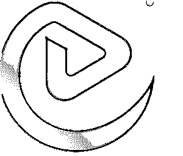
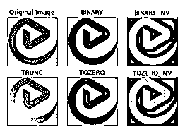

# OpenCV 阈值

> 原文：<https://www.educba.com/opencv-threshold/>

## OpenCV 阈值介绍

OpenCV 是一种有助于处理图像的技术。OpenCV 中的阈值有助于指定像素值。这些像素值被分配给阈值。然后，将这些值与阈值进行比较，如果像素值大于阈值，则将该值设置为最大值，如果小于阈值，则将该值设置为 0，从而分割图像。为了分割图像，这种技术是最常用的，有助于获得更好的结果。Python 还提供了一个设置这个阈值的函数，我们很快就会用到它。

**语法:**

<small>网页开发、编程语言、软件测试&其他</small>

使用该函数的语法如下:

`cv.threshold(src, thresholdValue, maxValue, threshold type)`

**参数:**

*   **src:** 这将是应该是灰度的源图像。灰度图像是黑白图像。
*   **thresholdValue:** 这将是高于像素值和低于像素值的阈值。阈值将根据像素不断变化。
*   **最大值:**这将是可以分配给一个像素的最大值。
*   **阈值类型:**阈值类型是将应用于图像的技术或类型。

我们也可以像添加源一样添加目的地。一旦图像被处理，它将被存储在这个位置。

### OpenCV 中阈值函数是如何工作的？

为了创建二值图像，必须对图像进行分割。这个分割是通过使用 OpenCV 阈值来完成的。这种阈值处理是简单阈值处理和自适应阈值处理。这里使用的像素值必须有相应的阈值，该阈值应该是相同的。

逻辑将保持不变，如果像素值小于阈值，则它将被设置为 0，如果它大于阈值，则它将被设置为最大值。它可以使用阈值技术，如 THRESH_BINARY、THRESH_BINARY_INV、THRESH_TRUNC、THRESH_TOZERO、THRESH_TOZERO_INV。这些技术有助于创建灰度图像。

这些技术的工作原理如下:

*   **简历。THRESH_BINARY:** 大于阈值的像素亮度将设置为 255，否则将为 0 的黑色。
*   **简历。THRESH_BINARY_INV:** 在这种情况下，像素的亮度将是 THRESH_BINARY 的倒数。当像素值小于阈值时为 0，否则为白色。
*   **简历。THRESH_TRUNC:** 当像素强度变得大于阈值时，它将被截断到阈值。此后，像素值应设置为与阈值相同的值，其他值也相同。
*   **简历。THRESH_TOZERO:** 所有像素的值小于阈值，这些像素的像素强度被设置为零。
*   **简历。THRESH_TOZERO_INV:** 这将按照与上述函数相反的方式工作。

### OpenCV 阈值示例

让我们看一个例子，看看 OpenCV 是如何工作的，以及它如何在不同的阈值下工作。

我们将要处理的原始图像如下:

让我们处理这个图像，并使用 OpenCV 技术将其转换成灰度。

**代码:**

`# Python program example to understand threshold and its techniques
# importing necessary libraries
import cv2
import numpy as np
# specify the path where the image is and read it using imread
img1 = cv2.imread('eduCBA.JPG')
# cv2.cvtColor is used with the image to change it to grayscale image
imagenew = cv2.cvtColor(img1, cv2.COLOR_BGR2GRAY)
# use different thresholding techniques.
#pixels which will have value greater than specified pixel values will be set to 255
ret, thrsh1 = cv2.threshold(imagenew, 150, 255, cv2.THRESH_BINARY)
ret, thrsh2 = cv2.threshold(imagenew, 200, 255, cv2.THRESH_BINARY_INV)
ret, thrsh3 = cv2.threshold(imagenew, 125, 255, cv2.THRESH_TRUNC)
ret, thrsh4 = cv2.threshold(imagenew, 180, 255, cv2.THRESH_TOZERO)
ret, thrsh5 = cv2.threshold(imagenew, 160, 0, cv2.THRESH_TOZERO_INV)
# display the different images
cv2.imshow('Image after applying Binary Threshold', thrsh1)
cv2.imshow('Image after applying Binary Threshold Inverted', thrsh2)
cv2.imshow('Image after applying Truncated Threshold', thrsh3)
cv2.imshow('Image after applying Set to 0', thrsh4)
cv2.imshow('Image after applying Set to 0 Inverted', thrsh5)
# De-allocate any associated memory usage
if cv2.waitKey(0) & 0xff == 27:
cv2.destroyAllWindows()
titles = ['Original Image','BINARY','BINARY_INV','TRUNC','TOZERO','TOZERO_INV'] images = [imagenew, thrsh1, thrsh2, thrsh3, thrsh4, thrsh5] for i in range(6):
plt.subplot(2,3,i+1),plt.imshow(images[i],'gray')
plt.title(titles[i])
plt.xticks([]),plt.yticks([])
plt.show()`

上面的代码首先导入处理图像所需的必要库。

如果 OpenCV 库出现错误，您可以使用以下命令安装它:

**代码:**

`pip install opencv-python`

安装完成后，您将收到以下消息:

**输出:**

然后，代码转到存储图像的路径。然后，它使用 imread 函数读取该图像。cv2.cvtcolor 是 cv2 库中的一个函数。它会将此图像转换为灰色。现在，我们将使用上述指定的阈值技术，然后观察一旦像素被舍入到特定阈值时图像发生的变化。我们已经应用了所有 5 种阈值技术。在将这些技术应用到“imagenew”之前，我们已经获取了图像的不同像素值。

最后一种技术将阈值设置为 0。我们调用这些函数时，只需使用 cv2 函数，后跟函数名，就可以得到所需的结果。一旦我们应用了这些，我们就可以使用 imshow 函数打印输出，这个函数也存在于 cv2 库中。这些输出将显示在不同的窗口中，并以网格的形式显示，因为我们使用了绘图库。在我们执行了必要的操作后，我们清除存储器。

**原始图像的输出如下图所示:**

正如你所看到的，上面的图像有一个灰度，并根据不同的像素和阈值而改变。

### 结论

OpenCV 是一种深度学习算法，它有助于在使用不同的模型和算法将图像用于分类之前处理图像。阈值功能有助于创建灰度图像，因此该图像只能有两种结果，即黑色或白色。这有助于更好地处理和有效地应用模型。

### 推荐文章

这是一个 OpenCV 阈值的指南。这里我们讨论一下入门，OpenCV 中的阈值函数是如何工作的？和示例。您也可以看看以下文章，了解更多信息–

1.  [OpenCV kmeans](https://www.educba.com/opencv-kmeans/)
2.  [Python 数组长度](https://www.educba.com/python-array-length/)
3.  [Python 过滤函数](https://www.educba.com/python-filter-function/)
4.  [Python 读取 Excel 文件](https://www.educba.com/python-read-excel-file/)

