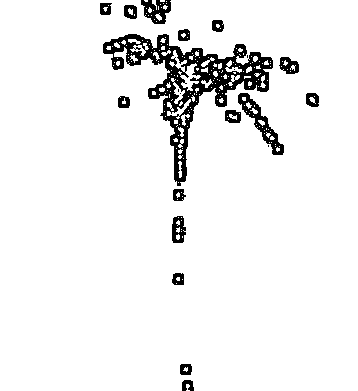

# OpenCV inRange

> 原文：<https://www.educba.com/opencv-inrange/>

## OpenCV inRange 简介

每当我们想用两个数组的对应元素来检查给定数组的元素时，其中一个数组表示上限，另一个数组表示下限， 我们在 OpenCV 中使用了一个名为 inRange() function 的函数，如果给定数组的元素位于表示上限和下限的两个数组之间，这个 inRange()函数返回一个等于 255 的元素数组，或者如果给定数组的元素不位于表示上限和下限的两个数组之间，这个 inRange()函数返回一个等于 0 的元素数组。

**OpenCV 中定义 inRange()函数的语法:**

<small>网页开发、编程语言、软件测试&其他</small>

`resultarray = inRange(sourcearray, upperboundarray, lowerboundarray)`

在哪里，

*   sourcearray 是其元素要与表示上限和下限的数组进行比较的数组。
*   upperboundarray 是由表示上限的元素组成的数组。
*   lowerboundarray 是由表示下限的元素组成的数组。
*   resultarray 是表示从 inRange()函数返回的等于 255 或 0 的元素的数组。

### OpenCV 中 inRange()函数的使用

*   为了确定给定数组的元素是否位于代表上限和下限的两个数组的元素之间，我们使用了 OpenCV 中一个名为 inRange() function 的函数。
*   OpenCV 中的 inRange()函数有三个参数，即 source array、upperboundsarray 和 lowerboundsarray。
*   参数 sourcearray 是其元素要与表示上限和下限的两个数组进行比较的数组。
*   参数 upperboundsarray 是由表示上限的元素组成的数组。
*   参数 lowerboundsarray 是由表示下限的元素组成的数组。
*   如果源数组的元素位于代表上限和下限的两个数组的元素之间，则 inRange()函数返回由等于 255 的元素组成的数组。
*   如果源数组的元素位于表示上限和下限的两个数组的元素之间，则 inRange()函数返回由等于 0 的元素组成的数组。

### OpenCV inRange 示例

以下是 OpenCV inRange 的示例:

#### 示例#1

python 中的 OpenCV 程序，通过指定下限和上限来屏蔽给定的图像，然后使用 inRange()函数将结果图像显示为屏幕上的输出。

**代码:**

`#importing the module cv2 and numpy
import cv2
import numpy as np
#reading the image which is to be masked
imagergb = cv2.imread('C:/Users/admin/Desktop/plane.jpg')
#defining the lower bounds and upper bounds
lower_bound = np.array([0, 0, 0])
upper_bound = np.array([350,55,100])
#masking the image using inRange() function
imagemask = cv2.inRange(imagergb, lower_bound, upper_bound)
#displaying the resulting masked image
cv2.imwrite("C:/Users/admin/Desktop/logo1.png", imagemask)`

**输出:**

在上面的程序中，我们正在导入模块 cv2 和 numpy。然后我们使用 imread()函数读取要遮罩的图像。然后，我们指定两个数组的上限和下限，作为参数传递给 inRange()函数以及源图像，以屏蔽图像并将其显示为屏幕上的输出。

#### 实施例 2

python 中的 OpenCV 程序，通过指定下限和上限来屏蔽给定的图像，然后使用 inRange()函数将结果图像显示为屏幕上的输出。

**代码:**

`#importing the module cv2 and numpy
import cv2
import numpy as np
#reading the image which is to be masked
imagergb = cv2.imread('C:/Users/admin/Desktop/tree.jpg')
#defining the lower bounds and upper bounds
lower_bound = np.array([0, 0, 0])
upper_bound = np.array([350,55,100])
#masking the image using inRange() function
imagemask = cv2.inRange(imagergb, lower_bound, upper_bound)
#displaying the resulting masked image
cv2.imwrite("C:/Users/admin/Desktop/logo1.png", imagemask)`

**输出:**

在上面的程序中，我们正在导入模块 cv2 和 numpy。然后我们使用 imread()函数读取要遮罩的图像。然后，我们指定两个数组的上限和下限，作为参数传递给 inRange()函数以及源图像，以屏蔽图像并将其显示为屏幕上的输出。

#### 实施例 3

python 中的 OpenCV 程序，通过指定下限和上限来屏蔽给定的图像，然后使用 inRange()函数将结果图像显示为屏幕上的输出。

**代码:**

`#importing the module cv2 and numpy
import cv2
import numpy as np
#reading the image which is to be masked
imagergb = cv2.imread('C:/Users/admin/Desktop/car.jpg')
#defining the lower bounds and upper bounds
lower_bound = np.array([0, 0, 0])
upper_bound = np.array([350,55,100])
#masking the image using inRange() function
imagemask = cv2.inRange(imagergb, lower_bound, upper_bound)
#displaying the resulting masked image
cv2.imwrite("C:/Users/admin/Desktop/logo1.png", imagemask)`

**输出:**

在上面的程序中，我们正在导入模块 cv2 和 numpy。然后我们使用 imread()函数读取要遮罩的图像。然后，我们指定两个数组的上限和下限，作为参数传递给 inRange()函数以及源图像，以屏蔽图像并将其显示为屏幕上的输出。

#### 实施例 4

python 中的 OpenCV 程序，通过指定下限和上限来屏蔽给定的图像，然后使用 inRange()函数将结果图像显示为屏幕上的输出。

**代码:**

`#importing the module cv2 and numpy
import cv2
import numpy as np
#reading the image which is to be masked
imagergb = cv2.imread('C:/Users/admin/Desktop/logo.png')
#defining the lower bounds and upper bounds
lower_bound = np.array([0, 0, 0])
upper_bound = np.array([350,55,100])
#masking the image using inRange() function
imagemask = cv2.inRange(imagergb, lower_bound, upper_bound)
#displaying the resulting masked image
cv2.imwrite("C:/Users/admin/Desktop/logo1.png", imagemask)`

**输出:**

在上面的程序中，我们正在导入模块 cv2 和 numpy。然后我们使用 imread()函数读取要遮罩的图像。然后，我们指定两个数组的上限和下限，作为参数传递给 inRange()函数以及源图像，以屏蔽图像并将其显示为屏幕上的输出。

### 推荐文章

这是 OpenCV inRange 的指南。这里我们分别讨论 OpenCV 中 inRange()函数的介绍、工作原理和实例。您也可以看看以下文章，了解更多信息–

1.  [OpenCV kmeans](https://www.educba.com/opencv-kmeans/)
2.  [Python 断言错误](https://www.educba.com/python-assertionerror/)
3.  [Python 过滤函数](https://www.educba.com/python-filter-function/)
4.  [Python 读取 Excel 文件](https://www.educba.com/python-read-excel-file/)

