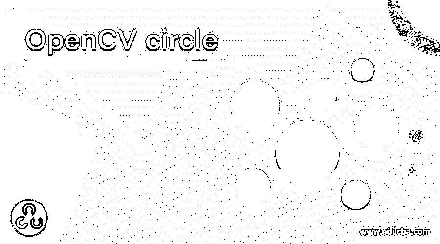
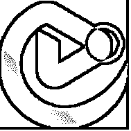

# OpenCV 圆

> 原文：<https://www.educba.com/opencv-circle/>

## OpenCV circle 简介

每当我们试图解决与计算机视觉相关的问题时，经常需要绘制不同的几何形状，如圆形、矩形等。为了在给定的图像上绘制圆，我们使用 OpenCV 中称为 circle()函数的函数，使用该函数可以在给定的图像上绘制以给定的 x 坐标和 y 坐标为中心的所需半径、所需的边界线颜色和所需的边界线粗细的圆，并且使用 circle()函数将绘制有圆的图像作为输出返回。

**OpenCV 中定义 circle()函数的语法如下:**

<small>网页开发、编程语言、软件测试&其他</small>

`circle(sourceimage, (x coordinate, y coordinate), radius, color. thickness)`

其中 sourceimage 是要在其上绘制圆的图像，
x 坐标和 y 坐标表示要在给定图像上绘制的圆的中心坐标，
radius 是要在给定图像上绘制的圆的半径，
color 是要在给定图像上绘制的圆的边界线颜色，
thickness 是要在给定图像上绘制的圆的边界线粗细。

### OpenCV 中 circle()函数的使用

*   每当我们试图解决与计算机视觉相关的问题时，经常需要绘制不同的几何形状，如圆形、矩形等。
*   为了在给定的图像上画一个圆，我们使用了 OpenCV 中一个名为 circle()的函数。
*   circle()函数有五个参数，即 sourceimage，(x 坐标，y 坐标)，半径，颜色和厚度。
*   参数 sourceimage 是要在其上绘制圆的图像。
*   参数 x 坐标和 y 坐标表示要在给定图像上绘制的圆的中心坐标。
*   参数 radius 是要在给定图像上绘制的圆的半径。
*   参数 color 是要在给定图像上绘制的圆的边框线颜色。
*   参数 thickness 是要在给定图像上绘制的圆的边界线粗细。
*   circle()函数返回一个图像，在该图像上从指定的 x 坐标和 y 坐标、指定的半径、指定的边框线颜色和指定的边框线粗细绘制了一个圆。

### OpenCV 圆圈示例

下面举几个例子

#### 示例#1

python 中的 OpenCV 程序演示 circle()函数，使用该函数在给定图像上从指定的 x 坐标和 y 坐标、指定的半径、指定的边界线颜色和指定的边界线粗细绘制一个圆，并作为屏幕上的输出返回:

`#importing the module cv2
import cv2
#reading the image from a given path on which the circle is to be drawn
imageread = cv2.imread('C:/Users/admin/Desktop/logo.png')
#using circle() function to draw a circle on the given image
imagecircle = cv2.circle(imageread, (120, 50), 20, (255, 0, 0), 2)
#displaying the image with circle drawn on it as the output on the screen
cv2.imwrite("C:/Users/admin/Desktop/logo1.png", imagecircle)`

给定程序的输出显示在下面的快照中:

在上面的程序中，我们正在导入模块 cv2。然后，我们使用 imread()函数读取要在其上画圆的图像。然后利用 circle()函数，通过指定源图像、x 坐标和 y 坐标、半径、边界线颜色和边界线圆，在给定的图像上画一个圆。circle()函数返回画有圆圈的图像，作为屏幕上的输出。输出显示在上面的快照中。

#### 实施例 2

python 中的 OpenCV 程序演示 circle()函数，使用该函数在给定图像上从指定的 x 坐标和 y 坐标、指定的半径、指定的边界线颜色和指定的边界线粗细绘制一个圆，并作为屏幕上的输出返回:

`#importing the module cv2
import cv2
#reading the image from a given path on which the circle is to be drawn
imageread = cv2.imread('C:/Users/admin/Desktop/plane.jpg')
#using circle() function to draw a circle on the given image
imagecircle = cv2.circle(imageread, (200, 100), 100, (0, 255, 0), 2)
#displaying the image with circle drawn on it as the output on the screen
cv2.imwrite("C:/Users/admin/Desktop/logo1.png", imagecircle)`

给定程序的输出显示在下面的快照中:

在上面的程序中，我们正在导入模块 cv2。然后，我们使用 imread()函数读取要在其上画圆的图像。然后利用 circle()函数，通过指定源图像、x 坐标和 y 坐标、半径、边界线颜色和边界线圆，在给定的图像上画一个圆。circle()函数返回画有圆圈的图像，作为屏幕上的输出。输出显示在上面的快照中。

#### 实施例 3

python 中的 OpenCV 程序演示 circle()函数，使用该函数在给定图像上从指定的 x 坐标和 y 坐标、指定的半径、指定的边界线颜色和指定的边界线粗细绘制一个圆，并作为屏幕上的输出返回:

`#importing the module cv2
import cv2
#reading the image from a given path on which the circle is to be drawn
imageread = cv2.imread('C:/Users/admin/Desktop/educba.jpg')
#using circle() function to draw a circle on the given image
imagecircle = cv2.circle(imageread, (150, 50), 50, (0, 0, 255), 2)
#displaying the image with circle drawn on it as the output on the screen
cv2.imwrite("C:/Users/admin/Desktop/logo1.png", imagecircle)`

给定程序的输出显示在下面的快照中:

在上面的程序中，我们正在导入模块 cv2。然后，我们使用 imread()函数读取要在其上画圆的图像。然后利用 circle()函数，通过指定源图像、x 坐标和 y 坐标、半径、边界线颜色和边界线圆，在给定的图像上画一个圆。circle()函数返回画有圆圈的图像，作为屏幕上的输出。输出显示在上面的快照中。

### 结论

在本文中，我们通过 OpenCV 中 circle()函数的定义、语法和工作原理，学习了 OpenCV 中 circle()函数的概念，并给出了相应的编程示例及其输出。

### 推荐文章

这是一个 OpenCV 圈的指南。这里我们通过 circle()函数的定义、语法和工作原理来讨论 OpenCV 中 circle()函数的概念。您也可以看看以下文章，了解更多信息–

1.  [打开 CV resize()](https://www.educba.com/open-cv-resize/)
2.  [OpenCV kmeans](https://www.educba.com/opencv-kmeans/)
3.  [开源软件](https://www.educba.com/open-source-software/)
4.  [Python 的优势](https://www.educba.com/advantages-of-python/)

