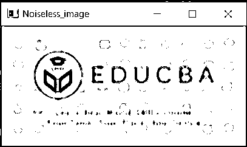

# OpenCV 中值滤波器

> 原文：<https://www.educba.com/opencv-median-filter/>

## OpenCV 中值滤波器简介

给定图像的像素值的随机变化可以被定义为图像中的噪声，并且有几种算法来从给定图像中去除噪声，中值滤波器是 OpenCV 中从给定图像中去除噪声的这种算法之一，使用该算法，将在小矩阵的帮助下扫描整个图像，并且通过计算所有值的中值来重新计算中心像素值 在 matrix 中，为了实现中值滤波算法，我们在 OpenCV 中使用了一个名为 medianBlur()的函数。

**语法:**

<small>网页开发、编程语言、软件测试&其他</small>

下面是 OpenCV 中定义 medianBlur()函数的语法如下:

`medianBlur(source_image, kernel_size)`

其中，source_image 是要使用 medianBlur()函数去除噪声的图像，并且

kernel_size 表示内核的大小，它必须是一个正整数。

### OpenCV 中 medianBlur()函数的工作原理

下面我们讨论 OpenCV 中 medianBlur()函数的工作原理如下:

*   为了消除给定图像像素值的随机变化或噪声，我们使用 OpenCV 中的中值滤波器。
*   函数 medialBlur()用于去除给定图像中的噪声。
*   使用 imread()函数读取必须去除噪声的图像。
*   然后对图像应用 medianBlur()函数，同时指定内核的 sie，以从图像中去除噪声。
*   medianBlur()函数返回一个去除了噪声的图像。

### OpenCV 中值滤波器示例

以下是 OpenCV 中值滤波器的示例:

#### 示例#1

python 中的 OpenCV 程序演示了 medianBlur()函数，该函数读取给定图像并从给定图像中移除噪声，然后将其作为输出显示在屏幕上:

**代码:**

`#importing all the required modules
import cv2 as cv
#reading the image whose noise is to be removed using imread() function
imageread = cv.imread('C:/Users/admin/Desktop/educba.jpg')
#using medinaBlur() function to remove the noise from the given image
imagenormal = cv.medianBlur(imageread, 5)
#displaying the noiseless image as the output on the screen
cv.imshow('Noiseless_image',imagenormal)
cv.waitKey(0)
cv.destroyAllWindows()`

**输出:**

**说明:**在上面的程序中，我们正在导入所需的模块。然后我们使用 imread()函数读取必须去除噪声的图像。然后我们利用 medianBlur()函数去除图像中的噪声。然后我们在屏幕上显示无噪声图像作为输出。

#### 实施例 2

python 中的 OpenCV 程序演示了 medianBlur()函数，该函数读取给定图像并从给定图像中移除噪声，然后将其作为输出显示在屏幕上:

**代码:**

`#importing all the required modules
import cv2 as cv
#reading the image whose noise is to be removed using imread() function
imageread = cv.imread('C:/Users/admin/Desktop/plane.jpg')
#using medinaBlur() function to remove the noise from the given image
imagenormal = cv.medianBlur(imageread, 5)
#displaying the noiseless image as the output on the screen
cv.imshow('Noiseless_image',imagenormal)
cv.waitKey(0)
cv.destroyAllWindows()`

**输出:**

**说明:**在上面的程序中，我们正在导入所需的模块。然后我们使用 imread()函数读取必须去除噪声的图像。然后我们利用 medianBlur()函数来去除图像中的噪声。然后我们在屏幕上显示无噪声图像作为输出。

#### 实施例 3

python 中的 OpenCV 程序演示了 medianBlur()函数，该函数读取给定图像并从给定图像中移除噪声，然后将其作为输出显示在屏幕上:

**代码:**

`#importing all the required modules
import cv2 as cv
#reading the image whose noise is to be removed using imread() function
imageread = cv.imread('C:/Users/admin/Desktop/car.jpg')
#using medinaBlur() function to remove the noise from the given image
imagenormal = cv.medianBlur(imageread, 5)
#displaying the noiseless image as the output on the screen
cv.imshow('Noiseless_image',imagenormal)
cv.waitKey(0)
cv.destroyAllWindows()`

**输出:**

**说明:**在上面的程序中，我们正在导入所需的模块。然后我们使用 imread()函数读取必须去除噪声的图像。然后我们利用 medianBlur()函数来去除图像中的噪声。然后我们在屏幕上显示无噪声图像作为输出。

#### 实施例 4

python 中的 OpenCV 程序演示了 medianBlur()函数，该函数读取给定图像并从给定图像中移除噪声，然后将其作为输出显示在屏幕上:

**代码:**

`#importing all the required modules
import cv2 as cv
#reading the image whose noise is to be removed using imread() function
imageread = cv.imread('C:/Users/admin/Desktop/tree.jpg')
#using medinaBlur() function to remove the noise from the given image
imagenormal = cv.medianBlur(imageread, 5)
#displaying the noiseless image as the output on the screen
cv.imshow('Noiseless_image',imagenormal)
cv.waitKey(0)
cv.destroyAllWindows()`

**输出:**

**说明:**在上面的程序中，我们正在导入所需的模块。然后我们使用 imread()函数读取必须去除噪声的图像。然后我们利用 medianBlur()函数来去除图像中的噪声。然后我们在屏幕上显示无噪声图像作为输出。

#### 实施例 5

python 中的 OpenCV 程序演示了 medianBlur()函数，该函数读取给定图像并从给定图像中移除噪声，然后将其作为输出显示在屏幕上:

**代码:**

`#importing all the required modules
import cv2 as cv
#reading the image whose noise is to be removed using imread() function
imageread = cv.imread('C:/Users/admin/Desktop/logo.png')
#using medinaBlur() function to remove the noise from the given image
imagenormal = cv.medianBlur(imageread, 5)
#displaying the noiseless image as the output on the screen
cv.imshow('Noiseless_image',imagenormal)
cv.waitKey(0)
cv.destroyAllWindows()`

**输出:**

**说明:**在上面的程序中，我们正在导入所需的模块。然后我们使用 imread()函数读取必须去除噪声的图像。然后我们利用 medianBlur()函数来去除图像中的噪声。然后我们在屏幕上显示无噪声图像作为输出。

### 结论

在本文中，我们学习了在 OpenCV 中使用 medianBlur()函数进行中值滤波的概念、定义 medianBlur()函数的语法、medianBlur()函数的工作原理以及相应的编程示例和演示它们的输出。

### 推荐文章

这是一个 OpenCV 中值滤波器的指南。这里我们讨论 OpenCV 中值滤波器的介绍、语法、工作原理和代码实现示例。您也可以看看以下文章，了解更多信息–

1.  [CSS 调整大小](https://www.educba.com/css-resize/)
2.  [Matlab 图像调整大小](https://www.educba.com/matlab-image-resize/)
3.  [在 Photoshop 中调整对象大小](https://www.educba.com/resize-object-in-photoshop/)
4.  [在 Adobe Illustrator 中调整图像大小](https://www.educba.com/resize-image-in-adobe-illustrator/)

