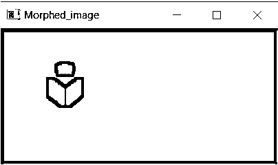

# OpenCV 形态学

> 原文：<https://www.educba.com/opencv-morphology/>

## OpenCV 形态学简介

基于图像的形状在图像上执行的简单操作被称为形态学变换，并且有几种形态学操作，即腐蚀、膨胀、开、闭、形态学梯度、顶帽和黑帽，并且我们利用用于膨胀图像的 expand()函数、用于腐蚀图像的 erode()函数和用于在图像上执行开、闭、形态学梯度、顶帽和黑帽操作的 morphologyEx()函数，并且这些操作被用于从图像中去除噪声、去除图像中前景对象中的小孔等。morphologyEx()函数返回一个对其执行了形态学操作的图像。

**OpenCV 中定义 morphologyEx()函数的语法如下:**

<small>网页开发、编程语言、软件测试&其他</small>

`morphologyEx(source_image, operation, kernel)`

其中 source_image 是必须对其执行形态学操作的图像，

operation 表示要在源图像上执行的形态学操作，并且

kernel 表示核矩阵。

### OpenCV 中的形态学函数如何工作？

OpenCV 中 morphologyEx()函数的工作原理如下:

*   基于图像的形状对图像执行的简单操作，以从图像中去除噪声、去除图像中前景对象中的小孔等。被称为形态转换。
*   有几种形态学操作，即腐蚀、膨胀、打开、关闭、形态学梯度、礼帽和黑帽。
*   腐蚀运算之后是膨胀运算，称为开形态学运算。
*   我们利用 morphologyEx()函数中的操作 MORPH_OPEN 对给定的图像执行开形态学操作。
*   膨胀运算后接腐蚀运算称为闭形态运算。
*   我们利用 morphologyEx()函数中的操作 MORPH_CLOSE 对给定的图像执行封闭的形态学操作。
*   图像的膨胀操作和腐蚀操作之间的差异被称为形态梯度操作。
*   我们利用 morphologyEx()函数中的操作 MORPH_GRADIENT 对给定的图像执行形态梯度操作。
*   输入图像和打开图像的操作之间的差异称为顶帽操作。
*   我们利用 morphologyEx()函数中的操作 MORPH_TOPHAT 对给定图像执行 TOPHAT 形态学操作。
*   关闭输入图像的操作和输入图像之间的差异被称为黑帽操作。
*   我们利用 morphologyEx()函数中的操作 MORPH_BLACKHAT 对给定的图像执行黑帽形态学操作。

### 例子

让我们讨论 OpenCV 形态学的例子。

#### 示例#1

python 中的 OpenCV 程序演示 morphologyEx()函数，使用 imread()函数读取给定图像，对给定图像执行打开形态学操作，并在屏幕上显示输出:

**#导入所需模块**

 **`import cv2
import numpy as np
#reading the image on which opening morphological operation is to be performed using imread() function
imageread = cv2.imread('C:/Users/admin/Desktimg/educba1.jpg')
#defining the kernel matrix
kernel = np.ones((4,4),np.uint8)
#using morphologyEx function by specifying the MORPH_OPEN operation on the input image
openingimage = cv2.morphologyEx(imageread, cv2.MORPH_OPEN, kernel)
#displaying the morphed image as the output on the screen
cv2.imshow('Morphed_image', openingimage)
cv2.waitKey(0)`

给定程序的输出显示在下面的快照中:

在上面的程序中，我们正在导入所需的模块。然后，我们使用 imread()函数读取将要执行形态学操作的图像。然后我们定义核矩阵。然后，我们通过在图像上指定打开操作来利用 morphologyEx()函数。然后我们在屏幕上显示变形后的图像作为输出。

#### 实施例 2

python 中的 OpenCV 程序演示 morphologyEx()函数，使用 imread()函数读取给定图像，对给定图像执行闭合形态学运算，并在屏幕上显示输出:

`#importing the required modules
import cv2
import numpy as np
#reading the image on which opening morphological operation is to be performed using imread() function
imageread = cv2.imread('C:/Users/admin/Desktimg/educba1.jpg')
#defining the kernel matrix
kernel = np.ones((4,4),np.uint8)
#using morphologyEx function by specifying the MORPH_CLOSE operation on the input image
closingimage = cv2.morphologyEx(imageread, cv2.MORPH_CLOSE, kernel)
#displaying the morphed image as the output on the screen
cv2.imshow('Morphed_image', closingimage)
cv2.waitKey(0)`

给定程序的输出显示在下面的快照中:

在上面的程序中，我们正在导入所需的模块。然后，我们使用 imread()函数读取将要执行形态学操作的图像。然后我们定义核矩阵。然后，我们通过在图像上指定闭合操作来利用 morphologyEx()函数。然后我们在屏幕上显示变形后的图像作为输出。

#### 实施例 3

python 中的 OpenCV 程序演示 morphologyEx()函数，使用 imread()函数读取给定图像，对给定图像执行形态学梯度运算，并在屏幕上显示输出:

`#importing the required modules
import cv2
import numpy as np
#reading the image on which opening morphological operation is to be performed using imread() function
imageread = cv2.imread('C:/Users/admin/Desktimg/educba1.jpg')
#defining the kernel matrix
kernel = np.ones((4,4),np.uint8)
#using morphologyEx function by specifying the MORPH_GRADIENT operation on the input image
gradientimage = cv2.morphologyEx(imageread, cv2.MORPH_GRADIENT, kernel)
#displaying the morphed image as the output on the screen
cv2.imshow('Morphed_image', gradientimage)
cv2.waitKey(0)`

给定程序的输出显示在下面的快照中:

在上面的程序中，我们正在导入所需的模块。然后，我们使用 imread()函数读取将要执行形态学操作的图像。然后我们定义核矩阵。然后，我们通过在图像上指定形态学梯度操作来利用 morphologyEx()函数。然后我们在屏幕上显示变形后的图像作为输出。

#### 实施例 4

python 中的 OpenCV 程序演示 morphologyEx()函数使用 imread()函数读取给定图像，对给定图像执行高帽操作和黑帽操作，并在屏幕上显示输出:

`#importing the required modules
import cv2
import numpy as np
#reading the image on which opening morphological operation is to be performed using imread() function
imageread = cv2.imread('C:/Users/admin/Desktimg/educba1.jpg')
#defining the kernel matrix
kernel = np.ones((4,4),np.uint8)
#using morphologyEx function by specifying the MORPH_TOPHAT operation on the input image
tophatimage = cv2.morphologyEx(imageread, cv2.MORPH_TOPHAT, kernel)
#using morphologyEx function by specifying the MORPH_BLACKHAT operation on the input image
blackhatimage = cv2.morphologyEx(imageread, cv2.MORPH_BLACKHAT, kernel)
#displaying the morphed image as the output on the screen
cv2.imshow('Morphed_image', tophatimage)
cv2.waitKey(0)
#displaying the morphed image as the output on the screen
cv2.imshow('Morphed_image', blackhatimage)
cv2.waitKey(0)`

给定程序的输出显示在下面的快照中:

在上面的程序中，我们正在导入所需的模块。然后，我们使用 imread()函数读取将要执行形态学操作的图像。然后我们定义核矩阵。然后，我们通过在图像上指定 top hat 操作来利用 morphologyEx()函数。然后，我们通过在图像上指定黑帽操作来利用 morphologyEx()函数。然后我们在屏幕上显示变形后的图像作为输出。

### 结论

在本文中，我们已经学习了使用 morphologyEx()函数进行形态学运算的概念，并给出了相应的编程示例及其输出来演示它们。

### 推荐文章

这是一个 OpenCV 形态学指南。这里我们讨论一下 OpenCV 中的词法功能的介绍，语法，如何工作？还有例子。您也可以看看以下文章，了解更多信息–

1.  [OpenCV kmeans](https://www.educba.com/opencv-kmeans/)
2.  [Python 数组长度](https://www.educba.com/python-array-length/)
3.  [Python 索引错误](https://www.educba.com/python-indexerror/)
4.  [Python 初始化列表](https://www.educba.com/python-initialize-list/)

**