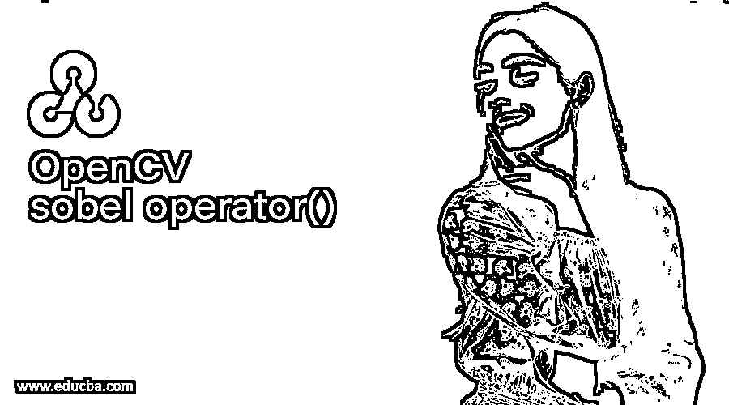
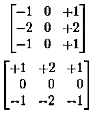
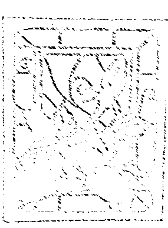
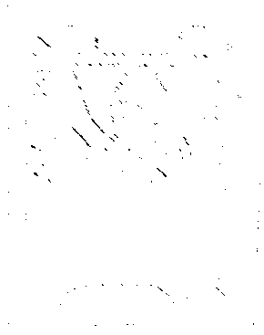
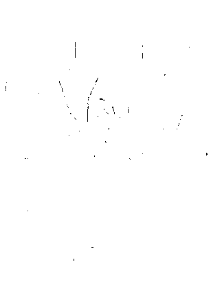

# OpenCV sobel 运算符()

> 原文：<https://www.educba.com/opencv-sobel-operator/>

## OpenCV sobel 算子介绍()

OpenCV sobel 操作符()是 Python 编程语言的 OpenCV 库中存在的命令，使用该命令是为了使用户能够检测出图像中垂直方向和水平方向上的边缘。这是一个非常重要的功能，因为检测图像中的边缘是执行图像处理时涉及的最基本的操作之一。OpenCV sobel 运算符命令的使用有助于我们引入系统要处理的像素总量(输入的数据),并有助于保持图像的结构尺寸和外观。最常用的边缘检测方法或方案是–拉普拉斯 sobel(这对于图像中存在的噪声非常敏感；基于二阶导数的边缘检测器)和基于一阶导数的梯度 sobel 边缘检测器。边缘检测方法的这两种方案以相似的方式工作，并且提供相同的边缘检测复杂度。

**OpenCV Sobel 运算符()的语法**

<small>网页开发、编程语言、软件测试&其他</small>

以下是使用 OpenCV sobel operator()函数时必须使用的语法:

`Sobel * (* src *, * * * dst *, * * * ddepth *, * * * dx *, * * * dy *) *`

**OpenCV Sobel 算子()函数的参数:**

OpenCV sobel 算子函数接受以下参数:

| **参数** | **参数说明** |
| **Src** | 该参数用于表示用户输入的图像或源图像。它是属于 Mat 类的对象。 |
| **夏令时** | 该参数用于表示系统在对其执行功能后产生的最终输出图像，或者目标图像。它是属于 Mat 类的对象 |
| **第四层** | 该参数用于表示图像所具有的债务(-1)。它由一个具有整数值的变量表示。 |
| **Dx** | 该参数是具有用于表示 X 导数的整数值的变量。该参数的值可以是零或一。 |
| **Dy** | 该参数是具有整数值的变量，用于表示 Y 导数。该参数的值可以是零或一。 |
| **返回值** | 这个方法负责返回一个输出图像，它将从指定的文件中加载。 |

### OpenCV sobel 运算符是如何工作的？

sobel 算子通过两种方式对用户提供的图像进行边缘检测。让我们讨论这两个问题:

**索贝尔算子–边缘检测**

这是一种基于一阶导数梯度的方法。它通过计算为图像提供的一阶导数，分别对 Y 轴和 X 轴进行操作来起作用。操作者使用两个 3×3 维的核，这两个核与用户提供的图像一起卷积。以便计算垂直和水平方向的导数的近似值。下图有助于我们理解如何为 y 方向和 x 方向获取 Sobel 核值:

**索贝尔算子–拉普拉斯边缘检测**

与现有的边缘检测方法不同，这里只使用一个核来计算这个二阶导数的一次通过的值。1 Colonel 用于 lap 损伤检测方法，如下图所示。

下图可以用来演示在使用单个内核时如何考虑对角线

使用 OpenCV 库
* * * * * * * * * * * * * * * * * * * * * * * * cv2，可以使用下面的语法来利用拉普拉斯边缘检测命令。拉普拉斯* (* src *，* * * d *深度，其他* * *选项。*..) * * * * * * * * * * * * * *

### OpenCV Sobel 算子使用示例

`# command used to import the OpenCV library to utilize OpenCV read image function
import cv2
# command used to import the numpy library to utilize np_array commands
import numpy as np1
from matplotlib import pyplot as plt2
# command used for reading an image from the disk that has been instructed by the user
#user selects an image with multiple edges and curved line with varying colour intensities
img1 = cv2.imread(Glass painting with multiple edges.jpg',)
# converting the image in to a gray scale image
gray1 = cv2.cvtColor(img1, cv2.COLOR_BGR2GRAY)
# removing the noice from the image
imgT = cv2.GaussianBlur(gray1,(30,30),0)
# convoluting along with kernels
laplacian1 = cv2.Laplacian(imgT, cv2.CV_64F)
sobelx1 = cv2.Sobel(imgT,cv2.CV_64F,1,0,ksize=5) # x-axis
sobely1 = cv2.Sobel(imgT,cv2.CV_64F,0,1,ksize=5) # y-axis
plt2.subplot(2,2,3),plt2.imshow(sobelx1,cmap = * 'gray1')
plt2.title('Sobel X-Axis'), plt2.x * ticks([]),* * * plt2.y * ticks([])
plt2.subplot(2,2,4),plt2.imshow(sobely1,cmap = 'gray1')
plt2.title('Sobel Y-Axis'), plt2.x * ticks([]), plt2.y * ticks([])
plt2 *. * subplot * (20,20,10), * plt2 *.imshow * (imgT, * cmap * = * 'gray1')
plt2.title('Original'), * plt2.xticks([]), plt2\. y * ticks * ([*])
plt2.subplot(20,20,20),plt2.imshow(laplacian1,cmap = 'gray1')
plt2.title('Laplacian Edge Detection View'), plt2.x * ticks([]), plt2.y * ticks([])
plt2.show()
cv2.waitKey(0)
cv2.destroyAllWindows()`

**输出:**

用于检测边缘的原始图像:

在 Sobel X 相关版本中应用 OpenCV sobel 算子()输出图像

在 Sobel Y 相关版本中应用 OpenCV sobel 算子()输出图像

在与拉普拉斯边缘检测器模式相关的版本中，应用 OpenCV sobel 算子()输出图像。

### 结论

OpenCV sobel 算子()是一个非常重要的函数，因为检测图像中的边缘是执行图像处理时涉及的最基本的操作之一。OpenCV sobel 运算符命令的使用有助于我们引入系统要处理的像素总量(输入的数据),并有助于保持图像的结构尺寸和外观。

### 推荐文章

这是 OpenCV sobel 算子()的指南。在这里，我们讨论 OpenCV sobel 操作符的介绍、语法和工作原理。举例说明。您也可以看看以下文章，了解更多信息–

1.  [OpenCV warpPerspective()](https://www.educba.com/opencv-warpperspective/)
2.  [OpenCV 透视变换](https://www.educba.com/opencv-perspectivetransform/)
3.  [OpenCV 按位与](https://www.educba.com/opencv-bitwise_and/)
4.  [OpenCV 规格化](https://www.educba.com/opencv-normalize/)

